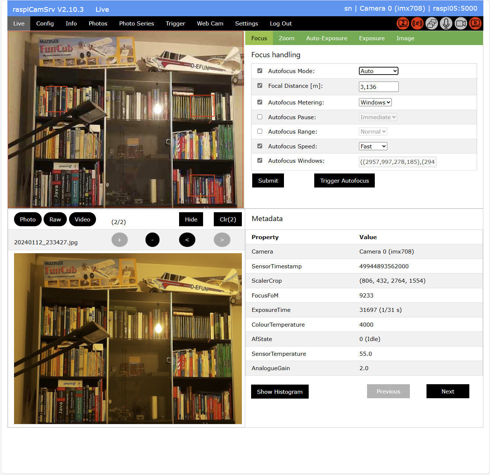

# raspiCamSrv

The Raspberry Pi Camera Server (raspiCamSrv) is a web server which can be deployed on a Raspberry Pi device giving access to installed cameras and allows to control these.

It can be installed on all Raspberry Pi platforms which allow connection of one or multiple cameras and supports the currently existing camera types.
Up to now, it was tested on Pi Zero W, Pi Zero 2 W, Pi 4 and Pi 5 running Bullseye as well as Bookworm together with camera modules 1, 2, 3, HQ and GS. On Pi 5, also parallel installation of two different cameras was tested.

**raspiCamSrv** is built with [Flask 3.x](https://flask.palletsprojects.com/en/stable/) and uses the [Picamera2 library](https://datasheets.raspberrypi.com/camera/picamera2-manual.pdf).

Due to responsive layout from [W3.CSS](https://www.w3schools.com/w3css/), all modern browsers on PC, Mac or mobile devices can be used as clients.

## Getting Started

- For [System Setup](#setup--getting-started) or [installation procedure](#raspicamsrv-installation), see below.<br>Alternatively, consider [running raspiCamSrv as Docker container](./docs/SetupDocker.md).

- If you need to be independent from an existing Wi-Fi or cabled connection, see [Setup of Raspberry Pi Zero as Standalone System](./docs/bp_PiZero_Standalone.md)


- For release history and updating an existing system, see [Release Notes](./docs/ReleaseNotes.md).    

## Feature Overview V3.3.0

For more details, see the [User Guide](docs/UserGuide.md).    



- The [Live screen](docs/LiveScreen.md) shows a live stream of the active camera and allows individually selecting and setting all [camera controls](docs/CameraControls.md) supported by Picamera2.
- The **live stream** (MJPEG stream) can also be directly accessed through the endpoint ```http://<server>:<port>/video_feed```.   
It can be configured whether or not authentication is required.
- Web access to photo snapshots is achieved through the URL ```http://<server>:<port>/photo_feed```.   
The setting for necessity of authentication applies also to photo snapshots.
- For systems with 2 Raspberry Pi cameras (currently Pi 5) both cameras can stream simultaneously.    
The non-active camera stream and photo can be accessed through endpoints ```http://<server>:<port>/video_feed2``` and ```http://<server>:<port>/photo_feed2```, respectively.
- Clients which are currently streaming through **raspiCamSrv** are shown on the [Info Screen](./docs/Information.md#streaming-clients) together with their IP address and the streams they are using.
- Support of [Tuning](./docs/Tuning.md) by selection and management of tuning files.
- Triggered capture of videos and photos (see [Triggered Capture of Videos and Photos](./docs/Trigger.md)) with motion detection
- [Event viewer](./docs/TriggerEventViewer.md) with calendar overview
- Notification on captured events by e-Mail (see [Notification](./docs/TriggerNotification.md))
- [Extended Motion Capturing Algorithms](./docs/TriggerMotion.md) are available, including [Frame Differencing](./docs/TriggerMotion.md#test-for-frame-differencing-algorithm), [Optical Flow](./docs/TriggerMotion.md#test-for-optical-flow-algorithm) and [Background Subtraction](./docs/TriggerMotion.md#test-for-background-subtraction-algorithm)
- The [Extended Motion Capturing Algorithms](./docs/TriggerMotion.md) can be run in a testing mode, showing live views of intermediate image processing results which can help for a better understanding of the algorithms and adjustment of their variable parameters.
- For cameras with focus control (camera 3), it is also possible to graphically draw autofocus windows and trigger the autofocus to measure the LensPosition which is translated into a focal distance (see [Focus handling](docs/FocusHandling.md)).
- For zooming, the intended image section can be [drawn graphically](docs/ZoomPan.md#graphically-setting-the-zoom-window) on the live stream area.
- Photos, raw photos and videos can be taken, which are shown in the lower part of the [Live screen](docs/LiveScreen.md) together with their metadata or alternatively with their histogram (see [Photo taking](docs/Phototaking.md)).
- Videos can be recorded along with audio if a microphone (e.g. USB microphone) is connected to the Raspberry Pi (see [Recording Audio along with Video](docs/Settings.md#recording-audio-along-with-video))
- "Intelligent" camera control supporting simultaneous camera access from different tasks as long as the requested configurations are compatible (see [raspiCamSrv Tasks and Background Processes](./docs/Background%20Processes.md)).   
This includes a continuous live stream while taking photos, videos or photo series.   
- For raw photos and videos, a jpeg placeholder is shown
- The photos taken may be added to a display buffer for inspection of photos and metadata and for comparison (see [Photo Display](docs/Phototaking.md#photo-display))
- On the [Config screen](docs/Configuration.md), camera configurations can be specified for four different use cases (Live View, Photo, Raw Photo and Video). These will be applied together with the selected controls when photos or videos will be taken. The *Live view* configuration will also be immediately applied to the Live stream.
- When modifying [Stream Sizes](./docs/Configuration.md#stream-size-width-height) to non-standard aspect ratios, an option can assure that this is syncronously done for all camera configurations, so that Live Stream, Photos, Raw Photos and Videos have all the same aspect ratio and are not distorted.- The [Info screen](docs/Information.md) shows the installed cameras, and, for the active camera, the camera properties as well as the available sensor modes.
- The [Photos screen](docs/PhotoViewer.md) allows scrolling through all available photos and videos with detail views of selected items.
- This screen allows also photo/video download and deletion.
- With the [Photo Series](docs/PhotoSeries.md) screen, different kinds of photo series ([Timelapse Series](./docs/PhotoSeriesTimelapse.md), [Exposure Series](./docs/PhotoSeriesExp.md), [Focus Stacks](./docs/PhotoSeriesFocus.md)) can be configured, executed and monitored during their progress.
- For [Timelapse Series](./docs/PhotoSeriesTimelapse.md), it is possible to define active periods depending on sunrise and sunset.
- The [Photo Series](docs/PhotoSeries.md) screen allows also to persist specific [Camera Configurations](docs/Configuration.md) together with [Camera Controls](docs/CameraControls.md) in the file system for later reuse.
- Photo Series can be set to be [automatically continued](./docs/PhotoSeries.md#series-configuration) on server start if they had been interrupted by a server stop or system shotdown or reboot.
- On the [Console](./docs/Console.md), configurable buttons allow execution of arbitrary OS commands and scripts including restart of the Flask service or reboot of the Raspberry Pi.
- The [Settings screen](docs/Settings.md) allows a few configuration settings such as selection of the active camera as well as selecting the type of photos, raw photos and videos in the range supported by Picamera2
- The Settings screen includes also functions to control the **raspiCamSrv** [Server Configuration](./docs/SettingsConfiguration.md).<br>The entire configuration can be persisted or loaded from stored configuration files.
- It is also possible to configure the server to use the persisted configuration on server startup.
- Access to the server requires [registration and authentification](docs/Authentication.md).
- Generator for executable Python code including the entire interface to Picamera2 of a **raspiCamSrv** session.   
(See [Generation of Python Code for Camera](./docs/Troubelshooting.md#generation-of-python-code-for-camera))
- The [raspiCamSrv API](./docs/API.md) allows integration of the Raspberry Pi cameras with automated systems allowing these to take photos, start/stop video recording, start/stop motion detection, switching cameras and query status information.<br>Server access to the API endpoints is protected through JSON Web Tokens (JWT).

**New in V3.3**
- Support for interaction with GPIO-connected devices based on the [gpiozero](https://gpiozero.readthedocs.io/en/stable/index.html) library. All basic input and output devices provided by *gpiozero* are supported and can be configured in the [Settings / Devices](./docs/SettingsDevices.md) dialog. In addition, also support for [Stepper Motor](./docs/gpioDevices/StepperMotor.md) is provided.
- Events occurring on Input [Devices](./docs/SettingsDevices.md), such as sensors or buttons, can be configured as [Triggers](./docs/TriggerTriggers.md) for the execution of [Actions](./docs/TriggerActions.md). Various actors, such as LEDs, buzzers, motors and servos can thus be integrated. All this integrates well with available functionality of the camera system.
- Besides [Trigger](./docs/TriggerTriggers.md)-based [Action](./docs/TriggerActions.md) execution, actions can also be envoked through flexibly configurable [Action Buttons](./docs/ConsoleActionButtons.md).

## Known Issues

- In **Safari** (e.g. on an iPad), there is still an issue with the Live Screen:    
 Due to the specific timing of the onload event, [AF Windows](docs/FocusHandling.md#autofocus-windows) may not be visible immediately after the page has been loaded. If you just 'pull' the entire window down for a short time (don't touch the AF Windows canvas), they will show up.   
 If the Live stream does not show up (e.g. after visiting another screen), take a photo and then push **Hide**/**Show**. This will show the live stream.
 - There may be an issue configuring specific sensor modes or stream sizes for the *Live View* in [Config](./docs/Configuration.md). As a result, the live view will not show up and the server log will show an exception. You may need to reset the server (see [Reset Server](./docs/SettingsConfiguration.md))<br>This is already fixed but may not yet be available in your environment (see [picamera2 Issue #959](https://github.com/raspberrypi/picamera2/issues/959))

## Limitations
The software is still being tested and extended.

- USB cameras are detected but currently not supported. One reason is that many USB cameras use the YUYV format whereas **raspiCamSrv** uses MJPEG for the Live stream and YUYV would require OpenCV for rendering.
- **raspiCamSrv** will not automatically detect a changed camera setup, for example if cameras are plugged in and out while the Raspberry Pi is running (certainly, this would apply only to USB cameras and nobody will unplug a Pi camera without shutting down the system). However, there is a **Reset Server** button on the [Settings](docs/Settings.md) screen, which, when pressed, will force the configuration to be updated.
- Although the layout is responsive, it may not be "good-looking" with all sizes of browser windows

## Credits
- Most technical information on Picamera2 (<https://github.com/raspberrypi/picamera2>) has been taken from the [Raspberry Pi - The Picamera2 Library](https://datasheets.raspberrypi.com/camera/picamera2-manual.pdf) document.
- The implementation of live streaming with Flask has been inspired by <https://blog.miguelgrinberg.com/post/video-streaming-with-flask>
- The detailed solution for the mjpeg_server is based on the example [mjpeg_server.py](https://github.com/raspberrypi/picamera2/blob/main/examples/mjpeg_server.py) of the [picamera2 repository](https://github.com/raspberrypi/picamera2)
- The solution for drawing on the canvas for definition of AF Windows has been inspired by <https://codepen.io/AllenT871/pen/GVyXKp>
- The [Extended Motion Capturing Algorithms](./docs/TriggerMotion.md) are based on work done by Isaac Berrios, published under [Introduction to Motion Detection: Part 1 - 3](https://medium.com/@itberrios6/introduction-to-motion-detection-part-1-e031b0bb9bb2)   
The algorithm code has been taken from this source as well as its [GitHub Repository](https://github.com/itberrios/CV_projects/tree/main/motion_detection) and integrated into the **raspiCamSrv** environment.
- raspiCamSrv uses the [gpiozero](https://gpiozero.readthedocs.io/en/stable/index.html) library for interfacing GPIO-connected devices.

## Setup / Getting Started

### Required
- A **Raspberry Pi** ([Zero W](https://www.raspberrypi.com/products/raspberry-pi-zero-w/), [Zero 2 W](https://www.raspberrypi.com/products/raspberry-pi-zero-2-w/), [Pi 1](https://www.raspberrypi.com/products/raspberry-pi-1-model-b-plus/), [Pi 3](https://www.raspberrypi.com/products/raspberry-pi-3-model-b-plus/), [Pi 4](https://www.raspberrypi.com/products/raspberry-pi-4-model-b/), [Pi 5](https://www.raspberrypi.com/products/raspberry-pi-5/))
- A [Raspberry Pi camera](https://www.raspberrypi.com/documentation/accessories/camera.html)
- A suitable **camera cable** <br>(Pi Zero W, Pi Zero 2 W and Pi 5 have the small CSI-2 camera port, requiring a special cable which is usually not shipped with the camera)
- A **microSD card**
- A suitable **power supply**<br>For Pi Zero W or Pi Zero 2 W, a normal mobile phone charger is sufficient as long as it has a Micro-USB connector
- Optionally, a **case** for the specific model may ease handling.<br>For Pi Zero W or Zero 2 W, offerings for the official case (e.g. [here](https://www.reichelt.de/gehaeuse-fuer-raspberry-pi-zero-rot-weiss-rpiz-case-whrd-p223607.html?PROVID=2788&gclid=EAIaIQobChMI2JfM3vjcgwMVSxYGAB1pSQBOEAYYASABEgL_GPD_BwE)) should include a special short camera cable.<br>The cover for the camera is fine for camera models 1 and 2. For camera model 3, some handwork is necessary to enlarge the hole to a square for the camera body.
- A **Wifi network** with internet access and known access credentials (**SSID**, **password**)
- A **PC or Mac** with network access and **(micro)SD** card reader

The setup description, below, assumes a completely autonomous or 'headless' setup, where the Raspberry Pi requires nothing but a power supply cable without any necessity to ever connect it to a display, keyboard or mouse.   
<br>Here, the camera model 2 is installed.

The described steps were successfully executed with Raspberry Pi Imager version 1.8.5 and a Raspberry Pi Zero W.

### System Setup
For system setup, follow the instructions of the [Raspberry Pi Getting Started Documentation](https://www.raspberrypi.com/documentation/computers/getting-started.html#install-using-imager) for OS installation using Imager.   
Make sure that SSH is enabled on the Services tab.

Once the SD card is written, insert it into the Raspberry Pi and power it up.   
Initially, it will take several minutes until it is visible in the network.

### RaspiCamSrv Installation

If you want to update an existing installation to the latest version, see [Update Procedure](./docs/ReleaseNotes.md#update-procedure).

In case of problems during installation and usage, see [Troubleshooting](./docs/Troubelshooting.md)

|Step|Action
|----|--------------------------------------------------
|1.  | Connect to the Pi using SSH: <br>```ssh <user>@<host>```<br>with \<user> and \<host> as specified during setup with Imager.
|2.  | Update the system<br>```sudo apt update``` <br>```sudo apt full-upgrade```
|2.a | If you intend to take videos and have installed a *lite* version of the OS, you may need to install *ffmpeg*:<br>Check whether ffmpeg is installed with<br>```which ffmpeg```<br>I you get an empty response, install with<br>```sudo apt install ffmpeg```
|3.  | Create a root directory under which you will install programs (e.g. 'prg')<br>```mkdir prg```<br>```cd prg```
|4.  | Check that git is installed (which is usually the case in current Bullseye and Bookworm distributions)<br>```git --version```<br>If git is not installed, install it with<br>```sudo apt install git```
|5.  | Clone the raspi-cam-srv repository:<br>```git clone https://github.com/signag/raspi-cam-srv```
|6.  | Create a virtual environment ('.venv') on the 'raspi-cam-srv' folder:<br>```cd raspi-cam-srv```<br>```python -m venv --system-site-packages .venv```<br>For the reasoning to include system site packages, see the [picamera2-manual.pdf](./docs/picamera2-manual.pdf), chapter 9.5.
|7.  | Activate the virtual environment<br>```cd ~/prg/raspi-cam-srv```<br>```source .venv/bin/activate```<br>The active virtual environment is indicated by ```(.venv)``` preceeding the system prompt
|8.  | Make sure that picamera2 is available on the system:<br>```python```<br>```>>>import picamera2```<br>```>>>quit()```<br>If you get a 'ModuleNotFoundError', see the [picamera2 Manual](https://datasheets.raspberrypi.com/camera/picamera2-manual.pdf), chapter 2.2, how to install picamera2.<br>For **raspiCamSrv** it would be sufficient to install without GUI dependencies:<br>```sudo apt install -y python3-picamera2 --no-install-recommends```
|9.  | Install Flask 3.x **with the virtual environment activated**.<br>Raspberry Pi OS distributions come with Flask preinstalled, however with versions 1.1 or 2.2.<br>RaspiCamSrv requires Flask 3.x, which can be installed with<br>```pip install "Flask>=3,<4"```<br>If you want to check the Flask version, you may need to deactivate/activate the virtual environment first:<br>```deactivate```<br>```source .venv/bin/activate```<br>```flask --version```<br>This should reveal version 'Flask 3.1.0' or another 3.x version.<br><br>Make sure that Flask is really installed in the virtual environment:<br>```which flask``` should output<br>```/home/<user>/prg/raspi-cam-srv/.venv/bin/flask```
|10.  | **Optional** installations:<br>The following installations are only required if you need to visualize histograms for some of the [Photo Series](docs/PhotoSeries.md)<br>or if you are interesten in using [Extended Motion Capturing Algorithms](./docs/TriggerMotion.md).<br>It is recommended to do the installation with an activated virtual environment (see step 7), although some of these packages might come preinstalled.<br>Install [OpenCV](https://de.wikipedia.org/wiki/OpenCV): ```sudo apt-get install python3-opencv```<br>Install [numpy](https://numpy.org/): ```pip install numpy```<br>Install [matplotlib](https://de.wikipedia.org/wiki/Matplotlib): ```pip install matplotlib```<br><br>The following installation is required for enabling the [raspiCamSrv API](./docs/API.md)<br>Install [flask-jwt-extended](https://flask-jwt-extended.readthedocs.io/en/stable/): ```pip install flask-jwt-extended```
|11.  | Initialize the database for Flask <br>(with ```raspi-cam-srv``` as active directory and the virual environment activated - see step 7):<br>```flask --app raspiCamSrv init-db```
|12. | Check that the Flask default port 5000 is available<br>```sudo netstat -nlp \| grep 5000```<br>If an entry is shown, find another free port (e.g. 5001) <br>and replace ```port 5000``` by your port in all ```flask``` commands, below and also in the URL in step 12.
|13. | Start the server<br>(with ```raspi-cam-srv``` as active directory and the virual environment activated - see step 7):<br>```flask --app raspiCamSrv run --port 5000 --host=0.0.0.0```
|14. | Connect to the server from a browser:<br>```http://<raspi_host>:5000```<br>This will open the [Login](docs/Authentication.md#log-in) screen.
|15. | Before you can login, you first need to [register](docs/Authentication.md).<br>The first user will automatically be SuperUser who can later register other users ([User Management](docs/Authentication.md#user-management))
|16. | After successful log-in, the [Live screen](docs/LiveScreen.md) will be shown
|17. | Done!
|18. | For usage of **raspiCamSrv**, please refer to the [User Guide](./docs/UserGuide.md)


When the Flask server starts up, it will show a warning that this is a development server.   
This is, in general, fine for private environments.   
How to deploy with a production WSGI server, is described in the [Flask documentation](https://flask.palletsprojects.com/en/stable/deploying/)

### Service Configuration

When the Flask server is started in a SSH session as described in step 10, above, it will terminate with the SSH session.

Instead, you may want the server to start up independently from any user sessions, restart after a failure and automatically start up when the device is powered up.

In order to achieve this, the Flask server start can be configured as service under control of systemd.

The following procedure is for the case where audio recording with video is **not** required. Otherwise, see [next](#service-configuration-for-audio-support) section.

|Step|Action
|----|-----------------------------------------------
|1.  | Open a SSH session on the Raspberry Pi
|2.  | Copy the service template *raspiCamSrv.service* which is provided with **raspiCamSrv** to your home directory<br>```cp ~/prg/raspi-cam-srv/config/raspiCamSrv.service ~``` 
|3.  | Adjust the service configuration:<br>```nano ~/raspiCamSrv.service```<br>Replace all (4) occurrences of '\<user>' with the user ID, specified during [System Setup](#system-setup)<br>If you need a port different from 5000 (see [RaspiCamSrv Installation](#raspicamsrv-installation), step 10), replace also ```port 5000``` by your port.
|4.  | Stage the service configuration file to systemd:<br>```sudo cp ~/raspiCamSrv.service /etc/systemd/system```
|5.  | Start the service:<br>```sudo systemctl start raspiCamSrv.service```
|6.  | Check that the Flask server has started as service:<br>```sudo journalctl -e```
|7.  | Enable the service so that it automatically starts with system boot:<br>```sudo systemctl enable raspiCamSrv.service```
|8.  | Reboot the system to test automatic server start:<br>```sudo reboot```


### Service Configuration for Audio Support

If it is intended to record audio along with videos, a slightly different setup is required (see [Settings](docs/Settings.md#recording-audio-along-with-video)):   
Instead of installing the service as a system unit, it needs to be installed as user unit (see [systemd/User](https://wiki.archlinux.org/title/Systemd/User)) in order to get access to [PulseAudio](https://wiki.archlinux.org/title/PulseAudio).

#### Bookworm Systems

If your system is a bookworm system (```lsb_release -a```) follow these steps:

|Step|Action
|----|-----------------------------------------------
|1.  | Open a SSH session on the Raspberry Pi
|2.  | Copy the service template *raspiCamSrv.service* which is provided with **raspiCamSrv** to your home directory<br>```cp ~/prg/raspi-cam-srv/config/raspiCamSrv.service ~``` 
|3.  | Adjust the service configuration:<br>```nano ~/raspiCamSrv.service```<br>Replace '\<user>' with the user ID, specified during [System Setup](#system-setup)<br>If necessary, raplace also the standard port 5000 with your port.<br>Remove the entry User=\<user> from the [System] section<br>In section [Install], change ```WantedBy=multi-user.target``` to ```WantedBy=default.target```
|4.  | Create the directory for systemd user units<br>```mkdir -p ~/.config/systemd/user```
|5.  | Stage the service configuration file to systemd for user units:<br>```cp ~/raspiCamSrv.service ~/.config/systemd/user```
|6.  | Start the service:<br>```systemctl --user start raspiCamSrv.service```
|7.  | Check that the Flask server has started as service:<br>```journalctl --user -e```
|8.  | Enable the service so that it automatically starts with a session for the active user:<br>```systemctl --user enable raspiCamSrv.service```
|9.  | Enable lingering in order to start the unit right after boot and keep it running independently from a user session<br>```loginctl enable-linger```
|10.  | Reboot the system to test automatic server start:<br>```sudo reboot```


#### Bullseye Systems

If your system is a bullseye system (```lsb_release -a```), which is currently still the case for Pi Zero, follow these steps:

|Step|Action
|----|-----------------------------------------------
|1.  | Open a SSH session on the Raspberry Pi
|2.  | Clone branch 0_3_12_next of Picamera2 repository<br>```cd ~/prg```<br>```git clone -b 0_3_12_next https://github.com/raspberrypi/picamera2```
|3.  | Copy the service template *raspiCamSrv.service* which is provided with **raspiCamSrv** to your home directory<br>```cp ~/prg/raspi-cam-srv/config/raspiCamSrv.service ~``` 
|4.  | Adjust the service configuration:<br>```nano ~/raspiCamSrv.service```<br>- Replace '\<user>' with the user ID, specified during [System Setup](#system-setup)<br>- If necessary, raplace also the standard port 5000 with your port.<br>- Add another Environment entry: ```Environment="PYTHONPATH=/home/<user>/prg/picamera2"```<br>- Remove the entry User=\<user> from the [System] section<br>- In section [Install], change ```WantedBy=multi-user.target``` to ```WantedBy=default.target```<br>For an example of the final .service file, see below
|5.  | Create the directory for systemd user units<br>```mkdir -p ~/.config/systemd/user```
|6.  | Stage the service configuration file to systemd for user units:<br>```cp ~/raspiCamSrv.service ~/.config/systemd/user```
|7.  | Start the service:<br>```systemctl --user start raspiCamSrv.service```
|8.  | Check that the Flask server has started as service:<br>```journalctl --user -e```
|9.  | Enable the service so that it automatically starts with a session for the active user:<br>```systemctl --user enable raspiCamSrv.service```
|10.  | Enable lingering in order to start the unit right after boot and keep it running independently from a user session<br>```loginctl enable-linger```
|11.  | Reboot the system to test automatic server start:<br>```sudo reboot```

Below is an example .service specification for user "sn":
```
[Unit]
Description=raspiCamSrv
After=network.target

[Service]
ExecStart=/home/sn/prg/raspi-cam-srv/.venv/bin/flask --app raspiCamSrv run --port 5000 --host=0.0.0.0
Environment="PATH=/home/sn/prg/raspi-cam-srv/.venv/bin:/usr/local/sbin:/usr/local/bin:/usr/sbin:/usr/bin:/sbin:/bin"
Environment="PYTHONPATH=/home/sn/prg/picamera2"
WorkingDirectory=/home/sn/prg/raspi-cam-srv
StandardOutput=inherit
StandardError=inherit
Restart=always

[Install]
WantedBy=default.target
```
