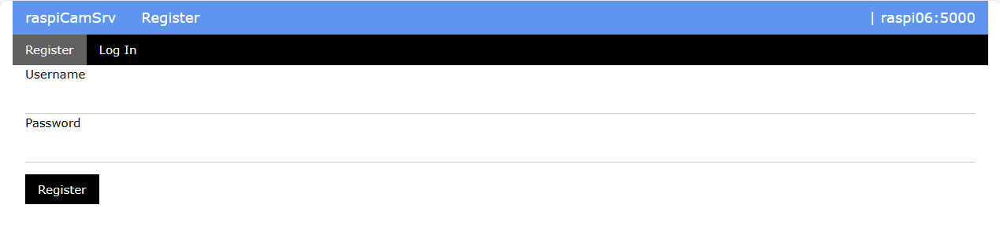
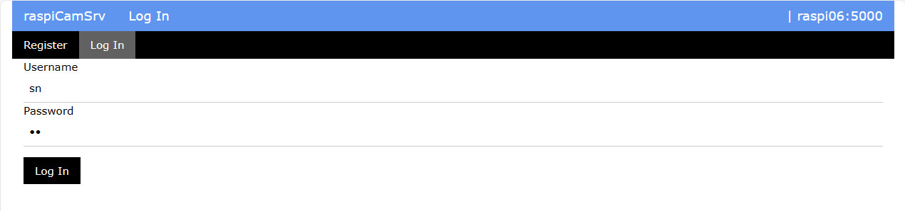

# raspiCamSrv Authorization

Access to the raspiCamSrv server requires login with Username and Password.

Currently, the implementation uses just the solution from the Flask 3 tutorial, which is a starting point but not really secure.
Currently, anybody may register and subsequently log in. This will be replaced by a more restrictive solution in future releases.

## Registration

On the registration page new users may register with a user name and password

After successful registration, the Log In screen is opened.

## Log In

After a user has logged out or when a session is no longer valid, the system will automatically redirect to the **Log In** screen whatever specific application URL is entered.

In this screen, registered users may log in with their Username and Password.

After successful login, the system will automatically open the main screen.