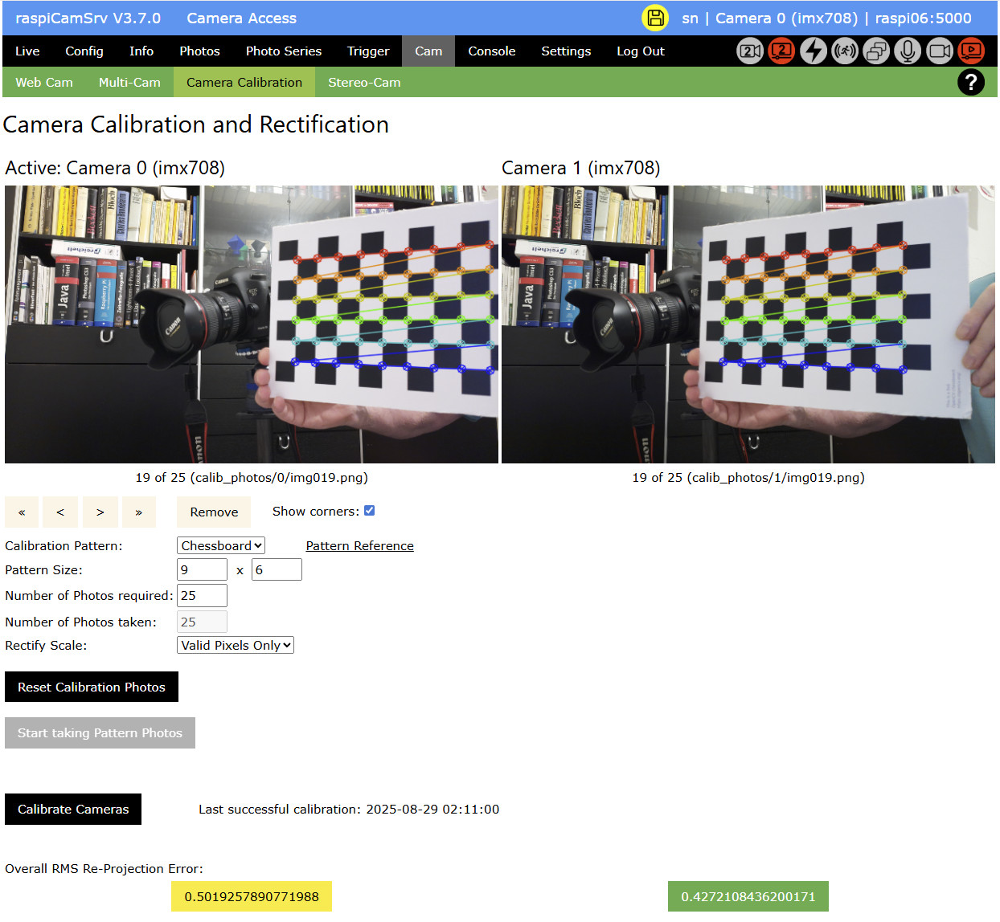

# Camera Calibration

[](./Cam.md)

This dialog allows calibration of the [stereo camera system](./CamStereo.md#stereo-camera) in order to improve the quality of the stereo result.

**NOTE**:The dialog is only accessible if [Stereo Vision](./Settings.md#activating-and-deactivating-stereo-vision) has been activated.

**REMINDER**: When finished with calibration you will need to [Store Configuration](./Settings.md#configuration) in order to preserve the results over a server restart.


When opened without existing calibration data, the dialog allows configuring the calibration process:

- *Calibration Pattern* allows selecting the pattern to be used for calibration.    
Currently, only the [Chessboard pattern from OpenCV](https://github.com/opencv/opencv/blob/4.x/doc/pattern.png) is supported.    
This pattern needs to be printed or displayed on a tablet for being used during the calibration process.   
- *Pattern Size* specifies the number of columns and rows of identifiable vertices of the pattern. 9x6 is appropriate for the standard chessboard pattern. (Only the inner vertices count)
- In *Number of Photos required* you can specify how many photos you want to use for calibration.    
The dialog allows selecting as few as 5 photos but this is only to see how quality decreases with the number of photos. 20-30 will be a better choice.
- *Number of Photos taken* will show the current number of photos.
- *Rectify Scale* is a parameter used during rectification.     
"Valid Pixels Only" will include only valid pixels in the final result and will remove black areas.    
"All Pixels" will include all pixels in the final result of transformed images.

## Picture Taking

The process of photo taking is automatic:

When the pattern is presented to the cameras so that it is fully visible in both cameras, the system will try to find the specified number of corners.   
Only if this is successful, the image will be stored.   
After 2 seconds, the next pair of images will be analyzed until sufficient photos have been taken.

The process is started with button **Start taking Pattern Photos** which will request a confirmation:


and signal readiness to take a photo:


Now you need to bring the pattern in the visible area and slowly change its orientation and position within the image areas.


If not all required corners could be found at the current position, this will be indicated:


## Picture Review

After all required pictures have been taken, camera streaming stops and the stored pictures are presented for being reviewed:


A navigation bar is shown which allows scrolling through the taken images.    
Images with bad quality can be removed.

*Show Corners* will present images where the found corners are shown:


If photos have been removed, the missing ones need to be filled up using button "Continue taking Pattern Photos" 


Button **Reset Calibration Photos** will remove all photos and reset the calibration process after a confirmation.

## Calibration

When the required number of photos have been taken, you can continue with calibration.



Display of the time of calibration as well as the *RMS Re-Projection Error* indicate that valid calibration data are available.

The color with which the error is shown, (green, yellow, red) indicates the quality of the calibration:

- < 0.5 px : excellent
- 0.5 - 1 px : acceptable
- > 1 px : poor

## Calibration Data Storage

Calibration photos (with and without corners) are stored underneath the ```raspiCamSrv/static``` folder:


