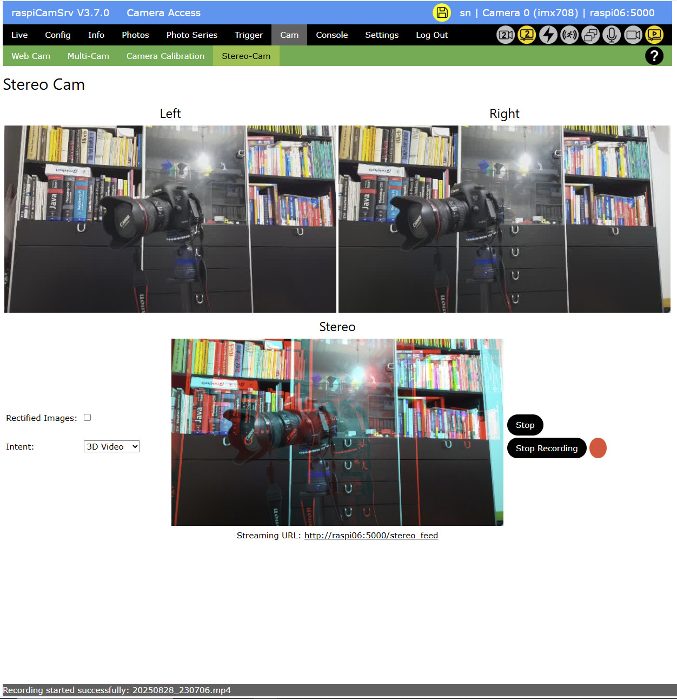

# Stereo-Cam

[](./Cam.md)

This dialog features [stereo camera](#stereo-camera) capabilities and can be used for visualizing [Depth Maps](#depth-maps) and [3D Video](#3d-video). Both can also be [streamed independently](#streaming).

**NOTE**:The dialog is only accessible if [Stereo Vision](./Settings.md#activating--deactivating-stereo-vision) has been activated.



## Stereo Camera

A precondition for Stereo Vision with raspiCamSrv is a system which allows connecting a pair of non-USB cameras of the same model.     
These cameras need to be arranged as a stereo system with a typical human eye distance:


For a 3D-printable model, see [Raspberry Pi Camera 3 Stereo Case](https://makerworld.com/en/models/1742837-raspberry-pi-camera-3-stereo-case)

**NOTE**: *Stereo Vision* needs to be activated in the [Settings](./Settings.md#activating--deactivating-stereo-vision) dialog.

## Implementation

Stereo Vision in raspiCamSrv is based on [OpenCV](https://opencv.org/) and is inspired by a variety of examples on [LearnOpenCV](https://learnopencv.com/) such as [Making A Low-Cost Stereo Camera Using OpenCV](https://learnopencv.com/making-a-low-cost-stereo-camera-using-opencv/), from which also part of the code has been adapted and integrated with raspiCamSrv.

## Depth Maps

(See [Wikipedia article on Depth Maps](https://en.wikipedia.org/wiki/Depth_map))

The Stereo-Cam dialog usually opens with the following layout:


When opening, the system starts the Live view for both cameras as indicated by the [Process Status indicators](./UserGuide.md#process-status-indicators) and shows the streams of left and right camera in the upper part of the dialog.

The lower left part allows configuration of the intended Stereo Vision:

- *Intent* distinguishes the basic intent and allows selection between **Depth Map** and **3D Video**.
- *Rectified Images*, when activated uses the rectified images (see [Camera Calibration](./CamCalibration.md)) instead of the original ones to construct the stereo image.
- *Algorithm* allows selecting the Open CV algorithm to be used when constructing the depth map.
- *Algorithm Reference* links to the respective references in Open CV ([Stereo Block Matching](https://docs.opencv.org/4.6.0/d9/dba/classcv_1_1StereoBM.html) or [Semi-Global Matching](https://docs.opencv.org/4.6.0/d2/d85/classcv_1_1StereoSGBM.html)) where the parameters for the different algorithms are explained.

Pushing **Start** with *Depth Map* selected as Intent, will start a background process which applies the algorithm to the images of left and right video stream to produce a stream of depth map images:


The activity of the Stereo thread, in addition to the two camera live view threads, is indicated by the different color of the [Process Status indicators](./UserGuide.md#process-status-indicators) for the two cameras.

## Streaming

The Stereo stream can also be accessed through the URL which is shown underneath the stream in the dialog.

This URL, when called independently from the raspiCamSrv UI, will automatically start all necessary streaming processes.

The necessity of authentication can be configured in the [Settings](./Settings.md#configuring-authentication-for-streaming).

## 3D Video

 (See [Wikipedia article on 3D Video](https://en.wikipedia.org/wiki/3D_film))

Starting Stereo processing with *Intent* "3D Video" will show the scene as 3D video which needs to be viewed with Red-Cyan color 3D glasses to see the 3D effect:


Here, you also have the possibility to record the stream as video.

Videos, recorded in this way, are stored under ```\static\photos\camera_S``` and can be accessed with the [Photos](./PhotoViewer.md) dialog by selecting the "Stereo" camera:


