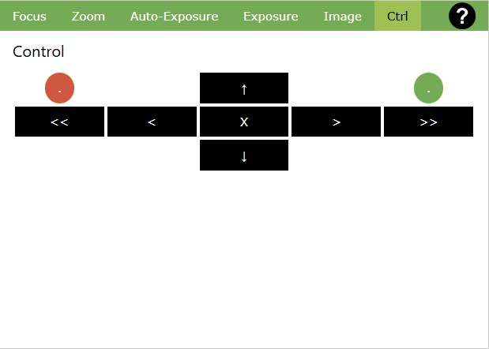

# Camera Controls / Ctrl

This tab shows functional buttons which have been configured in [Settings/Live Buttons](./SettingsLButtons.md).

Typically, these buttons will be used for control of devices which affect the camera position, such as servos controlling a Pan/Tilt device or a stepper motor for camera rotation.

You could also switch LEDs for illumination or control a slider motor.

When controlled through buttons on this page, the effect on the camera image can imediately be seen.
