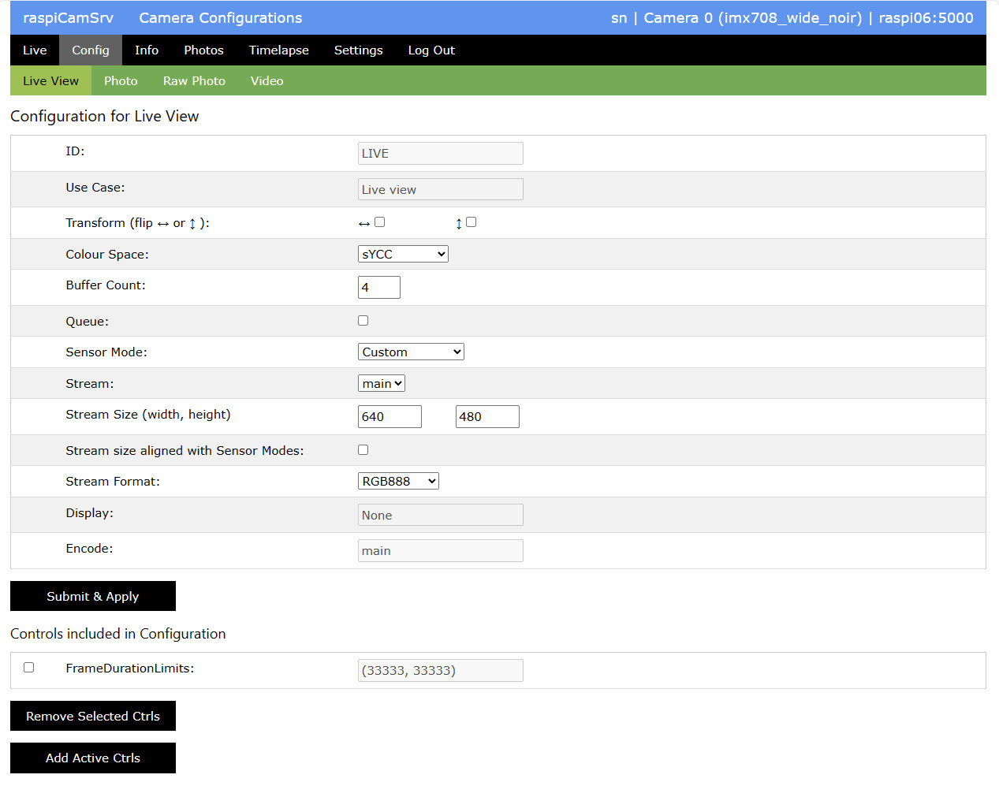

# raspiCamSrv Camera Configuration

[](./UserGuide.md)

Configuration parameters are so basic that they need to be applied before the camera is started.

Picamera2 provides three configuration bases which can be taken as is for a specific use case or they can be adjusted in one or several aspects.

These are
- Preview configuration   
for previews on a screen connected to the Raspberry Pi
- Still configuration   
for photos
- Video configuration   
for videos

**raspiCamSrv** does not make direct use of these configurations.

Instead, the following configurations can be fully configured:
- Live View configuration   
which will be applied to the live stream
- Photo configuration   
which will be applied when normal photos are taken
- Raw Photo configuration   
which will be applied when raw photos are taken
- Video configuration   
which will be applied when videos are recorded

Configuration changes may have an impact on the way how tasks and background processes are executed. If specific parameters, such as [Transform](#transform) are changed for a specific use case only, for example for *Video*, video recording will require that the Live Stream is stopped and paused while the video is being recorded.   
For more details, see [raspiCamSrv Tasks and Background Processes](./Background%20Processes.md).

## Configuration Tab

The *Config* submenu includes a tab *Tuning* which is described in [raspiCamSrv Camera Tuning](./Tuning.md) and not here.

An individual configuration tab is available for each use case. All tabs have essentially the same structure:   

As a general aspect, the green [Submenue](./UserGuide.md#submenue) bar includes an option to synchronize the aspect ratio of [stream sizes](#stream-size-width-height) across all configurations if this has been changed for the current configuration.   
If this option is activated after it was previously deactivated, all aspect ratios will be set to the one of the current configuration. 




**As always: any modifications need to be submitted before they can be effective**

### Transform

With *Transform*, you can specify whether the image needs to be flipped horizontally, vertically or both. The latter case is identical to rotation of 180°.

**NOTE:** When this is modified for one configuration, the settings are automatically transferred to all other configurations.<br>
This is necessary because **raspiCamSrv** simultaneously configures all streams (lores, main and raw) in order to allow using these in parallel for different purposes, such as live stream and video recording. The transform settings cannot be different for different streams at the same time.

### Colour Space

This allows selecting one of the supported colour spaces

### Buffer Count

Specifies the number of buffers used by the camera for the specific use case.

Values are preset in accordance with corresponding settings of the Picamera2 standard use cases

### Queue

Specifies whether the camera is allowed to queue up a frame ready for a capture request.

### Sensor Mode

When **raspiCamSrv** starts up, one of the first things is to query the camera system for the available Sensor Modes.  
These can be inspected on the [Info](./Information.md) screen.


These modes are offered for selection here.   
When a Sensor Mode is selected, its main characteristics are shown to the right.

In addition to the available Sensor Modes, a "Custom" mode can be selected which allows especially to set the intended stream size (width and height if the image in pixels)

For the *Raw Photo* use case, "Custom" cannot be selected. Raw photos will allways use the stream size of the selected Sensor Mode.

### Stream

Specifies the stream to be used for the respective use case.

The camera system supports three streams (see [Picamera2 Manual](./picamera2-manual.pdf)):
- the **main** stream
- the **lowres** stream
- and the **raw** stream

The latter is for raw data output which bypasses the image signal processor.

For the *Raw Photo* use case, this is the only stream which can be selected.

### Stream Size (width, height)

If a standard Sensor Mode has been selected, the size related to the mode is shown.

If "Custom" has been selected as sensor mode, you may enter any size here (except for *Raw Photos*).   
Produced photos or videos will then be in the specified format.

If the option to synchronize aspect ratios (right side of green Submenue bar) is selected, the *Stream Size*s for all other configurations will be adjusted to reproduce the aspect ratio of the current configuration.

**NOTE:** If, after submitting a *Live View* configuration, you get an error message ```
lores Stream Size must not exceed main Stream Size (Photo)```, you need to go to the *Photo* configuration and adjust its *Stream Size* to the desired value.

### Stream size aligned with Sensor Modes

If this option is activated, and if a stream size has been specified which is different from stream sizes of the available Sensor Modes, the Picamera2 Configuration will be asked to align the stream size. This may result in slightly different sizes which are, however, in better accordance with available Sensor Modes.

### Stream Format

It can be selected from a number of pixel and image formats supported by Picamera2.   
For details, see [Picamera2 Manual](./picamera2-manual.pdf), Appendix A.

Whereas for *Live Stream*, *Photo* and *Video* a format can be selected from the same list, the formats available for *Raw Photo* are different. These are specified in the Sensor Modes (see [Info](./Information.md)).   
**raspiCamSrv** queries these from Picamera2 at server startup and offers the found formats in the configuration screen.

### Display

This parameter is just shown for completeness.   
It specifies the stream which shall be used for display on a monitor connected to the system.   
This is not relevant in the scenario addressed by **raspiCamSrv**, which is usually headless.

### Encode

This specifies the stream which needs to be sent to the encoder.

Settings are preconfigured and cannot be modified.

Encoding is only necessary for the *Live View* (MJPEG encoding) and the *Video* use cases.

For *Video*, the encoder depends on the video format chosen.


## Controls included in Configuration

A configuration for a specific use case may also include Camera Controls.

Actually, Picamera2 requires that at least one control is included in the configuration.

**raspiCamSrv** preconfigurs a control with specific settings in accordance with the Picamera2 standard use case configurations.

In addition, the button **Add Active Ctrls** will include all controls which are currently active in the [Camera Controls](./CameraControls.md) configuration.

Values are taken as configured and cannot be modified here.

In case a control parameter has a wrong value, it can be selected and then removed from the configuration with the **Remove Selected Ctrls** button.
