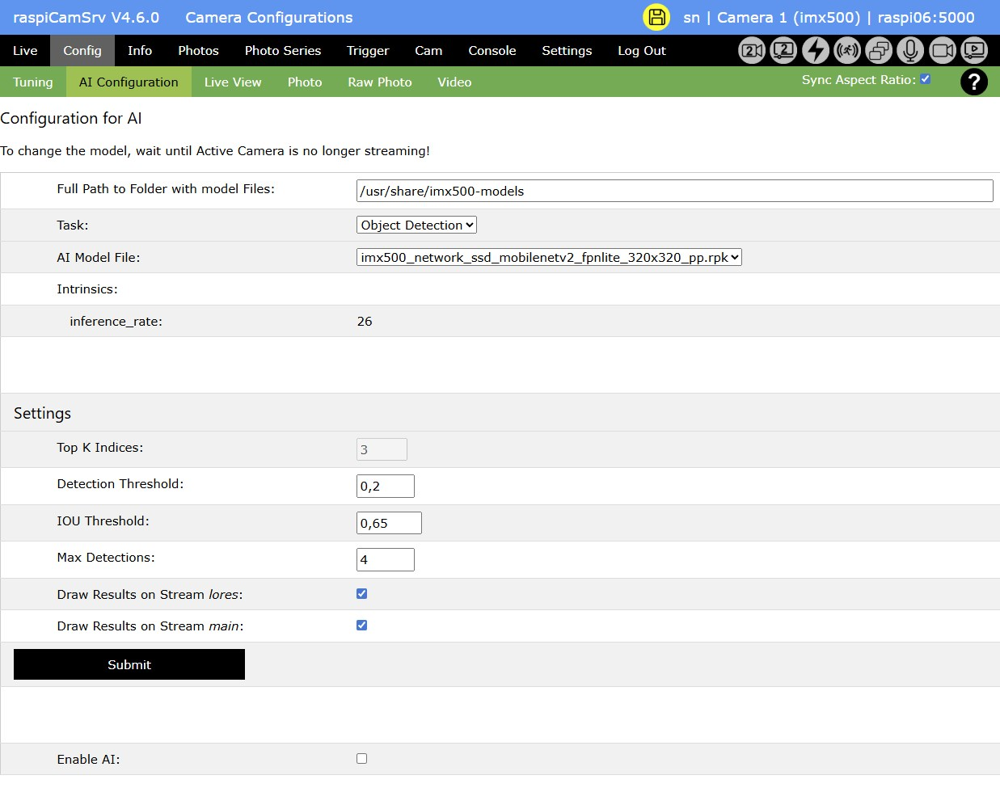

# raspiCamSrv Camera AI Configuration

[](./Configuration.md)

**NOTE**: This dialog is only available if the Active Camera is a [Raspberry Pi AI Camera](https://www.raspberrypi.com/documentation/accessories/ai-camera.html) and if AI features have been activated in the [Settings Diaolog](./Settings.md#activating-and-deactivating-the-use-of-camera-ai-features)

The IMX500 imaging sensor of the AI Camera can load a neural network model from a location on the Raspberry Pi and apply it to the individual frames delivered by the sensor. Inference data, generated by the model, are supplied to application2 through image meta data. This allows applications to evaluate these data and visualize them in the application context or through overlays on the individual frames.



The dialog has three distinct sections:

## Configuration for AI

Here you specify the neural network file which will be loaded by the AI Camera.

**NOTE**: The model can only be changed if the imx500 camera is currently not open. So, you need to wait until the Live View background process has automatically stopped (within 10 seconds).

You can check the status Live stream of the Active Camera by clicking on the *Config* menu until you see the [Process Status Indicator](./UserGuide.md#process-status-indicators) for the Active Camera change to grey.

Then, the fields for selection of the *AI Model File* will be enabled:

- *Full Path to Folder with Model Files*<br>This is the folder where model files are stored.
<br>With installation of the ```imx500-all``` package, a set of model files will already be available at
<br>```/usr/share/imx500-models```.
<br>Leaving the field empty will automatically set this as the default folder.
- *Task*
<br>Every model file has a specific *Task*.
<br>You can currently choose between 
<br>- Classification
<br>- Object Detection
<br>- Pose Estimation
<br>- Segmentation
<br>When choosing one of these tasks, the entry for the *AI Model File* will be cleared to enforce selection.
- *AI Model File*
<br>After a *Task* has been chosen, raspiCamSrv will iterate the available model files in the specified folder and determine the *Task* for which these have been prepared.
<br>Only files having the specified task will be offered for selection.
- *Intrinsics*
<br>Every model fileexposes a set of intrinsics characterizing its capabilities and operational details.
<br>These will be shown here.

Sources and details for various Reference Neural Network Models can be found on [https://github.com/raspberrypi/imx500-models](https://github.com/raspberrypi/imx500-models)

Implementations within **raspiCamSrv** are based on the [Demo Code Examples](https://github.com/raspberrypi/picamera2/tree/main/examples/imx500) coming with [Picamera2](https://github.com/raspberrypi/picamera2).

## Settings

This section includes several parameters by which the visualization of inference data can be adjusted.   
Only a subset of these parameters is applicable for a specific model.    
Parameters which do not apply, are disabled when a model has been selected.

- *Top K Indices* (Classification)
<br>Only the given number of indices with the highest rating will be visualized.
- *Detection Threshold*
<br>Only detections having a score larger than the given threshold will be visualized.
- *IOU Threshold*
<br>Specifies the IoU (Intersection over Union) threshold for object detection.
- *Max Detections*
<br>specifies the maximum number of detections to be visualized
- *Draw Resulte on Stream lores*
<br>If activated, inference results will be visualized on the *lores* stream which is usually used for the Live Stream  [Configuration](./Configuration.md)
- *Draw Resulte on Stream main*
<br>If activated, inference results will be visualized on the *main* stream which is usually used for the Photo and Video  [Configuration](./Configuration.md)

**NOTE**: Text sizes and line thickness used for visualization, as used in the Picamera2 demos are optimized for lower resolution previews (e.g. 640x480). If you intend to visualize on photos and/or videos, it is recommended to set the [Stream Size](./Configuration.md#stream-size-width-height) to a 'Custom' size of about the same size as the *lores* stream for *Live View*.

## Enable AI

Here you can enable the selected model together with the visualization parameters. Or you can disable a currently active model.

Either way will require a confirmation.


