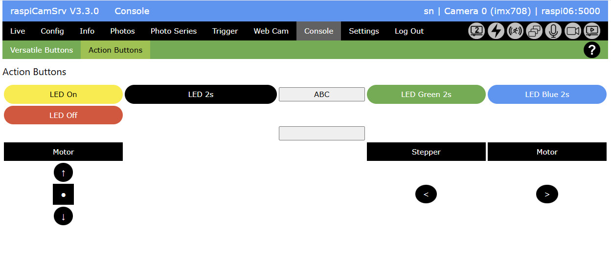

# Console - Action Buttons

This page shows buttons which have been configured in the [Settings / Action Buttons](./SettingsAButtons.md):

The example layout of this screenshot is based on the example configuration shown for the [Settings / Action Buttons](./SettingsAButtons.md) screen.

## Button Execution

When the [Action](./TriggerActions.md), configured for a button is executed, the behavior for the action is slightly different compared to invocation of an action on behalf of a [Trigger](./TriggerTriggers.md). 

- If a device is busy at the time when a button is pressed, the action is not executed. Instead a "Device busy" information is shown in the status line:    

- Also, the action is not executed in an own thread but synchronously, so that the user needs to wait for action completion which is confirmed in the message line.
