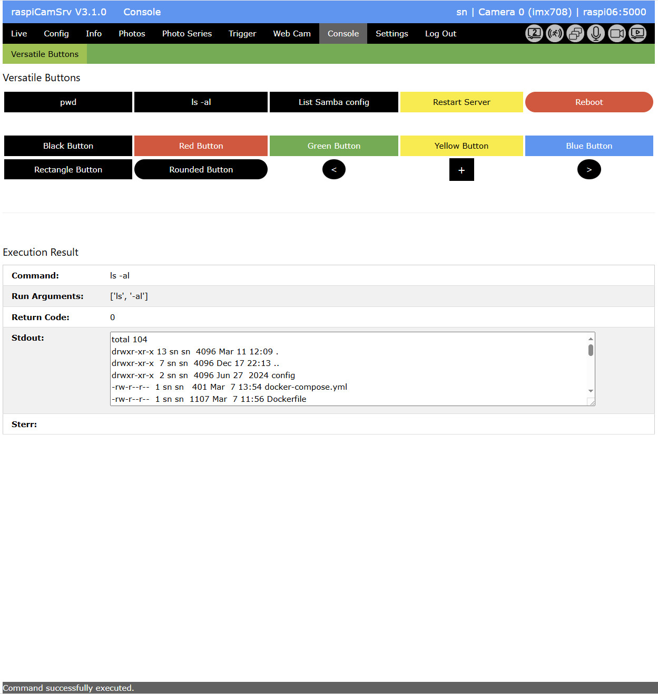
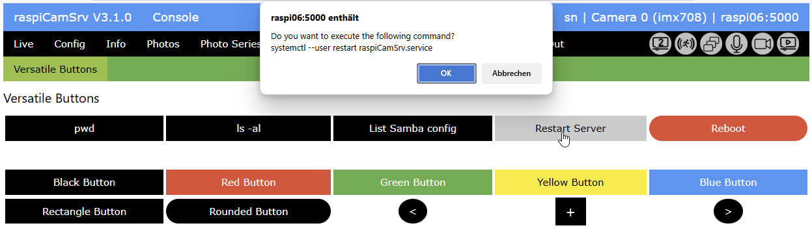

# Console - Versatile Buttons

This page shows buttons which have been configured in the [Settings / Versatile Buttons](./SettingsVButtons.md):

The example layout of this screenshot is based on the example configuration shown for the [Settings / Versatile Buttons](./SettingsVButtons.md) screen.

## Button Execution

When a button is clicked which is configured to require confirmation, a confirmation dialog is shown where execution can be refused:

## Execution Result

In the bottom part of the dialog the result of the command execution is shown:

- *Command* The command configured for the button.
- *Run Arguments* Command execution is done using the Python [subprocess.run](https://docs.python.org/3/library/subprocess.html) method which receives arguments as a list. This list is obtained by parsing the command string with spaces as separators.
- *Return Code* The return code returned from command execution.
- *Stdout* Output which command execution has sent to Stdout. Multiline output can be scrolled.
- *Stderr* Error information which command execution has sent to Stderr. Multiline output can be scrolled.
- Status Line The status line at the bottom shows whether the command could be executed or not, irrespective of errors which might have occurred during command execution.

The last *Execution Result* remains visible within the live time of the Flask server.

Of course, no result will be visible if the Flask server has been restarted or of the Raspberry Pi has been rebooted.

## Interactive Commandline

If the [Settings / Versatile Buttons](./SettingsVButtons.md) have declared the commandline to be interactive, commands can be directly entered on the commandline:

