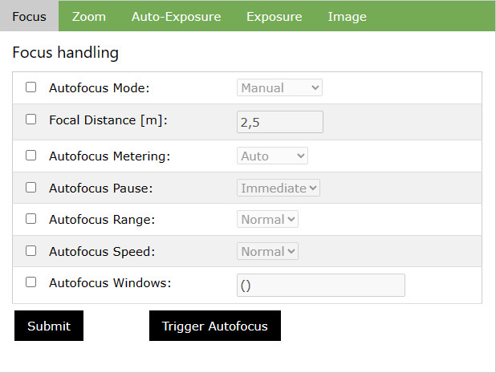
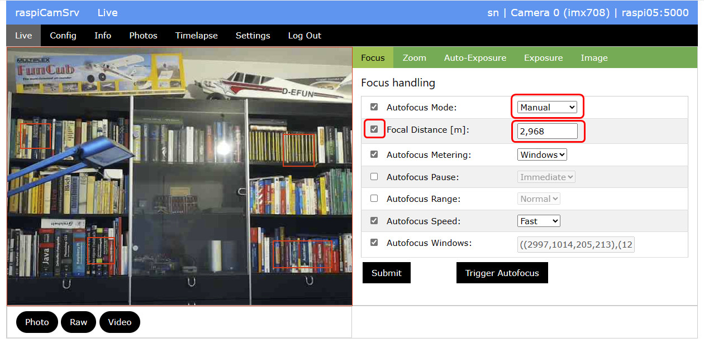
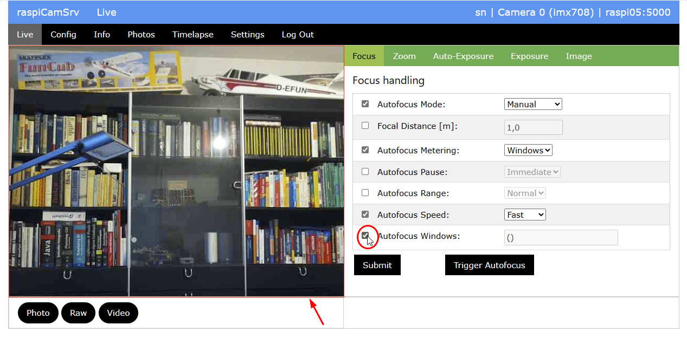
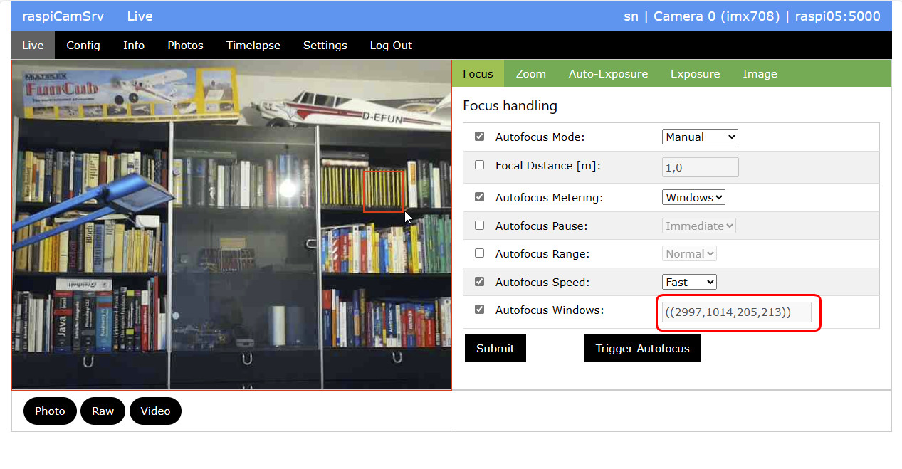
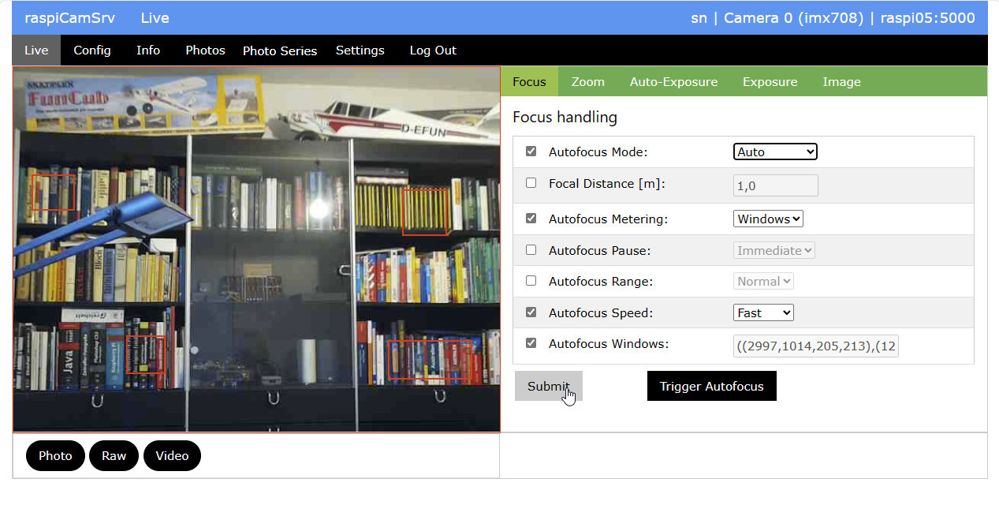

# raspiCamSrv Focus Handling

Focus handling is not supported by camera versions 1 and 2.

This tab includes various controls which affect the Auto Focus (AF) algorithm of the camera.

The **Autofocus Mode** can be set to "Manual", "Auto" or "Continuous"

## Manual Focus

When *Autofocus Mode* "Manual" is chosen, also the *Focal Distance* field must be activated and the distance must be set manually.

Pressing **Submit** will apply the setting to the live stream and the changed focus will be immediately visible.

## Continuous Focus

When *Autofocus Mode* is set to "Continuous", the camera will, after submitting, continuously try to focus under consideration of settings for other focus handling parameters.

## Automatic Focus

When *Autofocus Mode* is set to "Auto", the camera will automatically focus after an autofocus cycle has been triggered.

Before the cycle can be triggered through the **Trigger Autofocus** button, the settings must be applied with the **Submit** button.   

Submitting the "Auto" *Autofocus Mode* will have no effect on the live stream.

## Trigger Autofocus

The effect of the autofocus cycle will essentially depend on the settings for the other AF control parameters.

Whether or not the autofocus cycle was successful, will be shown in the message area at the bottom of the application window:

If the autofocus cycle was successful, **raspiCamSrv** will request metadata from the camera and determine the focal distance from the LensPosition.

The Value will be entered in the *Focal Distance* field, which will also be activated automatically.

Also, the *Autofocus Mode* will be automatically set to "Manual" so that the measured *Focal Distance* can be used for future photos.

## Autofocus Windows

These are rectangle areas within the image which will be used by the AF algorithm to focus.

Multiple rectangle areas can be specified.

**raspiCamSrv** supports graphical specification of these areas in the following way.

1. Activate the checkbox for *Autofocus Windows*.  
As result, a canvas will be drawn over the live stream area which is visible as thin red border:   
   
2. Now you can use the mouse to draw rectangles on this canvas:    
Position the cursor at one corner of the intended rectangle,   
press the left mouse button,    
and drag with mouse button down to the opposite corner.
3. When the mouse button is released, the rectangle coordinates will be scaled to the current scaler crop settings and entered in the *Autofocus Windows* field.  

4. If required, you can draw additional rectangles in the same way.   
While drawing rectangles, previously drawn rectangles will vanish without getting lost.
5. Finally, when the mouse pointer leaves the canvas area, all rectangles will be shown over the live stream area.   
   
**Don't forget to push Submit because otherwise, these settings will get lost!**
6. In order to remove all areas, just deactivate the *Autofocus Windows* checkbox and activate it again.

The canvas and the rectangles representing the AF Windows will remain visible as long as the *Autofocus Windows* checkbox is activated and whenever the *Focus* tab is visible.

