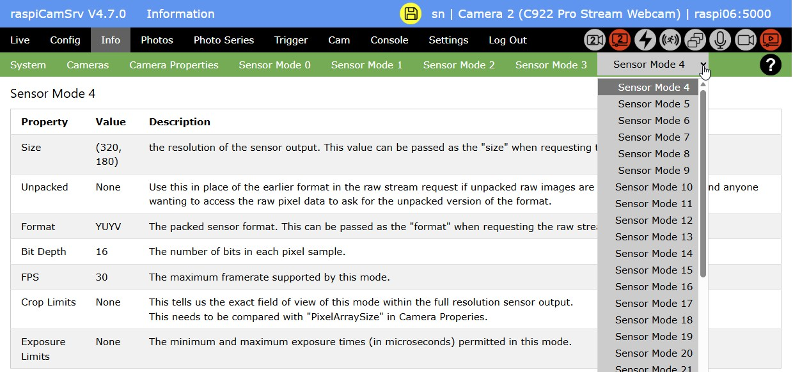

# raspiCamSrv Information on Camera System

[](./UserGuide.md)

This screen contains several tabs with information on the camera system:   
(When no cameras are connected, see [Info - No Cam](./Information_NoCam.md))

## Installed Cameras


### Raspberry Pi

This section shows information on the server hardware with *Model* and *Board Revision*

For the operating system, the kernel version (result of ```uname -r```), the Debian version (result of *Description* from ```lsb_release -a``` and ```cat /etc/debian_version```) and the system architecture (32-/64-bit) (result from ```dpkg-architecture --query DEB_HOST_ARCH```) are shown.

*Process Info* shows current process information for the raspiCamSrv server process (result of Linux ```ps -eLf``` command)
- *PID*: Process ID of Flask process (PID)
- *Start*: Process start time (STIME): either start time (HH:MM) at current day or day (MonDD) when process was started.
- *#Threads*: Number of threads (NLWP)
- *CPU Process*: CPU time of process (TIME for LWP == PID) in HH:MM:SS
- *CPU Threads*: Sum of CPU time for threads ((TIME for LWP != PID)) in %H:MM:SS

*FFmpeg Info* shows information on an ffmpeg process if encoding of .mp4 videos is currently active.   
Recording of .mp4 videos may have been [started manually](./Phototaking.md) or as an action within [motion capturing](./Trigger.md)

*raspiCamSrv Start* shows the time when the raspiCamSrv server has been started.   
At server start, raspiCamSrv checks whether or not the Raspberry Pi system time is synchronized with the time server.   
When the device is booted and raspiCamSrv is automatically started, the time synchronization will occasionally be done after the Flask server has already been started.    
In this case, in order to avoid timing issues, raspiCamSrv will wait at startup until time synchronization is completed.   
The time shown here is the system time at the moment when the check for time synchronization was successful.   
raspiCamSrv analyzes the output of command ```timedatectl``` to check the system clock synchronization status.    
If this check fails or times out (60 sec), raspiCamSrv will start nevertheless. In this case, the information "System time not synced at raspiCamSrv start" will be shown here.

### Camera x

The tab lists all cameras currently connected to the system.

Each camera has an identifying number (0, 1, ...) shown in the title above each parameter list.   
The assignment of camera number to physical camera may change when CSI cameras are plugged into a different CSI port (Pi 5) or when USB cameras are plugged into a different USB port.

When the server starts up, the first camera in the [list of cameras](#detection-of-cameras) is selected as active camera, unless a specific camera is activated when a [stored configuration](./SettingsConfiguration.md) is loaded at startup..

You may later switch to another camera on the [Settings](./Settings.md) screen or the [Multi Cam](./CamMulticam.md) screen

The active camera is indicated in the list.

The active camera will also be shown in the title bar of the application after log-in.

For USB cameras, the device through which the camera is accessible is also shown (See [Detection of Cameras](#detection-of-cameras)).

The information "(Not in use)" for a USB camera indicates that the camera has been detected by **raspiCamSrv** but it is not in use because USB cameras have been deactivated in the [Settings](./Settings_NoCam.md). In this case, the USB camera cannot be selected as active or second camera in the [Settings](./Settings.md) screen or the [Multi Cam](./CamMulticam.md) screen.

#### Status

*Current Status* shows the status of the camera:
- open / closed
- started / stopped
- current [Sensor Mode](#sensor-modes)   
This is only shown for the currently active camera if it is started.    
If the Sensor Mode cannot currently be determined, 'unknown' is shown.    
The Sensor Mode is usually automatically selected by the camera and normally corresponds to the largest [Stream Size](./Configuration.md#stream-size-width-height), requested by one of the [Camera Configurations](./Configuration.md).
- inactive<br>is shown for USB cameras which are currently not in use as active or second camera.
- excluded<br>is shown for a USB camera which is, in principle, available for being used with **raspiCamSrv**, but currently excluded in the [Settings](./Settings.md)
- not supported (OpenCV missing)<br>Is shown if a detected USB camera cannot be used within **raspiCamSrv** because OpenCV is not installed.

See [Camera Status and Number of Threads](#camera-status-and-number-of-threads)

Under *Tuning File*, you can see whether the Default or a custom tuning file are currently in use.    
See [raspiCamSrv Camera Tuning](./Tuning.md).

#### Camera connected but not in the list?

If you have a USB camera connected which does not show up in the list, you may have plugged in the camera while **raspiCamSrv** was running.   
In this case, you can use function [Reload Cameras](./SettingsConfiguration.md) to identify hot-plugged cameras.

### Streaming Clients


The tab lists the clients which are currently using one of the camera streams.   
Along with the IP address of the client, a list of streams is shown which the client is using:
- *live_view*<br> [The Live View](./LiveScreen.md) stream<br>indicated by [Process Status Indicator](./UserGuide.md#process-status-indicators) 
- *video_feed*<br>The [video Stream](./CamWebcam.md#video-stream) for the active camera<br>indicated by [Process Status Indicator](./UserGuide.md#process-status-indicators) 
- *video_feed2*<br>The [video Stream](./CamWebcam.md#video-stream) for the second camera, if available<br>indicated by [Process Status Indicator](./UserGuide.md#process-status-indicators) 

## Camera Properties


These are the properties of the camera which is currently active.

(See [Determining Camera Properties for USB Cameras](#determining-camera-properties-for-usb-cameras))


## Sensor Modes

The camera system advertises the supported Sensor Modes with their characteristics.

These are referred to within the [Camera Configuration](./Configuration.md).

The characteristics vor every Sensor Mode are shown on an individual tab:


USB cameras may advertise a large number of sensor modes. In this case, the remaining buttons for sensor mode selection can be found in a drop-down list:



## Camera Status and Number of Threads

The number of threads used by the server process depends on the status of the camera(s).

- When all cameras are closed, there is just the server process and, in case of Bookworm systems, 2 threads which are started with the import of Picamera2.    
Thus, there is a minimum of three threads (1 for Bullseye).
- Opening a camera starts additional threads which remain active while the camera is open.   
The number of threads may depend on the camera infrastructure specific for the operating system.
- Starting a camera and/or starting an encoder starts additional threads depending on the chosen camera function and encoder.
- **raspiCamSrv** also uses threads for background processes, such as live stream, video recording, photo series and motion detection. These ramain active while these processes are running.
- Stopping and closing a camera will also stop the dependent threads and thus reduce the number of active threads.
- If .mp4 video is currently recorded ([started manually](./Phototaking.md) or as an action within [motion capturing](./Trigger.md)), there will be an additional ffmpeg process with additional threads.
- In case of .mp4 video recording with H264Encoder and FfmpegOutput there seems to be an issue with threads:    
In this case, there may be threads surviving when the encoder is stopped (see [picamera2 Issue #1023](https://github.com/raspberrypi/picamera2/issues/1023)).   
So, when .mp4 videos have been recorded, the number of threads may not go down to 3 (1 for Bullseye) after all camaras have been closed.   
Experience shows that such threads may survive for a longer time but typically, they show only minor or no CPU utilization.   
Often, they vanish after the camera has been closed after live stream has stopped.

**raspiCamSrv** closes the camera in case it is not used:

- When the [live stream](./LiveScreen.md) stops after 10 seconds of inactivity, the camera used for the live stream will be stopped and closed.
- After [photos have been taken or videos have been recorded](Phototaking.md), the camera will be stopped and closed.
- For [Photo Series](./PhotoSeries.md), the camera will be stopped and closed after a shot if the interval to the next shot is >60 sec.   
This does not apply to [Exposure Series](./PhotoSeriesExp.md) and [Focus Stacks](./PhotoSeriesFocus.md).
- If [motion detection](./Trigger.md) is active, the live stream is kept activated which keeps the camera open and started.
- In case of [Stereo Vision](./CamStereo.md), the live streams for both cameras are kept active,

## Detection of Cameras

**raspiCamSrv** uses the ```Picamera2.global_camera_info()``` list (see [Picamera2 Manual](https://datasheets.raspberrypi.com/camera/picamera2-manual.pdf), ch. 8.7) to identify the currently connected cameras.

For each camera, the information provided by Picamera2 includes

- ```Num```: The camera number by which a camera is identified within Picamera2 as well as in raspiCamSrv.
- ```Model```: The model name of the camera, as advertised by the camera driver
- ```Location```: A number reporting how the camera is mounted, as reported by libcamera.
- ```Rotation```: How the camera is rotated for normal operation, as reported by libcamera
- ```ID```: An identifier string for the camera, indicating how the camera is connected. <br>You can tell from this value whether the camera is accessed using I2C or USB.

 ## Identification of USB Cameras

 A camera is identified as USB camera, if ```usb``` is found in the ```ID```.

 In **raspiCamSrv**, USB cameras are accessed through [OpenCV](https://opencv.org/) rather than through Picamera2, which provides only very limited support for USB cameras.

 However, with OpenCV, a camera cannot by accessed through the Picamera2 camera number (```Num```).    
 Instead, the ```/dev/videoX``` of the Linux kernel must be used.

 For mapping of the Picamera2 camera number (```Num```) to the device number, **raspiCamSrv** uses the following algorithm:

 Assuming that the ```ID``` is structured in the following way:

 e.g.:   
 ```/base/axi/pcie@1000120000/rp1/usb@200000-2:1.0-046d:085c```

 | Component                       | Meaning 
 |---------------------------------|------------
 | ```/base/axi/pcie@1000120000``` | Root of the system-on-chip’s PCIe controller
 | ```/rp1/usb@200000```           | The RP1 I/O controller’s USB host controller (i.e. USB root hub)
 | ```-2:1.0```                    | USB device address and interface: port 2, interface 1.0
 | ```-046d:085c```                | Vendor ID : Product ID (046d = Logitech, 085c = C922 Pro Stream Webcam)

 Now, with Video for Linux (V4L2), we can list all video devices:

 ```v4l2-ctl --list-devices``` reveals, for example:

 ```
 ...
rpi-hevc-dec (platform:rpi-hevc-dec):
        /dev/video19
        /dev/media1

Logi 4K Stream Edition (usb-xhci-hcd.0-1):
        /dev/video2
        /dev/video3
        /dev/video4
        /dev/video5
        /dev/media4

C922 Pro Stream Webcam (usb-xhci-hcd.0-2):
        /dev/video0
        /dev/video1
        /dev/media3
 
 ```

Each header within the list shows the camera's model and port (```(usb-xhci-hcd.0-2)``` indicates port 2)

Now, by mapping model and port from the Picamera2 ```ID``` with corresponding information from ```v4l2-ctl```, we can identify the group for each USB camera.

The first entry in the list of devices for this group is assigned to the camera number, assuming that this represents the main camera stream, whereas subsequent entries are for alternative functions.

## Determining Camera Properties for USB Cameras

Whereas camera properties of CSI cameras are directly provided by Picamera2 (see [Picamera2 Manual](https://datasheets.raspberrypi.com/camera/picamera2-manual.pdf), Appendix D), this is not the case for USB cameras.

**raspiCamSrv** maps properties of USB cameras as far as possible to the Picamera2 datastructure for seamless integration of USB cameras.

The USB camera properties are determined with the v4l2 through (e.g.):

```v4l2-ctl --device=/dev/video12 --all```

giving:

```
Driver Info:
        Driver name      : uvcvideo
        Card type        : C922 Pro Stream Webcam
        Bus info         : usb-xhci-hcd.0-2
        Driver version   : 6.12.47
        Capabilities     : 0x84a00001
                Video Capture
                Metadata Capture
                Streaming
                Extended Pix Format
                Device Capabilities
        Device Caps      : 0x04200001
                Video Capture
                Streaming
                Extended Pix Format
Media Driver Info:
        Driver name      : uvcvideo
        Model            : C922 Pro Stream Webcam
        Serial           : A9382BFF
        Bus info         : usb-xhci-hcd.0-2
        Media version    : 6.12.47
        Hardware revision: 0x00000016 (22)
        Driver version   : 6.12.47
Interface Info:
        ID               : 0x03000002
        Type             : V4L Video
Entity Info:
        ID               : 0x00000001 (1)
        Name             : C922 Pro Stream Webcam
        Function         : V4L2 I/O
        Flags            : default
        Pad 0x01000007   : 0: Sink
          Link 0x0200001f: from remote pad 0x100000a of entity 'Processing 3' (Video Pixel Formatter): Data, Enabled, Immutable
Priority: 2
Video input : 0 (Camera 1: ok)
Format Video Capture:
        Width/Height      : 640/480
        Pixel Format      : 'YUYV' (YUYV 4:2:2)
        Field             : None
        Bytes per Line    : 1280
        Size Image        : 614400
        Colorspace        : sRGB
        Transfer Function : Rec. 709
        YCbCr/HSV Encoding: ITU-R 601
        Quantization      : Default (maps to Limited Range)
        Flags             :
Crop Capability Video Capture:
        Bounds      : Left 0, Top 0, Width 640, Height 480
        Default     : Left 0, Top 0, Width 640, Height 480
        Pixel Aspect: 1/1
Selection Video Capture: crop_default, Left 0, Top 0, Width 640, Height 480, Flags:
Selection Video Capture: crop_bounds, Left 0, Top 0, Width 640, Height 480, Flags:
Streaming Parameters Video Capture:
        Capabilities     : timeperframe
        Frames per second: 30.000 (30/1)
        Read buffers     : 0

User Controls

                     brightness 0x00980900 (int)    : min=0 max=255 step=1 default=128 value=128
                       contrast 0x00980901 (int)    : min=0 max=255 step=1 default=128 value=128
                     saturation 0x00980902 (int)    : min=0 max=255 step=1 default=128 value=128
        white_balance_automatic 0x0098090c (bool)   : default=1 value=1
                           gain 0x00980913 (int)    : min=0 max=255 step=1 default=0 value=0
           power_line_frequency 0x00980918 (menu)   : min=0 max=2 default=2 value=2 (60 Hz)
                                0: Disabled
                                1: 50 Hz
                                2: 60 Hz
      white_balance_temperature 0x0098091a (int)    : min=2000 max=6500 step=1 default=4000 value=4000 flags=inactive
                      sharpness 0x0098091b (int)    : min=0 max=255 step=1 default=128 value=128
         backlight_compensation 0x0098091c (int)    : min=0 max=1 step=1 default=0 value=0

Camera Controls

                  auto_exposure 0x009a0901 (menu)   : min=0 max=3 default=3 value=3 (Aperture Priority Mode)
                                1: Manual Mode
                                3: Aperture Priority Mode
         exposure_time_absolute 0x009a0902 (int)    : min=3 max=2047 step=1 default=250 value=250 flags=inactive
     exposure_dynamic_framerate 0x009a0903 (bool)   : default=0 value=1
                   pan_absolute 0x009a0908 (int)    : min=-36000 max=36000 step=3600 default=0 value=0
                  tilt_absolute 0x009a0909 (int)    : min=-36000 max=36000 step=3600 default=0 value=0
                 focus_absolute 0x009a090a (int)    : min=0 max=250 step=5 default=0 value=0 flags=inactive
     focus_automatic_continuous 0x009a090c (bool)   : default=1 value=1
                  zoom_absolute 0x009a090d (int)    : min=100 max=500 step=1 default=100 value=100

```

By parsing this information, relevant data for camera properties can be retrieved and mapped to camera property elements.

The ```PixelArraySize``` is determined as the maximum size of the Sensor Modes found (see [below](#determining-sensor-modes-for-usb-cameras))


## Determining Sensor Modes for USB Cameras

Whereas sensor modes of CSI cameras are directly provided by Picamera2 (see [Picamera2 Manual](https://datasheets.raspberrypi.com/camera/picamera2-manual.pdf), ch. 4.2.2.3), this is not the case for USB cameras.

**raspiCamSrv** maps video formats of USB cameras as far as possible to the Picamera2 sensor mode datastructure for seamless integration of USB cameras.

The USB camera video formats are determined with the v4l2 through (e.g.):

```v4l2-ctl --device=/dev/video12 --list-formats-ext```

giving:

```
ioctl: VIDIOC_ENUM_FMT
        Type: Video Capture

        [0]: 'YUYV' (YUYV 4:2:2)
                Size: Discrete 640x480
                        Interval: Discrete 0.033s (30.000 fps)
                        Interval: Discrete 0.042s (24.000 fps)
                        Interval: Discrete 0.050s (20.000 fps)
                        Interval: Discrete 0.067s (15.000 fps)
                        Interval: Discrete 0.100s (10.000 fps)
                        Interval: Discrete 0.133s (7.500 fps)
                        Interval: Discrete 0.200s (5.000 fps)
                Size: Discrete 160x90
                        Interval: Discrete 0.033s (30.000 fps)
                        Interval: Discrete 0.042s (24.000 fps)
                        Interval: Discrete 0.050s (20.000 fps)
                        Interval: Discrete 0.067s (15.000 fps)
                        Interval: Discrete 0.100s (10.000 fps)
                        Interval: Discrete 0.133s (7.500 fps)
                        Interval: Discrete 0.200s (5.000 fps)
...

                Size: Discrete 2304x1536
                        Interval: Discrete 0.500s (2.000 fps)
        [1]: 'MJPG' (Motion-JPEG, compressed)
                Size: Discrete 640x480
                        Interval: Discrete 0.033s (30.000 fps)
                        Interval: Discrete 0.042s (24.000 fps)
                        Interval: Discrete 0.050s (20.000 fps)
                        Interval: Discrete 0.067s (15.000 fps)
                        Interval: Discrete 0.100s (10.000 fps)
                        Interval: Discrete 0.133s (7.500 fps)
                        Interval: Discrete 0.200s (5.000 fps)
...

                Size: Discrete 1920x1080
                        Interval: Discrete 0.033s (30.000 fps)
                        Interval: Discrete 0.042s (24.000 fps)
                        Interval: Discrete 0.050s (20.000 fps)
                        Interval: Discrete 0.067s (15.000 fps)
                        Interval: Discrete 0.100s (10.000 fps)
                        Interval: Discrete 0.133s (7.500 fps)
                        Interval: Discrete 0.200s (5.000 fps)

```

From this output the list of sensor modes is generated with information on Size and Format.

The FPS, stored for each sensor mode is the maximum value of fps found for each format.