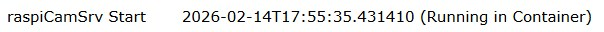

# raspiCamSrv Info/System Information

[](./Information.md)

This screen shows information on the Raspberry Pi system as well as on the software stack required by raspiCamSrv.


### Hardware and OS

This section shows information on the server hardware and operating system

- *Model*   
Raspberry Pi model frpm ```/proc/device-tree/model```
- *Board Revision*    
Board revision from ```/proc/cpuinfo```
- *Kernel Version*    
Kernel Version as reported by ```uname -r```
- *Debian Version*    
Information on the operating system:    
.. *Description* from ```lsb_release -a```   
.. *Version* from ```/etc/debian_version```   
.. 32-bit/64-bit from ```dpkg-architecture --query DEB_HOST_ARCH```

### Processes

This section informs about active processes related to raspiCamSrv.


#### Environment

shows whether the raspiCamSrv server process is running

- directly on the "Host System"
- or in a "Docker Container"

#### Server Process

shows how the server process has been started:

- "Server started via systemd system service"     
in this case, audio cannot be recorded along with video.
- "Server started via systemd user service"    
in this case, audio can be recorded along with video.
- "Server started via command line"

#### WSGI Server

raspiCamSrv is based on [Flask](https://flask.palletsprojects.com/en/stable/), which is a WSGI (Web Server Gateway Interface) application.    
A WSGI server is required to run the application. 

The server which is currently active is shown here.

Standard [raspiCamSrv installations](./installation.md) support the following alternatives:   

- *gunicorn*    
[Gunicorn](https://gunicorn.org/) is a mature, stable and widely used WSGI server for production use.     
For Gunicorn, also the number of threads, configured for the worker process, are shown.     
The number of threads limit the number of simultaneous MJPEG streams (See [Gunicorn Settings](./installation_man.md#gunicorn-settings)).
- *werkzeug*    
[Werkzeug](https://werkzeug.palletsprojects.com/en/stable/) is the WSGI server integrated in Flask for development and testing purposes.    
On start, a warning is shown:   
```Do not use it in a production deployment. Use a production WSGI server instead.```

#### Process Info

shows current process information for the raspiCamSrv server process (result of Linux ```ps -eLf``` command)

- *PID*   
Process ID of WSGI server running Flask.    
In case of *werkzeug*, there is just one process.    
For *gunicorn*, there are two processes, where the first is the Master process with typically 2 threads which control a single worker process (restricted through ```-w 1``` option at startup) which is running the Flask application.
- *Start*    
Process start time (STIME): either start time (HH:MM) at current day or day (MonDD) when process was started.
- *#Threads*    
Number of threads (NLWP)
- *CPU Process*    
CPU time of process (TIME for LWP == PID) in HH:MM:SS
- *CPU Threads*    
Sum of CPU time for threads ((TIME for LWP != PID)) in %H:MM:SS

#### FFmpeg Info

shows information on an ffmpeg process if encoding of .mp4 videos is currently active.

Recording of .mp4 videos may have been [started manually](./Phototaking.md) or as an action within [motion capturing](./Trigger.md)

#### raspiCamSrv Start

shows the time when the raspiCamSrv server has been started.

At server start, raspiCamSrv checks whether or not the Raspberry Pi system time is synchronized with the time server.   
When the device is booted and raspiCamSrv is automatically started, the time synchronization will occasionally be done after the Flask server has already been started.    
In this case, in order to avoid timing issues, raspiCamSrv will wait at startup until time synchronization is completed.   
The time shown here is the system time at the moment when the check for time synchronization was successful.

raspiCamSrv analyzes the output of command ```timedatectl``` to check the system clock synchronization status.    
If this check fails or times out (60 sec), raspiCamSrv will start nevertheless.    
In this case, the information "System time not synced at raspiCamSrv start" will be shown here.

If the server is running in a Docker container (see [Running raspiCamSrv as Docker Container](./SetupDocker.md)), the time is assumed to be synchronized and the check will be skipped.     
This is indicated through     



### Software Stack

In this section, information on installed packages is shown. 

- *Ver*    
is the package version
- *Loc*    
is the path from which the packages were loaded.

### Streaming Clients


The tab lists the clients which are currently using one of the camera streams.   
Along with the IP address of the client, a list of streams is shown which the client is using:

- *live_view*<br> [The Live View](./LiveScreen.md) stream<br>indicated by [Process Status Indicator](./UserGuide.md#process-status-indicators) 
- *video_feed*<br>The [video Stream](./CamWebcam.md#video-stream) for the active camera<br>indicated by [Process Status Indicator](./UserGuide.md#process-status-indicators) 
- *video_feed2*<br>The [video Stream](./CamWebcam.md#video-stream) for the second camera, if available<br>indicated by [Process Status Indicator](./UserGuide.md#process-status-indicators) 

