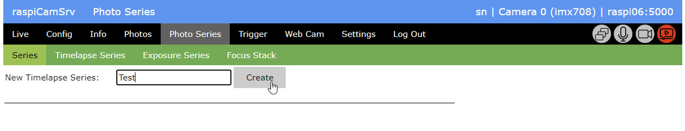
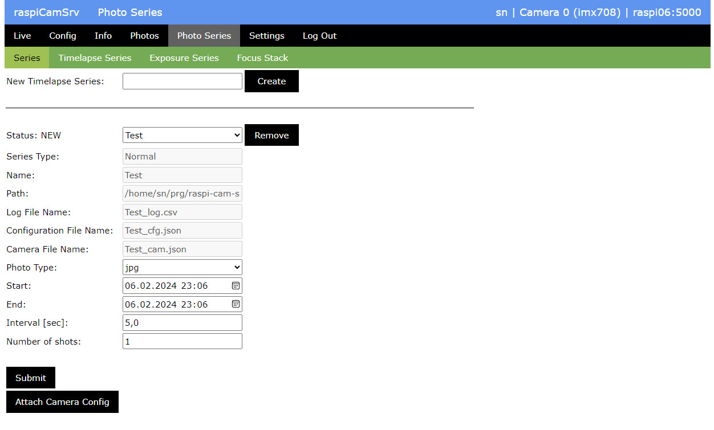
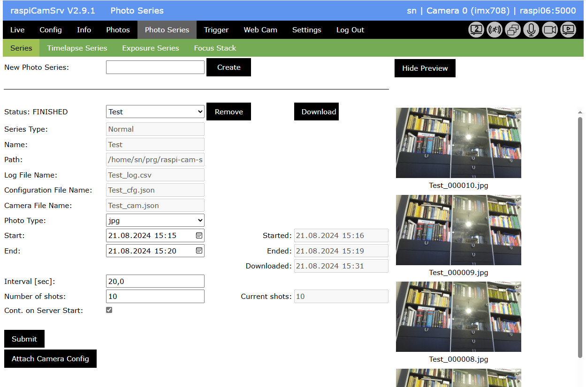
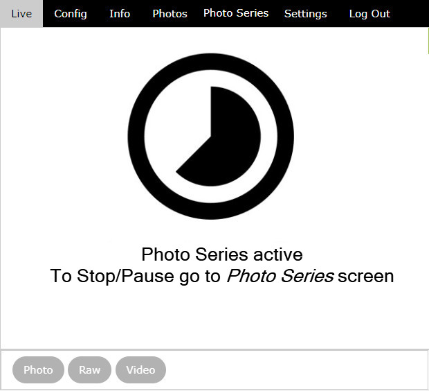
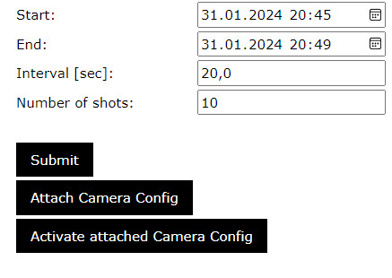
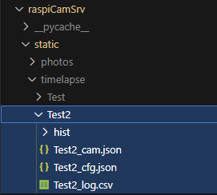
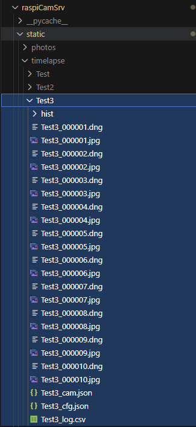
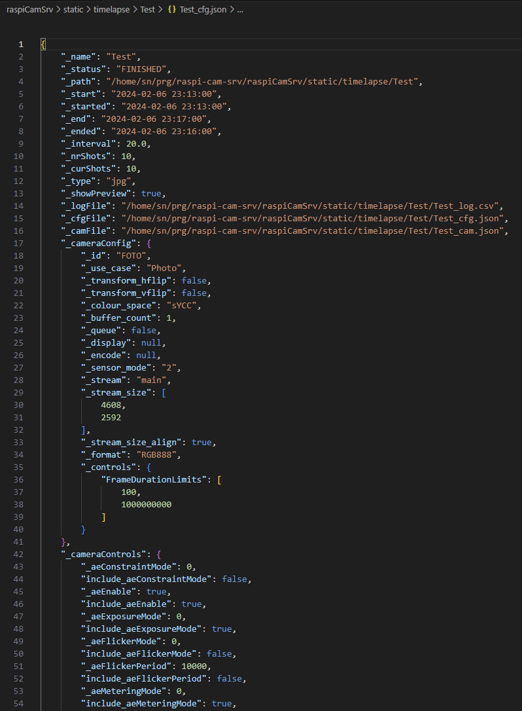
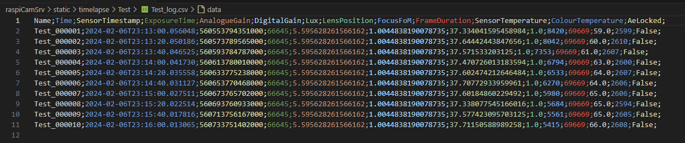
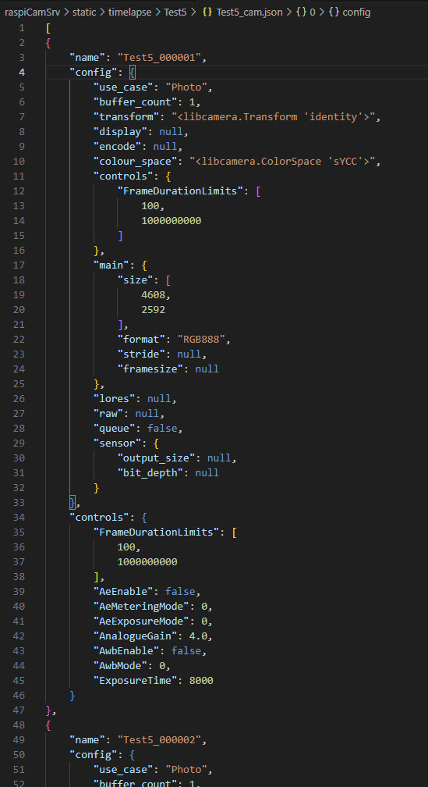

# raspiCamSrv Photo Series

[](./UserGuide.md)


The *Photo Series* screen allows the management of different kinds of Photo Series and includes means for series configuration, lifecycle management, photo shooting and supervision.   
A series is a sequence of photos taken with specific time intervals. Special kinds of series are [Timelapse Series](./PhotoSeriesTimelapse.md), [Exposure Series](./PhotoSeriesExp.md) and [Focus Stacks](./PhotoSeriesFocus.md).


## Creation of a new Series

When the *Photo Series* screen is opened for the first time, it offers the option to create a new series:



You need to enter a unique name for the series. Since the name will be used as folder name and as part of the filename for photos, you need to consider any restrictions for systems where you want to store and process these files.

Linux is quite tolerant in this aspect but it is recommended using only letters, numbers and underscore characters.

## Series Configuration

When a series is initially created, some parameters are predefined which later need to be configured:



- The lifecycle of a Photo Series is represented as its **Status**.   
Transitions between different states can be initiated by one or two buttons at the right of the series selection combo box.   
For details see the [Series State Chart](#photo-series-state-chart).
- If multiple series have been created, the **active series** can be selected with a combo box showing the series names.
- The *Series Type* distinguishes "Normal" series without special characteristics from specialized series, such as "Exposure Series", "Focus Stacks" or "Timelapse Series".
- The *Path* is the path where all resources for the series are located.   
For details see [Photo Series in the File System](#photo-series-in-the-file-system)
- The system has also initialized a [Series Configuration File](#series-configuration-file) a [Series Log File](#series-log-file) and a [Camera Settings File](#series-camera-file).
- In addition, a "hist" subdirectory has been created where histogram images will be stored (currently only for *Exposure Series*).
- Under *Photo Type*, it can be selected whether only ```jpg``` or ```raw+jpg``` photos shall be taken.
- The *Start* time is initiated with the current time.   
This needs to be set to the time when the series shall start.
- The *End* time can be set explicitly if a specific end time is required.   
If this is done, the number of shots will be calculated based on the specified *Interval*
- As *Interval* , the time difference (in seconds) between successive shots can be specified.   
From experience, the system will observe the given value within a tolerance of about 30 ms.
- *On Dial Marks* specifies whether the shots shall be taken on whole hours, quarters, minutes, ..., depending on the intarval.<br>For example, if the interval is 900 sec, photos will be taken exactly (within tolerances) at :00, :15, :30, :45, or if the interval is 3600 sec, photos will be taken every full hour.
- The *Number of Shosts* specifies the numper of photos intended for the series.   
If the *End* time has not been explicitly specified, it will be calculated from *Interval* and *Number of Shots* considering the specified *Start* time.
- The checkbox *Cont. on Server Start* allows to automatically continue an active series in case of a server restart.    
Such a situation may happen if the server is stopped (explicitly or implicitly with a device shutdown) while a series is active.    
For example, if you have a long running timelapse series, there might be power outages forcing a system reboot. If you have set the series to automatic continuation it will be continued as soon as the server is restarted. Otherwise, it will be in status PAUSED.   
Automatic continuation is not used for [Exposure Series](./PhotoSeriesExp.md) or [Focus Stack](./PhotoSeriesFocus.md) series because these series are typically not running for a longer time.

After the values have been entered, pressing the *Submit* button will calculate dependent parameters an change the [status](#photo-series-state-chart) of the series to "READY".

**For Photo Series of type [Exposure Series](./PhotoSeriesExp.md), [Focus Stack](./PhotoSeriesFocus.md) and [Timelapse Series](./PhotoSeriesTimelapse.md), additional configurations are required.**

## Series Start

A series in state "READY" can be started with the *Start* button.   
This will execute the following steps:

1. Set the status to "ACTIVE"
2. Configure the camera with the active [Configuratien](./Configuration.md) for "Photo" or "Raw Photo", depending on the selected *Photo Type*
3. Apply the active [Camera Controls](./CameraControls.md)<br>For [Exposure Series](./PhotoSeriesExp.md) and [Focus Stack](./PhotoSeriesFocus.md), specific controls will be adjusted or varied for each photo.
4. Start the camera
5. Wait until the start time
6. Execute the necessary capture request (jpg, dng, metadata)
7. Store the metadata in the [Series Log File](#series-log-file)
8. Store the camera configuration as well as the controls parameters, which have been applied before request execution, in the [Camera Settings File](#series-camera-file)
9. Wait until the next interval and repeat steps from 6. until either the configured *Number of Shots* or the configured *End* time has been reached.
10. Finally, the series status will be "FINISHED".

While the series is "ACTIVE", this is shown by the Series status indicator and the screen will show the progress:


In the *Preview* area, the time for the next photo to be taken is shown and the progress bar shows the time remaining.

When the photo time is reached, the page will be reloaded and the latest photo will be shown on top. The last 20 photos are available in the scroll area.

## Downloading a Series

A series can be downloaded at any time after it has been created.

Whether or not a series has been downloaded is shown under *Downloaded* which is either "Never" or the time of the last download.   

Pushing the *Download* button will require a confirmation before download will be executed.

The download will be named ```raspiCamSrvSeries_<name>_<YYYYMMDDHHMMSS>``` with the timestamp of the download.

The download is a zip archive including the entire folder structure of the series (see [Photo Series in the File System](#photo-series-in-the-file-system)):

- All photos taken until the time of download
- The [Series Cofiguration file](#series-configuration-file)
- The [Series Camera File](#series-camera-file) (which will be empty if no camera configuration has been attached to the series)
- The [Series Log File](#series-log-file) (which will be empty if the series has not yet been started)
- A subfolder ```hist``` containing histograms, in case the series has been an [Exposure Series](./PhotoSeriesExp.md)


## Finished Series

When a series has ended or after it has been actively finished with the *Finish* button, its status is shown as "FINISHED":



If the series has been downloaded after it had ended, can be seen by comparing the respective timestamps.

## Live Stream

### Active Live Stream

If the [Configuration](./Configuration.md) for the *Photo* and *Raw Photo* use cases are compliant with the configuration for *Live View*, the Live Stream will not be interrupted while the series is ACTIVE.    
For more details, see [raspiCamSrv Tasks and Background Processes](./Background%20Processes.md)

Simultaneous activity of Live Stream and Photo Series is indicated by the process status indicators:


If the series is an [Exposure Series](./PhotoSeriesExp.md) or a [Focus Stack](./PhotoSeriesFocus.md) Series, [Camera Controls](./CameraControls.md) will be modified while the series is active.    
*Auto Exposure* and *Auto White Balance* will be deactivated and other parameters, such as *Exposure Time*, *Analogue Gain* or *Focal Distance*/*Lens Position* will vary from photo to photo.   
These variations will be visible in the Live Stream.

After the series is FINISHED, the original control parameters will be restored.

### Paused Live Stream

If the Live Stream is paused because photo taking requires exclusive camera access because of specific [Configuration](./Configuration.md) (see [raspiCamSrv Tasks and Background Processes](./Background%20Processes.md)), this is indicated by the process status indicators:

    
and a placeholder image will be schown instead of the Live Stream:




## Interrupting an ACTIVE Series

While a Photo Series is ACTIVE, photo- and video taking is disabled:


The thread in which the Photo Series is executed, checks every 2 seconds whether a request to pause or stop has been issued.

If the series shall be paused and (possibly) continued later, the *Pause* button in the *Series* screen can be used.

If the series shall be interrupted and terminated, the *Finish* button can be used.

## Attaching Camara Configuration to a Photo Series

Before a Photo Series is started, normally the camera [configuration](./Configuration.md) and [controls](./CameraControls.md) will manually be adjusted for optimal photo quality.

These settings (configuration **and** controls) can be attached to a Photo Series with the *Attach Camera Config* button.

These will be persisted in the [series configuration file](#series-configuration-file)

If this has been done, the system offers to activate these settings at a later time:



So, if another series shall be run with the same or a similar setup, the camera configuration and control settings can be reused after they have been activated.

This feature can also be used to persist specific settings under an indicative name (the series name), also if it is not intended to really run such a series.


## Photo Series State Chart


## Photo Series in the File System

All resources related to a Photo Series are stored in the file system under    
```/home/<user>/prg/raspi-cam-srv/RaspiCamSrv/static/photoseries/<name>```   
where \<user> is the user ID specified during [system setup](../README.md#system-setup) and \<name> is the name of the series.

After [Creation of a new Series](#creation-of-a-new-series), the folder has been created and a [Series Configuration File](#series-configuration-file), a [Series Log File](#series-log-file) and a [Series Camera File](#series-camera-file) have been initiated:

.

After the series has been [started](#series-start), also all photos (.jpg) and, if selected, also the raw photos (.dng) can be found in this folder:

.

Typically, photo series will be processed on another system, especially if they have been taken with a Raspberry Pi Zero system.   
**RaspiCamSrv** does not provide any means to download or transfer these data. There are numerous tools to achieve this (e.g. scp, Samba)

### Series Configuration File

The file ```<name>_cfg.json``` contains the entire configuration of a series, including, if attached, the camera configuration and camera controls.



When the server starts up, all folders under ```.../photoseries``` are searched for a configuration file and series configurations are created from their contents. These will then be available in the **raspiCamSrv** *Photo Series* dialog.

### Series Log File

The file ```<name>_log.csv``` contains log entries for each photo of the series:



Bisides the name of the photo and the time of creation, the most important metadata are included which have been captured in the same request as the Raw Photo and / or jpg Photo.

### Series Camera File

The file ```<name>_cam.json``` contains a JSON structure with the [camara configuration](./Configuration.md) and the [camera controls](./CameraControls.md) applied for each photo of the series. This is available only for [Exposure Series](./PhotoSeriesExp.md) and [Focus Stack Series](./PhotoSeriesFocus.md).

