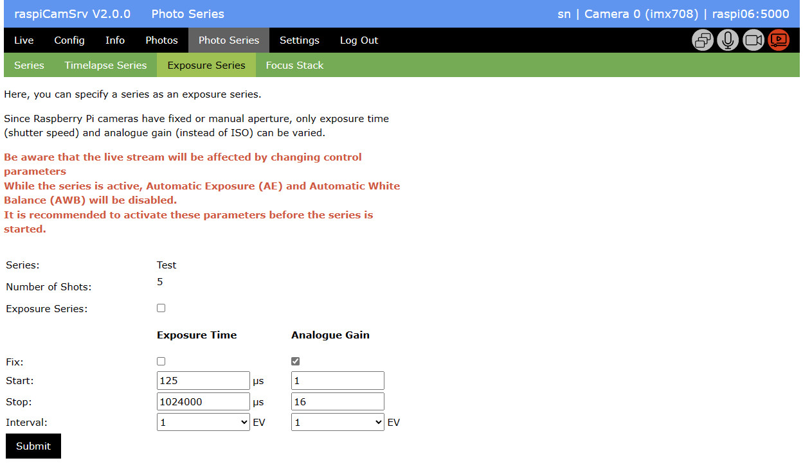
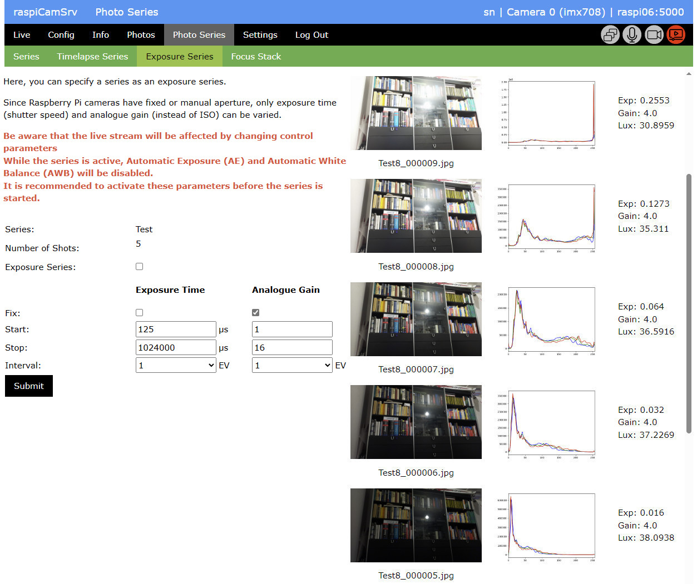

# Photo Series of type "Exposure Series"

Exposure series iterate through a specified range of an exposure parameter, keeping all other exposure parameters constant.   
In general, exposure is controlled by three parameters: aperture, exposure time and ISO value.   

Raspberry Pi cameras have a fixed or manually controlled aperture and ISO values are not standardized.   
Instead of ISO values, the Analogue gaing can be set. Roughly, the relation is *ISO* = 100 * *AnalogueGain*.

The *Exposure Series* subdialog allows specifying necessary parameters for series where either *Exposure Time* or *Analogue Gain* is varied.

The dialog references the active Photo Series which is managed in the [Series](./PhotoSeries.md) subdialog of the *Photo Series* dialog.

The *Number of Shots* is shown here, because it will be affected by the chosen *Start*, *Stop* and *Interval* values.

To configure the active Photo Series as *Exposure Series*, proceed as follows

1. Activate the *Exposure Series* checkbox
2. Select the exposure parameter which shall be kept at a fixed value by checking one of the check boxes under *Exposure Time* or *Analogue Gain*
3. For the selected parameter, enter the intended value in the *Start* field.
4. Now, specify *Start* and *Stop* values for the variable parameter
5. The interval is specified in terms of photographic [Exposure Values](https://en.wikipedia.org/wiki/Exposure_value) (EV) With a value of 1/3 EV the series is obtained by multiplying the last value of *Exposure Time* or *Analogue Gain* by 2**(1/3) to get the next value. With a value of 1 EV, the factor is 2**(1)=2 and with 2 EV, the factor is 2**(2)=4. 1/3 EV is the typical raster value for commercial cameras when modifying either aperture, exposure time or ISO.

Finally push the **Submit** button to store the specified value.   
This will recalculate the *Number of Shots* required for the series.

To start photoshooting, go to the [Series](./PhotoSeries.md) subdialog 

## Result

After the series has finished, the results can be inspected on the *Exposure Series* subscreen:

Together with each photo, the screen shows a histogram and characteristic metadata:
- Exp: Exposure Time in seconds
- Gain: Analogue Gain
- Lux: An estimation of the brightness

More information can be gained from 
- the [Series Camera File](./PhotoSeries.md#series-camera-file) which lists the configuration and control parameters applied before shooting a photo
- the [Series Log File](./PhotoSeries.md#series-log-file) which lists the metadata captured together with each photo.

## Parameter Table (1/3 EV)

The following table contains  systematic values for Exposure Time and Analogue Gain with 1/3 EV, corresponding roughly to commercial camera settings

## Parameter Taple (1 EV)

The following table contains  systematic values for Exposure Time and Analogue Gain with 1 EV, corresponding roughly to commercial camera settings

