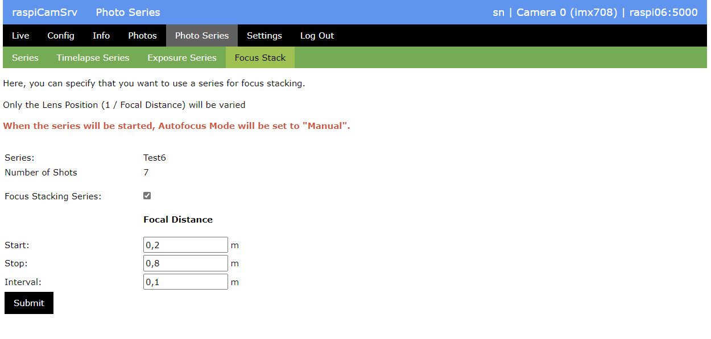
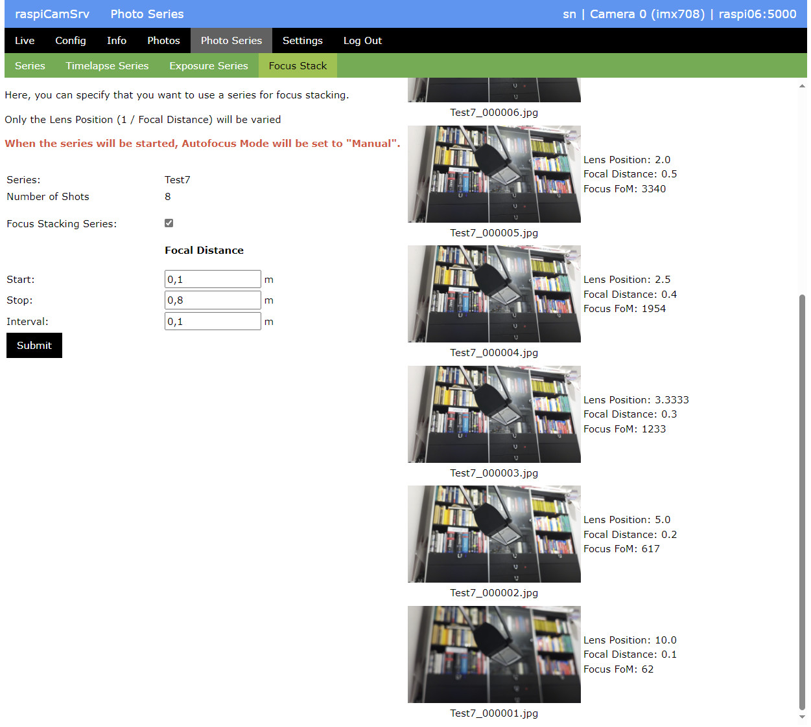

# Photo Series of Type "Focus Stack"

A Focus Stack series iterates the Lens Position (or Focal Distance).   
With suitable software, such a stack can be combined to achieve a large Depth of Field (DoF).

To create a focus stack, you can proceed as follows:

1. In the [Live Screen](./LiveScreen.md) use [Focus Handling](./FocusHandling.md) to determine the Focal Distance for the nearest and the furthest point of the scene.
2. After initializing a Photo Series in the [Series](./PhotoSeries.md) subscreen, open the *Photo Stack* subscreen and check *Focus Stacking Series*
3. Then enter the nearest and furthest Focal Distance as *Start* and *Stop* values and choose a suitable *Interval*
4. Push **Submit** to configure the series
5. In the [Series](./PhotoSeries.md) subscreen, start the Photo Series

The result will be shown in the *Focus Stack* subdialog:

Together with each photo, characteristic metadata are shown:
- The *Lens Position* with which the photo was taken (reciprocal of Focal Distance)
- The *Focal Distance* which was varied within the series
- The *Focus FoM*, a Figure of Merit (FoM) to indicate how in-focus the frame is. A larger FocusFoM value indicates a more in-focus frame.

More information can be gained from 
- the [Series Camera File](./PhotoSeries.md#series-camera-file) which lists the configuration and control parameters applied before shooting a photo
- the [Series Log File](./PhotoSeries.md#series-log-file) which lists the metadata captured together with each photo.
