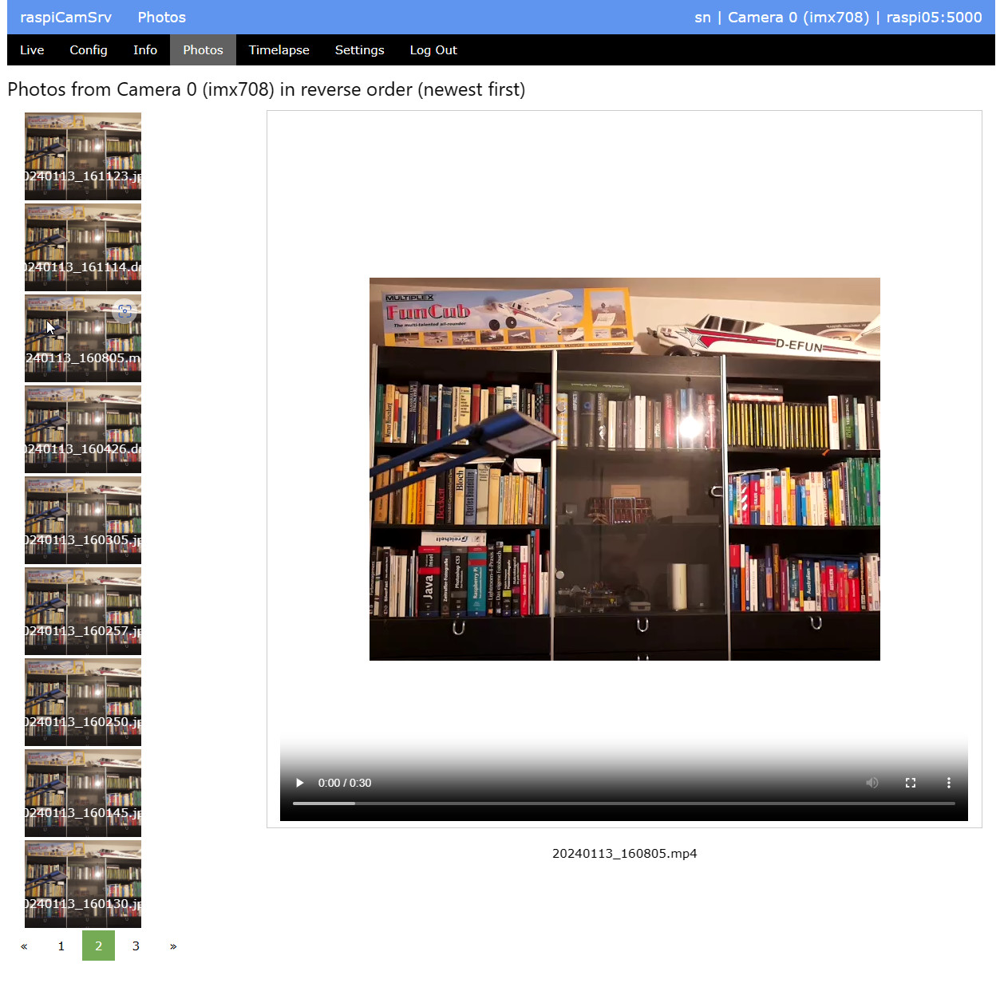

# raspiCamSrv Photo Viewer

[](./UserGuide.md)

All photos, raw photos or videos taken wit **raspiCamSrv** are stored in a camera-specific folder on the server.

Currently, the folder is located within the folder where Flask expects static content    
(```~/home/prgraspi-cam-srv/raspiCamSrv/static/photos/camera_n``` (n=0, 1)).   
The full path of the folder for the active camera is shown in the [Settings](./Settings.md) screen.

The current implementation of **raspiCamSrv** includes a very simple viewer which allows inspecting the available photos and videos as well as downloading and deleting selected files:



On the left side, a selection of photos (.jpg placeholders for raw and video) are shown in a scroll area in reverse order with the newest one on top.

The file name in the photo (or placeholder) shows the correct filename of the resource represented by the picture.

A large view of the photo or a video player is presented when a specific picture has been clicked on.

- You need to select the **Camera** for which photos shall be shown.<br>In systems with multiple cameras, photos taken with a camera are stored in a camera-specific folder.
- **From** and **To** date selectors allow restricting photos to a specific range of dates<br>When initially starting the dialog, the current day is selected.<br>Internally, **From** has time 00:00:00 and **To** 23:59:59.
- Button **Today** restricts the time range to the current date
- Button **All** sets **From** to January 1st, 1970 and **To** to today.
- On the left of each thumbnail picture, there is a **checkbox** where you can select photos or videos for download or for deletion.
- Buttons **Select all** and **Deselect all** apply to all photos currently shown in the scrolling area.
- With button **Delete** you can delete all selected photos<br>Before deletion is executed, a confirmation is required.<br>If a specific media (e.g. video or raw photo) incudes the media file itself, a jpg placeholder and an optional histogram file, all are deleted.<br>Deletion of photos also clears the [Photo Display Buffer](./Phototaking.md#photo-display).
- With the **Download** button, you can download the selected files.<br>Also here, a confirmation is required.<br>If more than one file has been selected, the selected files will be zipped into a file named *raspiCamSrvMedia_YYYYMMDD_HHMMSS.zip*<br>If a single file is selected, it will be downloades as is.<br>Placeholders for raw and videos as well as histogram are not included in the download.