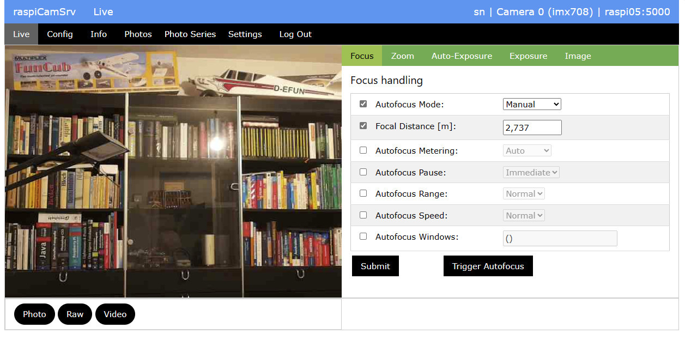
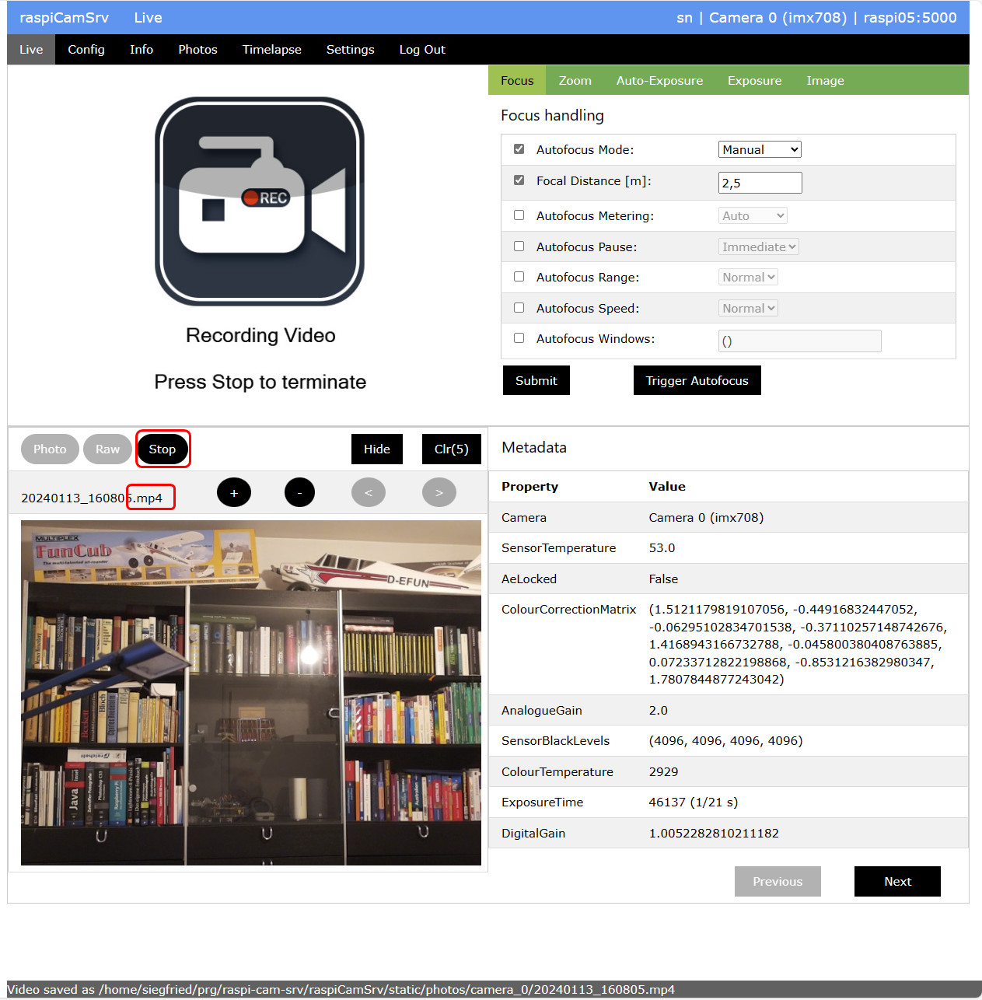
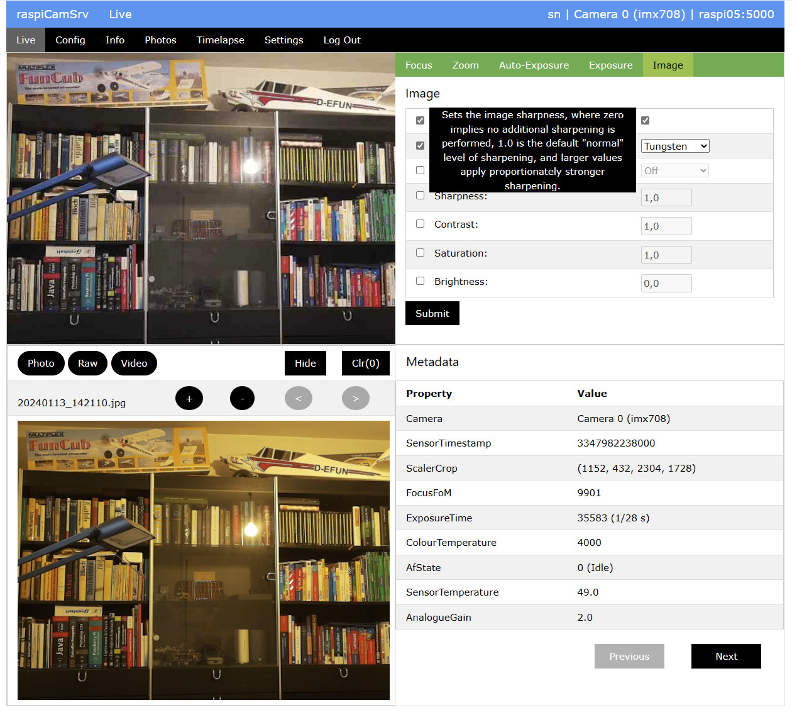
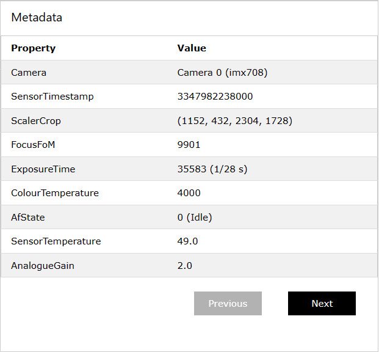
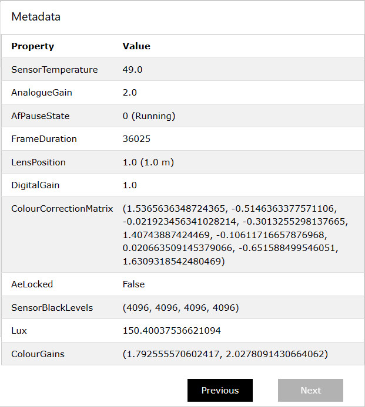

# raspiCamSrv Photo Taking

The *Live* tab of **raspiCamSrv** provides functionality to take photos, raw photos and videos.

In all cases, the predefined [Camara Configuration](./Configuration.md) for the specific use case is applied together with the currently activated [Camera Controls](./CameraControls.md).

As long as no photo has been taken, the *Live* screen will show like below:

Now, you can use
- the **Photo** button to take a photo,   
where the file type can be selected in the [Settings](./Settings.md) screen. ("jpg" is recommended)
- the **Raw** button to take a raw photo.   
Currently only the *.dng* format is supported.
- the **Video** button to record a video,   
where for the video format you may choose between *.mp4* and *.h264* in the [Settings](./Settings.md). Recommended is *.mp4*

## Photo / Raw Photo

When a photo or raw photo is taken, the live stream will be shortly interrupted in order to allow the system to apply the [Camera Configuration](./Configuration.md) for these use cases.

The photo (in the case of raw photos a placeholder photo) will be shown in the bottom area of the screen together with the Metadata.

## Video

When video recording is started, the system will first interrupt and block the live stream in order to allow application of [Camera Configuration](./Configuration.md) settings.

Then, a normal photo of the scene will be taken, which will be used as placeholder. This will be shown in the bottom area.

Afterwards, the live stream area will be replaced by a placeholder indicating that recording has started:

The **Video** button has changed to **Stop** which must be used to stop video recording.

## Photo Display

When a photo, raw photo or video has been taken, the bottom area will show the photo together with its Metadata:

The file name for the photo, raw photo or video has been generated automatically based on system date/time when the request is issued to the camera.

Above the photo, some buttons are shown which allow manipulation of a display buffer:

- Pressing the **-** button will remove the photo from display.   
It will not be removed from the file system.

- The active **+** button shows that the photo is not yet a member of the display buffer.   
Pressing this button will add it to the buffer.

This is shown as:

The indicator (x/y) above the **+** button shows the position of the Photo within the buffer as the left number and the total number of photos in the buffer as the right number.

With the larger number of photos within the buffer, navigation buttons **<** and **>** allow navigation within the buffer:

Additional buttons are available:

- **Hide** / **Show** can be used to hide or show the bottom area with the display buffer
- **Clr(x)** will clear the entire buffer.   
The number in brackets is the total number of elements in the buffer.
- **<** will display the previous photo in the buffer
- **>** will display the next photo within the buffer
- **-** when applied to a member of the buffer, will remove it from the buffer

## Metadata

Along with a photo, also its metadata will be shown.

Metadata and photo have been captured within the same capturing request.

For the metadata, tooltips on the metadata properties explain the respective parameter.

**Previous** and **Next** buttons allow scrolling the list of metadata if it does not fit on the screen.

## Histogram

Alternatively to the metadata, you may also switch to Histogram if usage of histograms has been activated in the [Settings](./Settings.md).

The setting whether metadata or histogram are shown, is kept and remains active also when the next photo is taken or when scrolling through the Photo Buffer.

Histogram graphics are calculated on the fly when they are requested for the first time.    
They are stored in a "hist" subfolder under the *Path for Photos/Videos* (see [Settings](./Settings.md))