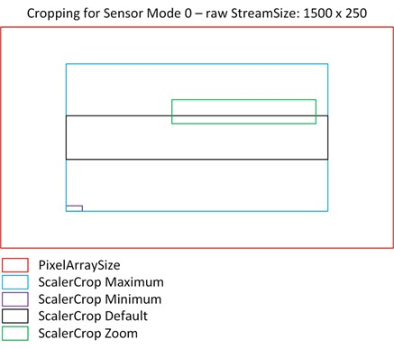

# Image Cropping and Sensor Modes

[](./ZoomPan.md)


## Pixel Array Size and Sensor Modes

Raspberry Pi cameras have sensors with various Pixel Array Sizes which are shown in the [Camera Properies](./Information.md#camera-properties) section of the [Info](./Information.md) screen.

For example, the V3 camera (Imx708) has a PixelArraySize of 4608 x 2592 pixels.


A camera can operate in a limited number of **Sensor Modes** (e.g. Sensor Modes 0, 1, 2 for the Imx708).

Information on Sensor Modes is shown in the [Sensor Mode x](./Information.md#sensor-modes) section of the [Info](./Information.md) screen.

Each Sensor Mode is characterized by (among others) 
- a Bit Depth
- a Frame Rate
- a specific field of view (Crop Limits) which either spans the entire PixelArraySize or a subarea of it.
- an output size which specifies the resolution of the image obtained with this Sensor Mode.   
Here, an image pixel corresponds to a single sensor pixel or a group of 2x2 pixels.   
The output sizes for Imx708 are    
Sensor Mode 0: 1536 x 864    
Sensor Mode 1: 2304 x 1296    
Sensor Mode 2: 4608 x 2592

## Cropping

Raspberry Pi cameras can deliver images from a subarea of the sensor.    
This area is specified by the [Camera Controls](./CameraControls.md) parameter [ScalerCrop](./ZoomPan.md#current-scalercrop-zoom) which can be specified in the [Zoom and Pan](./ZoomPan.md) section of the [Live](./LiveScreen.md) screen of **raspiCamSrv**.

The effective ScalerCrop rectangle (ScalerCrop Zoop/Pan) is restricted by parameters which can be obtained from the ```camera_controls``` (see [Picamera2 Manual](./picamera2-manual.pdf), Appendix B)

**NOTE**: All rectangles are specified by a tuple (xOffset, yOffset, width, height)

- ScalerCrop Maximum    
This is the largest rectangle in which the effective ScalerCrop rectanglemust be completely enclosed.    
This rectangle is limited by the Crop Limits of the Sensor Mode.
- Scaler Crop Minimum   
This is the smallest area which can be delivered by the camera.    
Only width and height are relevant and width and height of the effective ScalerCrop rectangle must not be smaller.
- Scaler Crop Default     
This is the default ScalerCrop rectangle which will always be chosen by the camera if an effective ScalerCrop rectangle is not requested within the Camera Properties.    

Whereas in a standard case, ScalerCrop Maximum and ScalerCrop Default cover the entire PixelArraySize, the pictures below show the situation for two extreme cases:

 &nbsp; 

## Strategy

The strategies by which the camera operates are not fully documented in detail.   
However, systematic experiments with the relevant parameters show the following bahavior:

- Use the [Camera Configuration](./Configuration.md) to specify the **Stream Sizes** for different use cases.    
The most 'relevant' configuration seems to be the **raw** stream.    
A special option (*Sync Aspect Ratio*) assures consistent aspect ratios for all configurations.
- Depending on the 'relevant' Stream Size, the camera will automatically choose a suitable Sensor Mode.    
The active Sensor Mode can be seen in the [Installed Cameras](./Information.md#camera-x) section of the [Info](./Information.md) screen for the active camera if it is currently open and started.    
**NOTE**: **raspiCamSrv** will normally use configurations where all 3 streams (raw, main, lores) are configured in order to allow simultaneous camera access with different intents.
- From the Crop Limits of the Sensor Mode the ScalerCrop Maximum rectangle is determined. 
- The ScalerCrop Default is the largest rectangle,    
which has the aspect ratio of the 'relevant' Stream Size,    
and which is fully inside the Crop Limits of the active Sensor Mode,   
and which is horizontally and vertically centered.
- Zooming and Panning allows scaling the rectangle and panning it within the area of the ScalerCrop Maximum rectangle.    
Zooming and Panning with **raspiCamSrv** always preserves the aspect ratio.
- Finally, the effective ScalerCrop area is scaled to the *Stream Size* of the different streams

Because the aspect ratio of the ScalerCrop Zoom/Pan rectangle is determined from the aspect ratio of the 'relevant' stream, the Live Stream will be distorted if the aspect ratio for the *Live View* configuration is different from that of the configuration for the 'relevant' stream.