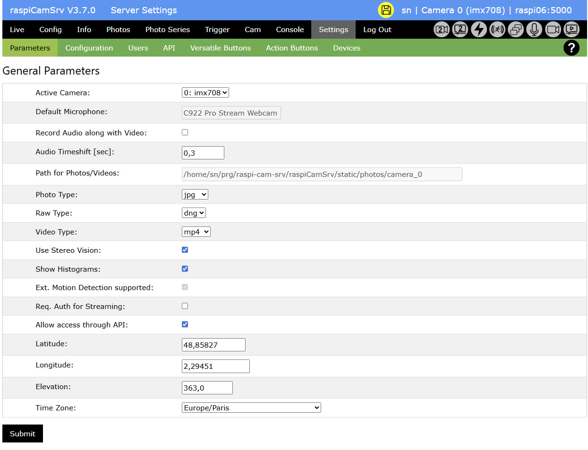
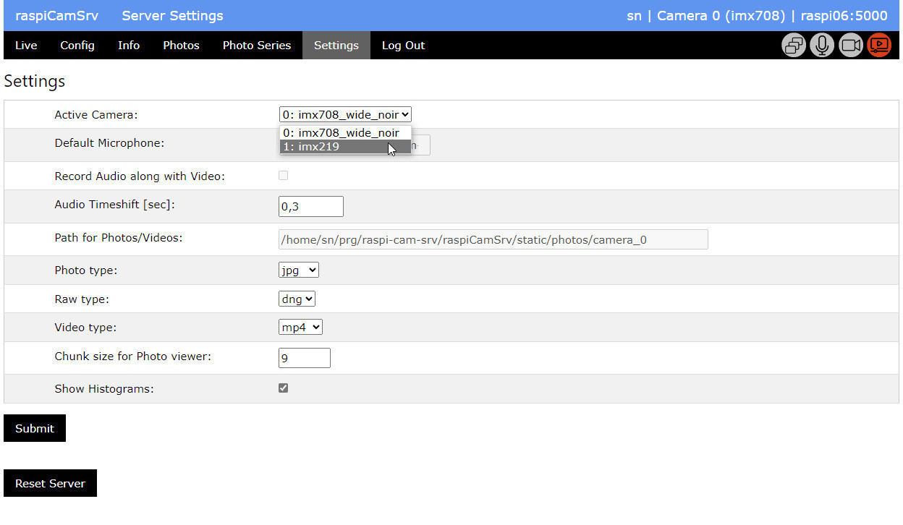

# raspiCamSrv Settings

[](./UserGuide.md)

The Parameters section of the Settings screen is used for specification of general parameters.

Other sections focus on
- [Server Configuration](./SettingsConfiguration.md)
- [User Management](./SettingsUsers.md)
- [API Management](./API.md)
- [Versatile Buttons](./SettingsVButtons.md)

*Users* and/or *API* may be invisible, depending on context.



The General Paramenters include

- *Active Camera* allows explicitely [setting the active camera](#switching-the-active-camera) for systems with multiple cameras.
- [Audio settings](#recording-audio-along-with-video) for systems with microphones if sound is to be recorded along with videos
- *Path for Photos/Videos* shows the path where media will be stored.
- File types for *Photo*, *Raw* Photo and *Video*
- *Show Histograms* allows [activatig/deactivating Histograms](#activating--deactivating-histograms) display of histograms
- *Ext. Motion Detection supported* shows whether the actually installed libraries allow support of [Extended Motion Tracking Algoritms](#extended-motion-detection-support)
- *Req. Auth for Streaming* controls whether [streaming requires authentication](#configuring-authentication-for-streaming)
- *Allow access through API* shows whether the installed libraries allow secure [API access](#api-access).<br>Also if it is supported, it can be deactivated.
- The geo-coordinates *Latitude*, *Longitute*, *Elevation* as well as the *Time Zone* are required for sun-calculations in [Sun-controlled Timelapse Photo Series](./PhotoSeriesTimelapse.md).


## Switching the active Camera

On systems which allow connection of multiple cameras (e.g. Pi 5), it is possible to switch the active camera.   
Only non-USB cameras are offered for selection (see also [Information](./Information.md#installed-cameras))



## Configuring Authentication for Streaming

It can be configured whether streaming of videos or photos requires authentication:


- If the checkbox is not checked, the system allows access to video streams or photos for everybody without authentication.
- If the checkbox is checked, video streams or photos can only be accessed if a valid session is active.   
If a streaming URL is entered in a browser and there is no valid Flask session, the login screen is shown and, after having entered valid credentials, the [Live](./LiveScreen.md) screen is shown. Now, the desired streaming URL can be directly entered or selected from the [Web Cam](./Webcam.md) screen.   
A valid Flask session exists, if login has been passed once within an active browser instance, either in another tab of the browser window intended for streaming or within another window of the **same** browser.   
Closing all windows of a browser kills the session. 


## Activating / Deactivating Histograms

**raspiCamSrv** can show histograms for photos.   
Histograms are generated with [OpenCV](https://de.wikipedia.org/wiki/OpenCV).  
This requires that the packages OpenCV, numpy and matplotlib are installed (see [RaspiCamSrv Installation](../README.md#raspicamsrv-installation) Step 9)   


If these packages are installed, you can select whether or not to *Show Histograms*.   
The default on first server start is to show histograms.

It may be necessary on smaller systems (Raspberry Pi Zero W, Raspberry Pi Zero 2 W) to deactivate this option because of memory restrictions.   
If the option is deactivated, the modules are not loaded and histograms will not be displayed, even if all packages are installed.

The system will automatically detect whether or not the required packages are installed and accessible. If this is not the case, this will be indicated:


## Extended Motion Detection Support

In all installations, [Motion Capturing](./TriggerMotion.md) with the *Mean Square Difference* algorithm are supported.

In order to also be able to use the extended algorithms, the following modules must be installed (see [Installation procedure, Step 10](../README.md#raspicamsrv-installation)):

- OpenCV
- numpy
- matplotlib

When the server starts up, it will be checked whether these modules can be imported.   
If the import had failed, this will be indicated on the Settings screen in the same way as for [Histograms](#activating--deactivating-histograms), above.   
Then, only the *Mean Square Difference* algorithm will be offered  for choice on the [Trigger/Motion](./TriggerMotion.md) tab.

## Recording Audio along with Video

### Preconditions

If a microphone, such as a USB microphone is connected to the Raspberry Pi, it is possible to record audio along with videos.

Picamera2 accesses the microphone through [PulseAudio](https://wiki.archlinux.org/title/PulseAudio).
PulseAudio daemons (```pulseaudio.socket``` and ```pulseaudio.service```) are running as [user units](https://wiki.archlinux.org/title/Systemd/User) and not as system units.

In order to access the microphone, **raspiCamSrv** needs to run in the user environment, too.   
This is automatically the case when the Flask service is directly started from the command line in the **raspiCamSrv** virtual environment with   
```flask --app raspiCamSrv run --debug --host=0.0.0.0```

Alternatively, **raspiCamSrv** can be configured as **user** service as described in [README / Service Configuration for Audio Support](../README.md#service-configuration-for-audio-support)

### Configuration

**raspiCamSrv** will automatically detect whether a microphone is connected and accessible through PulseAudio.

If this is the case, the default microphone will be shown in the Settings screen:
    
Also the checkbox *Record Audio along with Video* is enabled for change.

If the checkbox is checked, audio will be recorded when a video will be recorded.

If no microphone is connected or the microphone is not accessible through PulseAudio (because **raspiCamSrv** runs as system service), this will be indicated as   
    
and the *Record Audio along with Video* checkbox is disabled.

Microphones can be plugged in/out without stopping the system. After a refresh of the *Settings* screen, the system will detect the changed setup.

If multiple microphones are plugged in, PulseAudio will automatically select a default microphone.   
If the selected microphone is not the intended one, plug it out temporarily. Pulse Audio will automatically select another default and keep it.


### Audio/Video Synchronization

Due to timing issues of audio and video subsystems, there may be a delay between video and audio.   
The discrepancy is typically in subsecond range.

Test videos should be made with something like a clapperboard. In case of delays, the *Audio Timeshift* value should be adjusted (it can be positive or negative) until video and audio are in sync.

## API Access

API access to **raspiCamSrv** is protected through JSON Web Tokens (JWT).<br>This requires the module ```flask_jwt_extended```, which is first used in **raspiCamSrv V2.11**.

If the upgrade to this version has been done without installing this module (see [Release Notes V2.11](./ReleaseNotes.md#v2110)), the system will show a hint

and also hide the *API* section

In this case, the module can be installed (see [Release Notes V2.11](./ReleaseNotes.md#v2110)) and after the server has been restarted, it shows as 

which now allows activating or deactivating API support.

If the setting is changed, it is necessary to

1. [Store the configuration](./SettingsConfiguration.md)
2. Make sure that the server is configured to [Start with stored Configuration](./SettingsConfiguration.md)
3. Restart the server (see [Update Procedure, step 4](./ReleaseNotes.md#update-procedure))

This will be indicated through the hint


