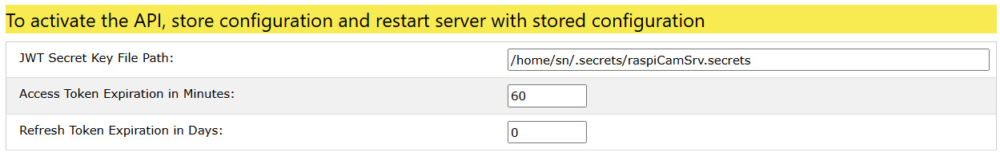

# Settings API

[](./Settings.md)

In this section of the Settings screen, parameters for protection of the API through [JSON Web Tokens](https://en.wikipedia.org/wiki/JSON_Web_Token) (JWT) can be configured.

**raspiCamSrv** uses the [Flask implementation of JWT](https://flask-jwt-extended.readthedocs.io/en/stable/index.html), requiring installation of the ```flask_jwt_extended``` package (see [Release Notes for 2.11](./ReleaseNotes.md#v2110))

This section will only be visible if this package is installed and if the [Geleral Parameter](./Settings.md) *Allow access through API* is checked.


JWT requires a secret private key to sign tokens.

**raspiCamSrv** will store this key in a secrets file and will not publish it in [configuration exports](./SettingsConfiguration.md#server-configuration-storage).<br>Therefore, in order to activate API support, the location of the secrets file needs to be specified. It is recommended using the folowing path:<br>```/home/<user>/.secrets/raspiCamSrv.secrets```<br>This file will usually also be used to store credentials of the mail server for [notification](./TriggerNotification.md) on motion detection.

The following parameters need to be configured:

- *JWT Secret Key File Path*: <br>The full path to the secrets file<br>The path as well as the file will be automatically created if they do not exist.
- *Access Token Expiration in Minutes*<br>The Access Token is used for normal access to API endpoints.<br>For higher security, it is recommended to limit the livetime of this token.<br>This requires, however, that clients are able to react on an expiration error with refreshing the token.<br>If this is not possible, expiration can be deactivated by specifying the value 0.
- *Refresh Token Expiration in Days*<br>The refresh token can be used to authenticate for receiving a fresh Access Token.<br>Both, Access Token and Refresh Token are obtained with the ```/api/login``` endpoint.<br>If an expiration period > 0 for the Refresh Token is specified, a new login is required if the refresh token has expired.

## API Status Information

The status of API support is indicated by the colored status line.

A status change will only take effect for clients if the server is restarted with the necessary configuration:

1. [Store the configuration](./SettingsConfiguration.md)
2. Make sure that the server is configured to [Start with stored Configuration](./SettingsConfiguration.md)
3. Restart the server (see [Update Procedure, step 4](./ReleaseNotes.md#update-procedure))


### API enabled but not active


This is the initial status before specification of the path to the secrets file.

### API configuration completed but not yet active



This status is obtained after valid JWT data have been submitted and if the server has not yet been restarted with these data.

### API active


This status is shown after the server has been started with valid JWT settings.

## Generation of Access Token

If a client system is not able to correctly obtain valid tokens from the server, it is possible to use an Access Token which does not expire and generate it with the **raspiCamSrv** UI:


This token can be copied into the clipboard and used as bearer token in API calls.<br>**raspiCamSrv** will never persist or publish this token, except once on this screen after it has been generated.