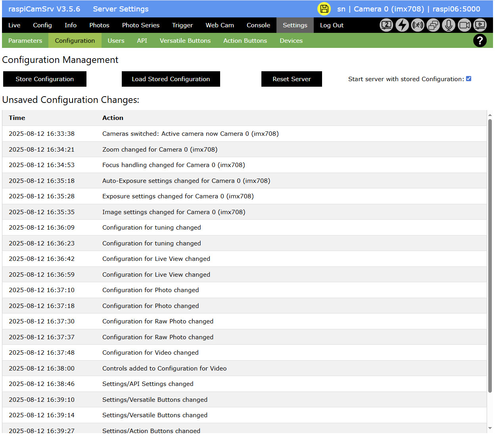
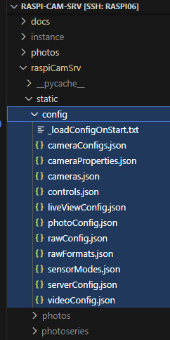

# Settings / Server Configuration

[](./Settings.md)


The *Settings* screen includes a *Configuration* section with functions to control the **raspiCamSrv** configuration:



- Button *Store Configuration* generates a set of JSON files which include the entire configuration of the **raspiCamSrv** server (see [below](#configuration-storage)).
- Button *Load Stored Configuration* replaces the current configuration with a previaously stored configuration.
- Button *Reset Server* stops any background activity (live stream, video, photo series) and replaces the current configuration with the default configuration.
- *Start server with stored Configuration* controls whether a server start shall use the default configuration or the stored configuration.

#### Server Configuration Storage

When the configuration is stored with the *Store Configuration* button, a set of files is created/replaced in the ```raspi-cam-srv/raspiCamSrv/static/config``` folder:



- _loadConfigOnStart.txt<br>This is just an empty marker file. If the file exists, the server will initiate its configuration with configuration data stored in the other files.<br>Otherwise, default configuration settings will be applied.
- cameraConfigs.json<br>This is currently not used
- cameraProperties.json<br>This file contains the camera properties of the actice camera, which are shown in [Camera Properties](./Information.md#camera-properties).<br>Camera properties are always read directly from the camera.
- cameras.json<br>This file contains the installed cameras with information shown in [Installed Cameras](./Information.md#installed-cameras)<br>Installed cameras are always directly queried from the camera system.
- controls.json<br>This file includes all the camera configuration settings as shown in the upper right part of the Live screen [Camera Controls](./LiveScreen.md#top-right-quarter)
- LiveViewConfig.json, photoConfig.json, rawConfig.json, videoConfig.json<br>contain the camera configuration settings for the different use cases as shown in the [Config screen](./Configuration.md)
- rawFormats.json<br>contain a list of formats which can be used for raw photos.<br>This information is extracted from the different [Sensor Modes](./Information.md#sensor-modes) and is always directly obtained from the camera system.
- serverConfig.json<br>This file includes configuration settings for the **raspiCamSrv** dialog system, such as information included in the [Settings](./Settings.md) dialog, or the configuration of the [Display Buffer](./LiveScreen.md#bottom-left-quarter) and some navigation details.
- streamingCfg.json contains, for each camera, the [Tuning](./Tuning.md) configuration, the [Live View Configuration](./Configuration.md) settings and the [Camera Controls](./CameraControls.md) which will be used for streaming. The included Video Configuration is stored because Picamera2 always requires the *main* stream to be configured. This will not be used for streaming.
- triggerConfig.json contains the configuration settings for triggered capture of videos and photos (motion capture)
- tuningConfig.json contains the settings maintained in the [Tuning](./Tuning.md) dialog
