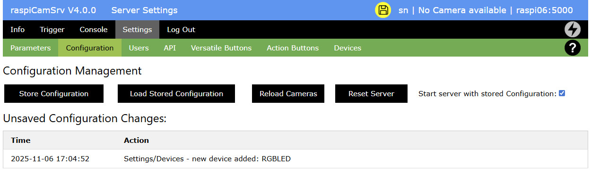

# Settings / Server Configuration (No Camera)

This is a variant of the [Settings / Server Configuration](./SettingsConfiguration.md) screen for the case when no camera is available.

The *Settings* screen includes a *Configuration* section with functions to control the **raspiCamSrv** configuration.

The list of *Unsaved Configuration Changes* lists all actions with their time of execution, which have been made during the current session and which have not yet been saved to the server.

For details, see [Settings / Server Configuration](./SettingsConfiguration.md)

When currently no camera is available in **raspiCamSrv** but one or more USB cameras have been plugged in while raspiCamSrv was active, button **Reload Cameras** will reset the entire camera configuration and usually detect new cameras.   
A confirmation is required:

