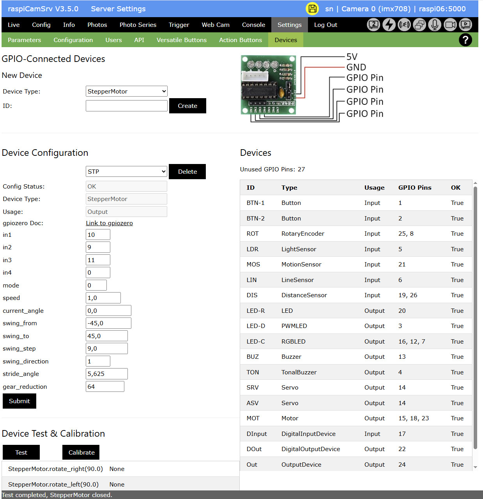

# Settings - Devices

[](./Settings.md)

On this Settings screen you can configure devices connected to the Raspberry Pi through GPIO.




**IMPORTANT**: To preserve any configurations ofer server restart, you need to [store the configuration and activate *Start Server with stored Configuration*](./SettingsConfiguration.md)

## Creating a Device

To create a new device, select one of the preconfigured Device Types and enter a unique ID by which the device will be identified within **raspiCamSrv**.

Pressing *Create* will open the *Device Configuration* where the device can be configured in detail.

A graphic with wiring information in the upper right area will help connecting the device.

## Configuring a Device

In **raspiCamSrv**, GPIO-connected devices are controlled using the [gpiozero](https://gpiozero.readthedocs.io/en/stable/index.html) library which is deployed with Raspberry Pi OS.

**raspiCamSrv** supports all 'regular' input and output device classes of gpizero as well as StepperMotor which is an own extension of ```gpiozero.OutputDevice```.

- *Config Status*<br>shows whether the device is completely configured.<br>This requires normally, that valid numbers have been set for all pin parameters.
- *Device Type*<br>shows the class name through which the device is accessible.
- *Usage*<br>shows whether the device is an Input or Output device.<br>This information is used when [Triggers](./TriggerTriggers.md) and [Actions](./TriggerActions.md) are configured where either one or the other can be selected.
- *gpiozero Doc*<br>A link to the *gpiozero* page for the specific class can help understanding the meaning of the different interface parameters as well as for the specific behavior of the class.<br>Only the link for the StepperMotor links to a **raspiCamSrv** page with information about this class.

Typically, most of the device types have an individual set of parameters with different data types and value ranges.

These parameters are preconfigured in **raspiCamSrv** (see [Device Type Configuration](#device-type-configuration)) and are shown with their default values from *gpiozero*.

In almost all cases, only the parameters for the GPIO pins need to be configured.

Only, when all GPIO pins are configured, the *Config Status* is set to "OK", which is a precondition that the device can be used.

## Device Overview

The right side of the dialog shows an overview of all configured devices with their associated GPIO pins and their *Config Status*

The information about *Unused GPIO Pins* can help finding places for new devices.<br>This information only considers the devices configured in **raspiCamSrv**.

## Modifying Device Configuration

You can modify configuration parameters for a device after selecting the device ID in the *Device Configuration* section.

If a device is selected, also the device Type and the image in the upper area are adjusted.

The ID of a device can not be modified.

## Deleting a Device

The *Delete* button allows deletion of the selected device. This requires an additional confirmation.

If a device is used in one of the [Triggers](./TriggerTriggers.md) or [Actions](./TriggerActions.md) configurations, it cannot be deleted. An error message will be shown only after deletion has been confirmed.

## Testing a Device

After a device has been configured, it should be tested that it is working correctly.

When the *Config Status* is "OK", the *Device Test* section is shown, which initially consists only of the *Test* button.

When it is pressed, a preconfigured set of test steps will be executed.

**IMPORTANT**: Before pressing *Test*, make sure that any moving devices (e.g. Motors, Servos) can move freely.

After the test is completed, the return values of the configured test methods will be shown.

For a test either the entire test or the individual steps may have preconfigured durations. So you need to wait until the test is completed and observe the device.


## Device Type Configuration

The *gpiozero* device types, supported by **RaspiCamSrv** are preconfigured in the file ```gpioDeviceTypes.py```.

Below is an example for the ```DistanceSensor```:

```json
gpioDeviceTypes = [
    {
        "type":"DistanceSensor",
        "usage":"Input",
        "docUrl": "https://gpiozero.readthedocs.io/en/stable/api_input.html#distancesensor-hc-sr04",
        "image": "device_DistanceSensor.jpg",
        "params": {
            "echo": {
                "value": "",
                "type": "int",
                "min": 0,
                "max": 27,
                "isPin": True
                },
            "trigger": {
                "value": "",
                "type": "int",
                "min": 0,
                "max": 27,
                "isPin": True
                },
            "queue_len": {
                "value": 9,
                "type": "int",
                "min": 0,
                "max": 99
                },
            "max_distance": {
                "value": 1.0,
                "type": "float",
                "min": 0.0,
                "max": 100.0
                },
            "threshold_distance": {
                "value": 0.3,
                "type": "float",
                "min": 0.0,
                "max": 100.0
                },
            "partial": {
                "value": False,
                "type": "bool"
                }
        },
        "testMethods":[
            "distance",
            "value"
        ],
        "events":[
            "when_in_range",
            "when_out_of_range"
        ],
        "eventSettings":{
            "threshold_distance": 0.0
        },
        "control":{
            "bounce_time": 0.0
        }
    },
]

```

The different elements are used for different purposes:

- *type*<br>identifies the class name for the device type.
- *usage*<br>distinguishes Input and Output devices
- *docURL*<br>is the URL for class documentation
- *image*<br>identifies the image shown in the dialog
- *params*<br>characterizes the class constructor interface with parameter name, default value, type (with some non-Python declarations) as well as the valid range.<br>The "isPin" sub-element identifies attributes which correspond to GPIO pins.
- *testMethods*<br> is a list of test methods, if necessary with parameters, which are executed during the test.
- *testDuration* or *testStepDuration* specify the duration of the entire test or of every test step.
- *events*<br>occur in Input devices and identify events which are captured by the device class and to which callback routines can be assigned.<br>This will be used in the specification of [Triggers](./TriggerTriggers.md).
- *eventSettings*<br>is a list of parameter assignments which will be set **before** callbacks are assigned to the event parameters.<br>An example is the ```threshold_distance``` which is required for ```DistanceSensor``` to distinguish between *in_range* and *out_of_range*.
- *actionTargets*<br>occur in Output devices and identify methods which can be used in [Actions](./TriggerActions.md).<br>Whereas the sub-element "method" identifies the method name (which can be a method or a property which **raspiCamSrv** determines through inspection), the "params" element specifies the parameters which can be configured for the method call or the property assignment.<br>These parameters serve also as 'templates' for type checks which are done during [Action](./TriggerActions.md) configuration.
- *control* elements<br>which can occur as sub-elements of "actionTarget" for Output devices as well as for Input devices, are not part of the class interface but are used to control specific behavior in **raspiCamSrv**.<br>For input devices it can, for example specify the ```bounce_time``` for software controlled bouncing suppression beyond that what might already be provided by *gpiozero*.<br>For Output devices and a specific action target, it can, for example specify a duration for which the action shall last, for example how long an LED shall be enlighted.