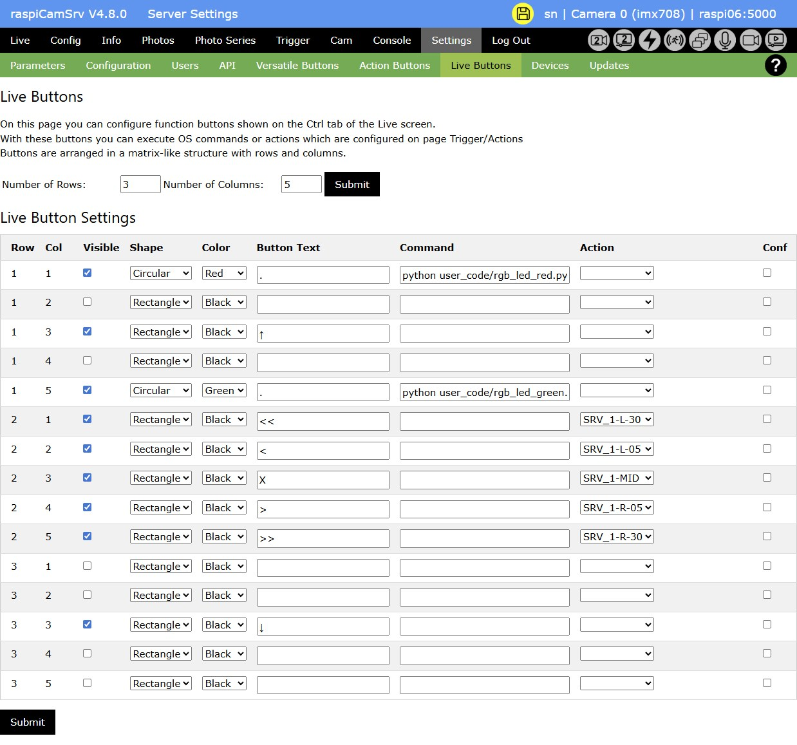

# Settings - Live Buttons

On this screen, you can 'design' the [Live Ctrl Buttons](./CameraControls_Ctrl.md) by assigning visual attributes and [Actions](./TriggerActions.md) or OS commands to Buttons arranged on a grid.

The general usage of this screen is similar to that for configuring [Versatile Buttons](./ConsoleVButtons.md), except that you can assign either an OS Command or an [Action](./TriggerActions.md) to a button.