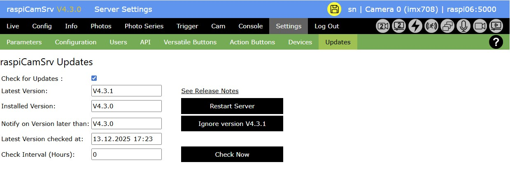

# Settings - Update

[](./Settings.md)

This dialog can be used to update raspiCamSrv to the latest version available on [GitHub](https://github.com/signag/raspi-cam-srv)


If the installed version is lower than the latest version on GitHub, the version number on the title bar is shown in yellow.

The Update dialog shows the following fields:

- *Check for Updates*<br>This switch can be used to activate or deactivate checking for updates.
- *Latest Version*<br>This is the latest version available on GitHub. raspiCamSrv determines the latest version by analyzing the [Release Notes](./ReleaseNotes.md).<br>GitHub is checked for the latest version at every start of the Flask server or with the specified time interval when executing any function of the [Live](./LiveScreen.md) dialogs.
- *See Release Notes*<br>The link opens the latest release notes for inspection of new features.
- *Installed Version*<br>This field shows the currently installed version.
- *Update to Vx.y.z*<br>This button is only visible if you can update to a newer version.<br>Pressing the button will issue a ```git pull origin main --depth=1``` command to update raspiCamSrv.<br>After the update has completed successfully, the button will turn to (see below):
- *Restart Server*<br>This button will restart the raspiCamSrv Flask server to switch to the new version.<br>**NOTE**: After completion of the update, the active server is still on the old version.<br>When the server restarts, the browser will get an empty response. You should press the *Back* button of the browser to return to the previous screen and then press any menu options of the **black** menu bar.
- *Notify on Version later than*<br>Initially, this field shows the current version.<br>If you want to skip updates to the indicated latest version, you can press the *Ignore ...* button and the field will show the latest version.<br>Information on possible updates will only be given, if the latest version on GitHub is later than the version shown in this field.
- *Latest Version checked at*<br>This shows the time when the indicated *Latest Version* was retrieved from GitHub.
- *Check Interval (Hours)*<br>Is the interval with which raspiCamSrv will check for updates.
- *Check Now*<br>Check GitHub for a new version now.

## Dialog after successfull Update



## Dialog with *Check for Updates* deactivated


