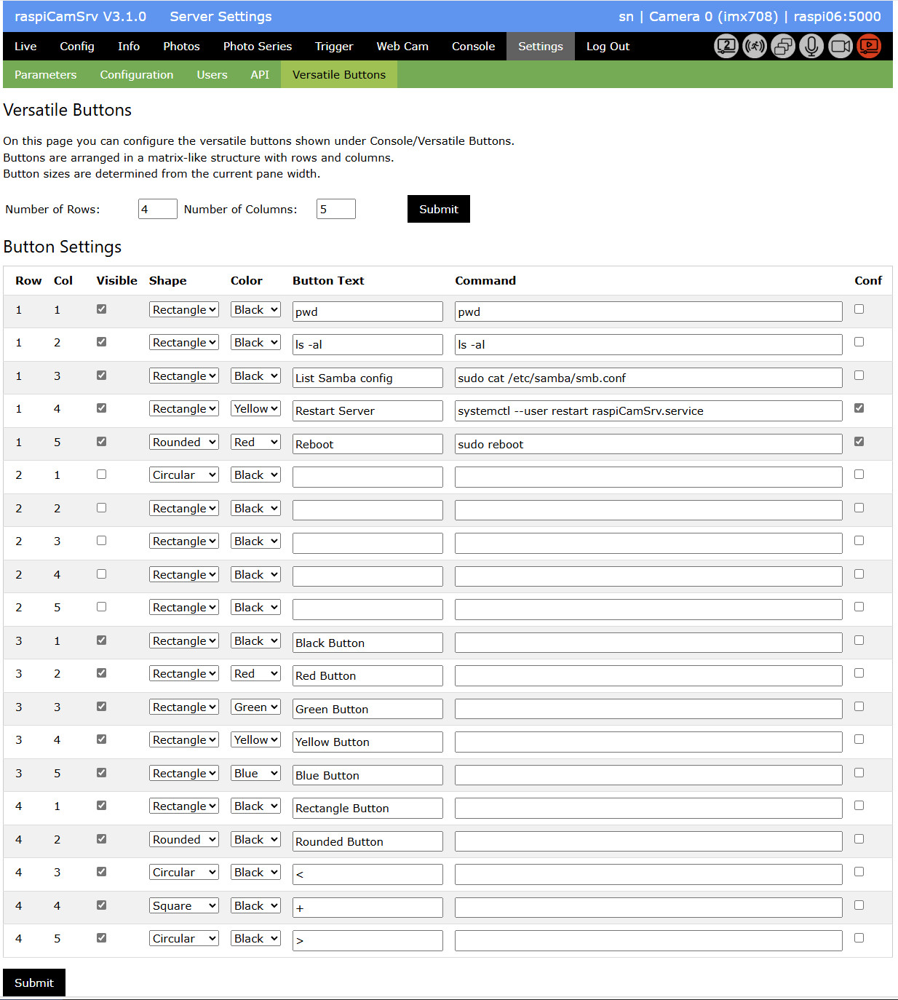

# Settings - Versatile Buttons

This Settings screen allows configuration of function buttons which will be shown on the [Console](./Console.md) screen.

The screenshot above is an example layout. Initially, the *Button Settings* area is empty.

## Button Layout

Buttons on the [Console](./Console.md) screen are arranged in an N x M grid where the *Number of Rows* and *Number of Columns* can be configured.   

Once non-zero values have been specified and submitted, the *Buttons Settings* area will show a list of parameters for specification of button properties.

If an existing grid layout is modified by changing either the number of rows and/or the number of columns, the configured rows and columns of buttons will be preserved if the new values are larger than the old ones. Superfluous rows or columns will be removed in case that new dimensions are smaller than the old ones.

The checkbox *Interactive Commandline* controls whether [Console](./Console.md) will show an interactive commandline where commands can be directly entered. 

**IMPORTANT**: You need to [Store Configuration](./SettingsConfiguration.md) if you want the button settings to survive a server restart!

## Button Settings

- *Row* The row in which the button will be placed.
- *Col* The column in which the button will be placed.
- *Visible* When the checkbox is activated, a button will be shown in the given grid cell, otherways the grid cell will remain empty.
- *Shape* The shape of each button can be selected from a small set of standard shapes (Rectangle, Rounded, Circular, Square). The example layout of the above configuration is shown for the [Console](./Console.md) screen.
- *Color* The Color of each button can be selected from a small set of standard Colors (Black, Red, Green, Yellow, Blue). The example layout of the above configuration is shown for the [Console](./Console.md) screen.
- *Button Text* Text to be shown on the button.
- *Command* Linux command to be executed on OS level. You may use available Linux commands or run your own scripts. It is recommended to test these commands on an OS prompt before configuring and running them out of **raspiCamSrv** The working directory is that of the service (see [Service Configuration](../README.md#service-configuration)).
- *Conf* If the checkbox is checked, the respective button will require a confirmation before the command will be executed.

Any changes for these settings need to be submitted with the button underneath the table

