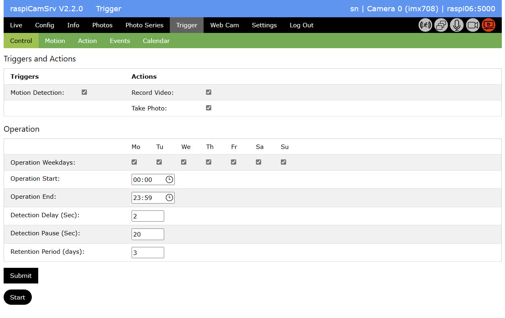

# Triggered Capture of Videos and Photos

[](./UserGuide.md)

**raspiCamSrv** supports triggered capture of videos and photos as well as actions GPIO-connected devices.

Currently supported triggers are
- [Triggers](./TriggerTriggers.md) from GPIO-connected sensors
- [Triggers](./TriggerTriggers.md) from camera events such as start and stop of video recording or streaming.
- [Motion Capturing](./TriggerMotion.md) through image analysis
- [Active Motion Capture](./TriggerActive.md)

Supported actions are:
- [Actions](./TriggerActions.md) with GPIO-connected devices, such as LEDs, motors, servos or sound devices
- [Trigger-Actions](./TriggerTriggerActions.md) define which trigger will execute which action(s)
- [Camera Actions](./TriggerCameraActions.md)
- [Notification](./TriggerNotification.md)

Registered events can be inspected in the
- [Event Viewer](./TriggerEventViewer.md)

## Control



In the *Control* section, you may specify basic aspects of triggered action:

- Under *Triggers*, you select the triggers to be used.   
You can activate Motion detection and/or the other *Configured Triggers*
- Under *Actions* you specify the actions to be taken in case of a trigger event.   
You may select among video recording and photo taking.   
In case *Record Video* is selected, also at least one photo must be taken. This photo will serve as placeholder for the video in the [Event Viewer](./TriggerEventViewer.md).    
With *Notification* you specify whether or not you want to be informed by e-Mail about an event. The details need to be specified on the [Notification](./TriggerNotification.md) tab.    
**ATTENTION**: If you have chosen to only activate *Configured Triggers* without *Motion Detection*, the listed Actions will be deactivated because they are currently only supported with *Motion Detection*. From the *Configured Triggers*, the configured [Trigger-Actions](./TriggerTriggerActions.md) will be executed, which currently do not yet include any camera actions.
- With *Operation Weekdays*, you specify the weekdays when triggering shall be active.
- *Operation Start* specifies the daytime when triggering is activated on each active weekday.
- *Operation End* specifies the daytime when triggering is paused.
- *Automatic Start with Server*   
When activated, the trigger capturing process can be automatically started with the server.   
When you change this parameter, you need to go to [Settings](./Settings.md) and store the current [Server Configuration](./SettingsConfiguration.md)   
If you want automatic start, you also need to select *Start Server with stored Configuration*.    
**Note** In case you start the Flask server manually, do not use the ```--debug``` option. This will cause an exception (see [Flask Issue #5437](https://github.com/pallets/flask/discussions/5437)).
- *Detection Delay* allows specifying a dalay in seconds. When an event is triggered, the configured action (video and/or photo, Notification) will be delayed by the specified number of seconds. Normally, this will be 0.    
- *Detection Pause* specifies a 'dead time' after an event has been registerd. Within this time no new event will be registered although the system will not stop detecting motion.    
This setting prevents from being flooded with registered events, for example if motion persists for a longer time.    
Detection pause (and alse *Detection Delay*), configured here, does not apply to the configured [Triggers](./TriggerTriggers.md). For these, it is possible to specify *bouncing-time* individually for every trigger.
- *Retention Period* specifies the number of days  for which event data will be retained when a [cleanup](./TriggerEventViewer.md#cleanup) is done.

Data changes will not be persisted unless the **Submit** button has been pressed.

## Starting Trigger capturing

Trigger- and event handling is activated using the *Start* button.

Depending on the selected *Triggers* *Motion Detection* and/or *Configured Triggers* are started.

Which process is currently active is indicated by the [status indicators](./UserGuide.md#process-status-indicators):

- Motion detection only:    

- Configured Triggers only:    

- Both    


Note that, whenever Motion Detection is active, also the live stream will be kept active because this is used to detect motion.

For active of motion capturing, see [Active Motion Capturing](./TriggerActive.md) 

