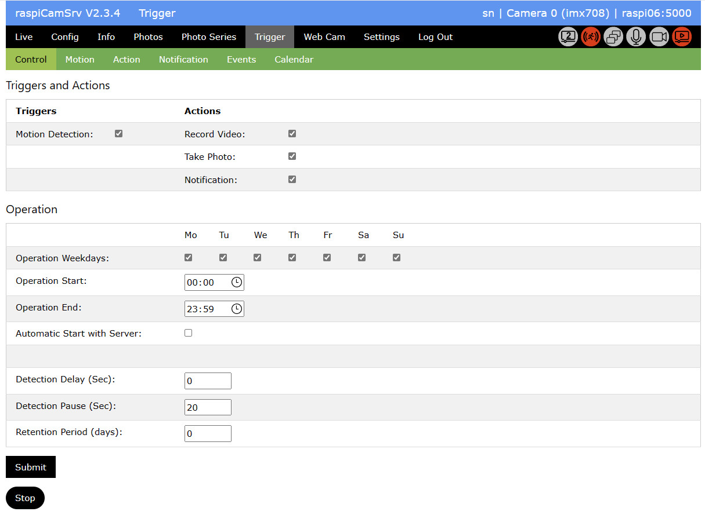
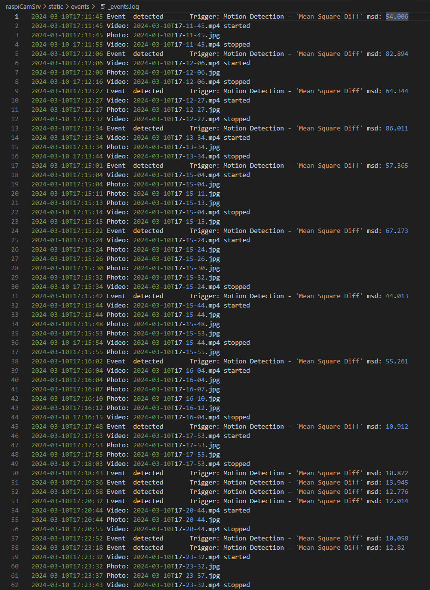
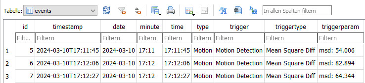
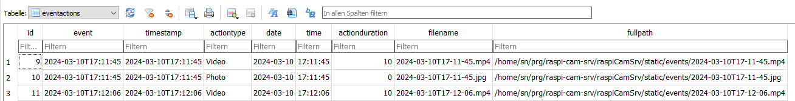

# Triggered Capture of Videos and Photos

[](./Trigger.md)

# Active Motion Capturing

The *Start* button on the *Control* page starts the trigger capturing process.



An active capture process is indicated with red [Process Status Indicator](./UserGuide.md#process-status-indicators)

The *Start* button has changed to *Stop*, which allows stopping the process.

If motion capturing is currently active but operation paused because of schedule settings, this is indicated by a yellow process status indicator:


## Event Data

Event data are stored in directory ```./prg/raspi-cam-srv/raspiCamSrv/static/events```:


Storage includes a log file as well as video and photo files.

## Parallel Activities

While motion capturing is active, the live stream process will be kept active because this is used for motion detection.

While motion capturing is active, you may continue working with **raspiCamSrv**.   
You may even take photos, videos or photo series.

However, you should avoid changing camera controls or configuration because this might restart the camera.

### Dos and Don'ts

#### Blocked:

- Changing [Settings](./Settings.md)
- Starting a [Exposure Series](./PhotoSeriesExp.md) or a [Focus Stack Series](./PhotoSeriesFocus.md)
- Changing [Camera Configuration](./Configuration.md)

#### Changing Zoom

This can be done while trigger capturing is active.   
However the moment when the new zoom setting is activated will be registered as motion event.

#### Changing Focus

To improve the focus for camera model 3, you may change [Focus Settings](./FocusHandling.md) and [Trigger Autofocus](./FocusHandling.md#trigger-autofocus)

#### Changing Camera Controls

In order to change the quality of videos and photos, you may change any [Camera Controls](./CameraControls.md) while motion capturing is active.

## Log File

While events are registered and videos and photos are taken, the system maintains a log file (```events/_events.log```) with antries for all events and the times when photos are captured or videos are started and stopped:



The log file of the above screenshot shows examples without delayed actions as well as with configurations with 4 photos in the *Photo Burst*.    

## Database

Events and event actions are also stored in the SQLite3 database stored at   
```./prg/raspi-cam-srv/instance/raspiCamSrv.sqlite```.

The primary purpose of the database is providing fast access to event data over a longer period for the [Event Viewer](./TriggerEventViewer.md)


Table *events* holds all individual events:



Table *eventactions* holds the actions taken for each event:

