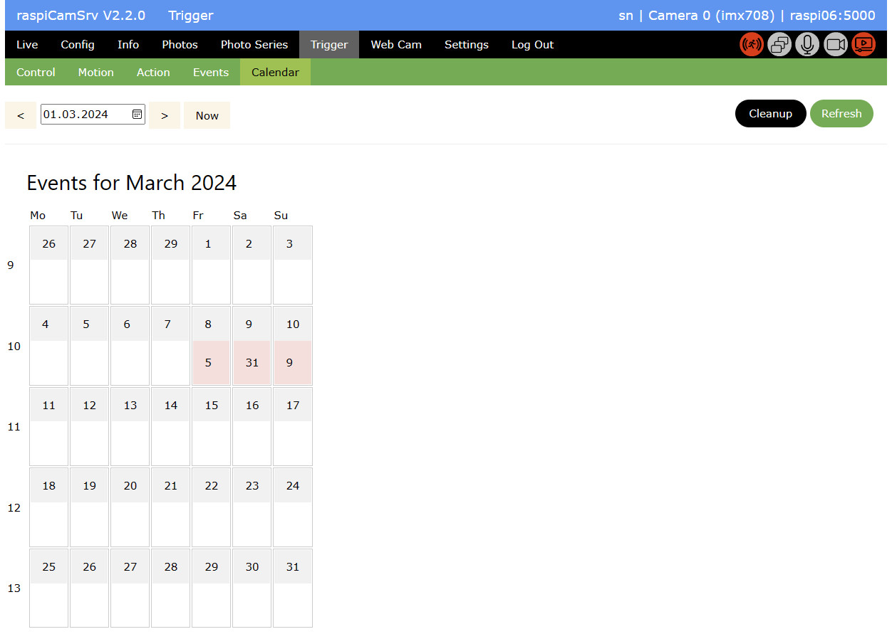
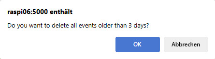

# Trigger / Event Calendar

The calendar gives an overview on the number of events which have been registered for a specific day:

Clicking on a red field navigates to the [Events](./TriggerEventViewer.md) display for this specific day.

You can change the active month using the date control and navigation arrows, or return to the current month with the *Now* button.

## Download Log

You can download the [Log file](./TriggerActive.md#log-file) including a timeline of all events and associated actions. 
Note that only those triggers and their associated actions will be included in the log, for which the [control parameter](./TriggerTriggers.md#control) *event_log* has the value "True".

## Cleanup

The *Cleanup* button can be used for removing old events.   
This requires that the process is stopped.

After pressing the button, a confirmation is required:   
    
The *Retention Period* for cleanup, shown in this confirmation, has been specified on the [Trigger/Control](./TriggerControl.md) page.

For all events older than the *Retention Period*, cleanup will

- remove all log file entries
- delete all photo and video files
- delete related database entries

