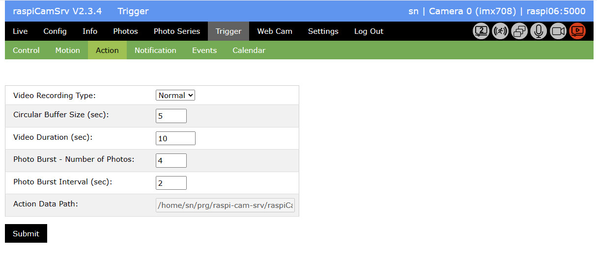

# Camera Actions

This section allows specification of aspects for photos and/or videos recorded in reaction an an  event:

- *Video Recording Type*   
With *Normal*, video recording starts with the event or, if configured, after a specified dalay.   
With "Circular*, the system continuesly captures video in a circular buffer with a capacity of a few seconds. In case of an event, also the seconds before the event will be available in the video.   
Currently, only *Normal* is supported.
- *Circular Buffer Size* is the number of seconds, the system shall look 'backwards' from the time of an event.
- *Video Duration* specifies the length of videos captured in case of an event.    
If a new event is registered while video recording from the previous event is still active, this will be stopped before recording for the new event starts.
- *Photo Burst - Number of Photos* allows specifying a number of photos which will be successively captured in case of an event.   
If video is recorded, at least one photo must be specified.
- *Photo Burst Interval* is the interval after the previous photo when the system will capture a new photo if there is still motion detected. If no motion is detected after this interval, no photo will be taken.
- *Action data path* is the path where pictures and logs for events will be stored.
