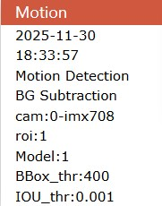
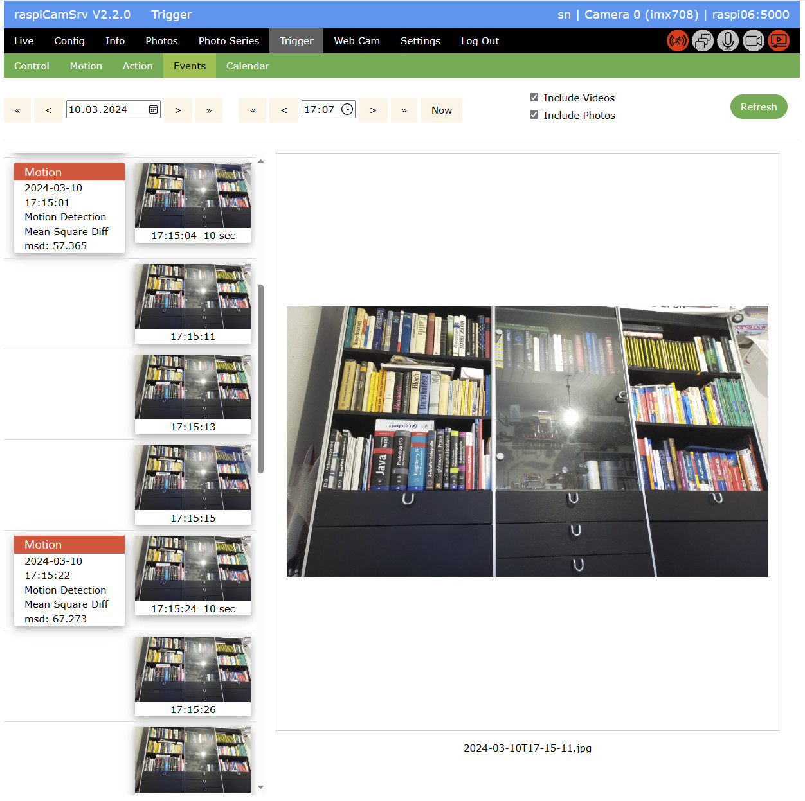

# Trigger / Events

Event Details are shown in the Event Viewer for a specific day:

In the top area, you may 

- change the active day using the date control or the arrow buttons.   
Single arrows shift by day, double arrows by week.   
In each case the starting hour is set to 00:00h.
- change the start time from which on events will be shown.   
Here, single arrows shift by a quarter of an hour, double arrows by an hour.
- You can select whether you want to see videos, photos, both or none.   
In case of videos, the first photo is always shown instead of the video on the left side, however clicking on the photo will open the video viewer.
- whether a video or a photo is represented by the small picture can be distinguished by information on the video length.

Selecting a video or photo shows it in the detail area on the right side.

## Event Card

The Event Card for each event     
    
shows, from top to bottom:

- Event Type
- Event date
- Event time
- Event trigger
- Event trigger algorithm   
[Mean Square Diff](./TriggerMotion.md)    
[Frame Diff.](./TriggerMotion.md#test-for-frame-differencing-algorithm)    
[Optical Flow](./TriggerMotion.md#test-for-optical-flow-algorithm)    
[BG Subtraction](./TriggerMotion.md#test-for-background-subtraction-algorithm)
- Trigger parameter (see [Motion](./TriggerMotion.md) tab)   
cam : Camera Num by which motion was detected    
roi : Index of the [Region of Interest](./TriggerMotion.md#regions-of-interest-and-regions-of-no-interest) in which motion was detected   
**NOTE**: Motion detection analysis is stopped whenever motion has been detected in one of the RoIs. The index of this ROI is reported here.    
msd : *Mean Square Threshold*    
BBox_thr : *Bounding Box Threshold*    
IOU_thr : *IOU Threshold*     
Motion_thr : *Motion Threshold*    
Model : *Background Subtraction Model* (1=MOG2, 2=KNN)

You may use the information to fine tune the algorithm parameters on the [Motion](./TriggerMotion.md) tab.

## Photos/Videos with ROI/RoNI

When [Photos/Videos with RoI/RoNI](./TriggerMotion.md) has been activated, borders of RoIs/RoNIs are shown on photos and videos (for "Mean Square Diff" not no videos):

- Red borders represent *Regions of Interest* where motion was detected first.
- Green borders represent the other specified *Regions of Interest.
- Blue borders represent *Regions of NO Interest.

In case that photos have been taken together with videos, this is represented as shown below.   
Videos show the video length in the footer.

