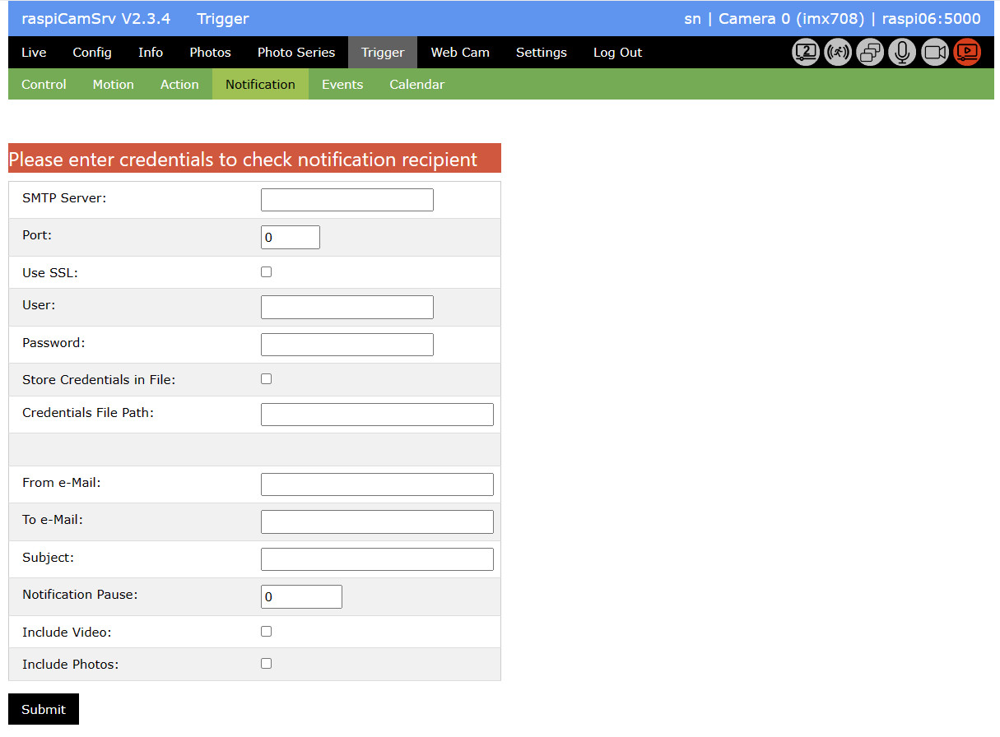
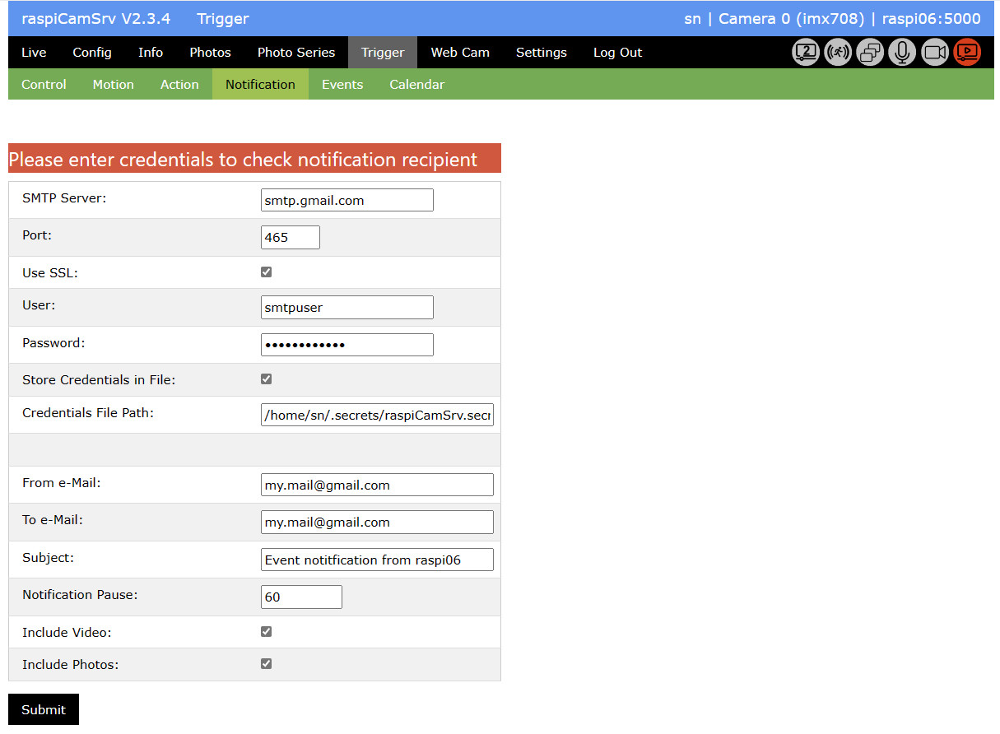
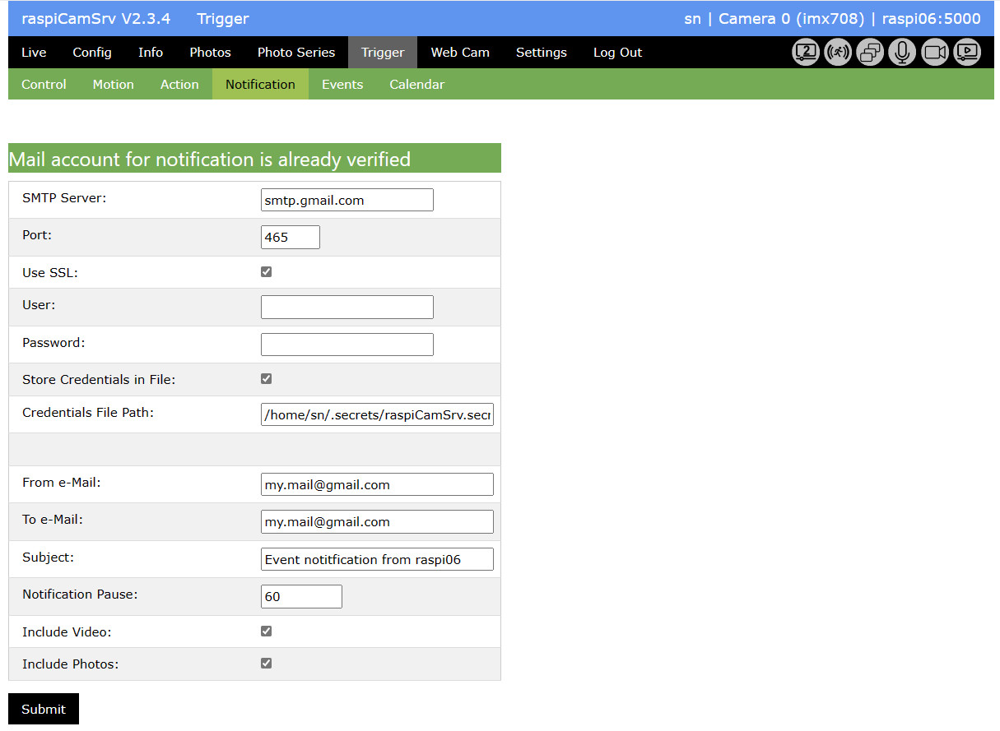
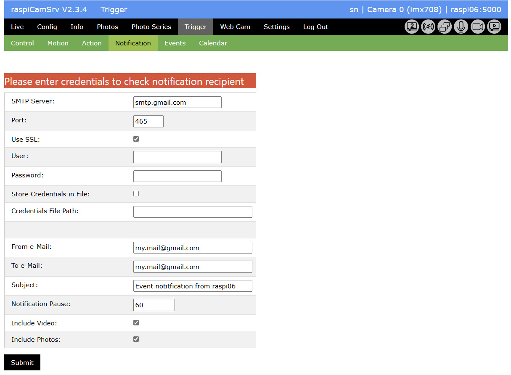

# Triggered Capture of Videos and Photos

[](./Trigger.md)

## Notification

On this tab, you specify the details required for notification on an event by e-Mail:



### Mail Server Settings

- *SMTP Server* is the server address, for example "smtp.gmail.com"
- *Port* is the server port to be used
- *Use SSL* specifies whether or not SSL (Secure Sockets Layer) is to be used
- *Server requires Authentication* must be checked if the mail server requires authentication with user and password.
- *User* is the user name to be used for login to the server. This is typically identical with the e-Mail address.
- *Password* is the password required for authentication

### Handling of Mail Server Credentials

Credentials for authentication to the mail server are not part of the normal raspiCamSrv configuration.    
They ere never exported to JSON files when configuration is stored ([Settings/Configuration](./SettingsConfiguration.md))   
Therefore, they can also not be imported when the server restarts.

**raspiCamSrv** offers two alternatives for secure handling:

#### 1. Storage in a Secrets File

This is activated by checking *Store Credentials in File* and by specifying the full path of that file in *Credentials File Path*.   
For example, the path could be ```/home/<user>/.secrets/raspiCamSrv.secrets```.   
If the path and the file do not exist, they will be automatically created.  
Access to this file should be restricted to the user running **raspiCamSrv** as service or from the command line.

The advantage of this method is, that on server restart the system can automatically load user name and password for connection to the mail server. Thus, notification will automatically be activated, provided that Triggered Capture is automatically started with server start.

#### 2. Manual Entry

Alternatively to storage in a secrets file, *User* and *Password* can be manually entered.   
**raspiCamSrv** will keep this information in memory during the server livetime.   
After server restart, these credentials are initally not available and, therefore, notification will not be active until the credentials have been entered once on this screen.

### Mail Settings

- *From e-Mail* is the e-Mail address to be shown in the *From* field. Mail servers may replace this with the e-Mail address of the account.
- *To e-Mail* is the e-Mail address of the recipient to whom the notification is to be sent.
- *Subject* Is the text for the *Subject* field of the mail to be sent.
- With *Notification Pause*, you can specify a pause in seconds in which no further notification mail wil be sent.   
A value smaller than the *Detection Pause* (see [Trigger Control](./Trigger.md#control)) will have no effect, so that every event will be notified.    
If the value is chosen as a multiple (N) of the *Detection Pause*, only every Nth event will be notified.
- *Include Video* specifies whether or not the event video will be included in the mail.    
If this is selected, the mail will be sent not earlier than video recording has terminated.    
This is determined by *Video Duration* (see [Trigger Actions](./Trigger.md#actions)).   
Keep in mind that the video size should not exceed the maximum mail size allowed by the provider.
- *Include Photos* specifies whether or not photos should be attached to the mail.   
If this is selected and a number > 1 has been specified for *Photo Burst* (see [Trigger Actions](./Trigger.md#actions)), the mail will not be sent before the last photo has been taken or the next event has been registered.

### Submitting Configuration Settings



When submitting configuration entries, the system will automatically try to connect to the mail server using the specified credentials.




If the connection test was successful, this is indicated in the message area, otherwise, an error message is shown.   
User and password are removed from the screen and need to be entered again, if necessary.

Whether or not connection to the mail server has been verified, is allways shown in the top of the screen.

### Entering Credentials after Server Restart

After the server has been restarted and credentials are not stored in a secrets file, they need to be entered once:




### Notification Errors

Sending a mail may require several seconds, especially if the mail includes larger attachments.   
Therefore an additional thread is started for each mail to be sent, in order not to block capturing events.

If an error occurs while trying to send a mail, an error status is set in the Trigger configuration settings.   
The error message is shown on the *Control* Tab of the *Trigger* screen:   


The message will vanish when Triggered Capture is restarted or when the server is restarted.   

Errors occurring in the sending process do not stop motion capturing.