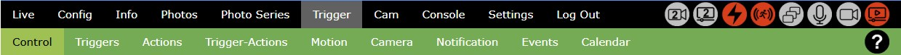

# Trigger - Triggers and Actions

**raspiCamSrv** can capture events from camera and GPIO input devices and let these process actions by the camera and GPIO output devices.

For example, pressing a button could trigger photo taking, or starting/stopping video recording could trigger switching an LED, or detection of motion could cause e-Mail notification.

**NOTE**: If no camera is connected, the camera-related menu items are missing.

- [Introduction](./Trigger.md) 
- [Control](./TriggerControl.md)
- [Triggers](./TriggerTriggers.md)
- [Actions](./TriggerActions.md)
- [Trigger-Actions](./TriggerTriggerActions.md)
- [Motion](./TriggerMotion.md)
- [Camera](./TriggerCameraActions.md)
- [Notification](./TriggerNotification.md)
- [Events](./TriggerEventViewer.md)
- [Calendar](./TriggerCalendar.md)