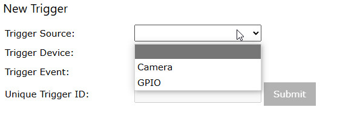
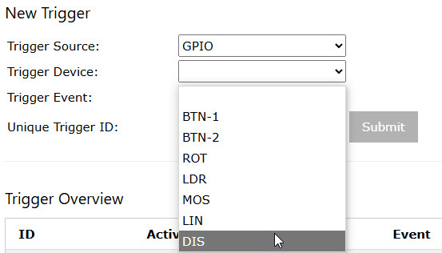
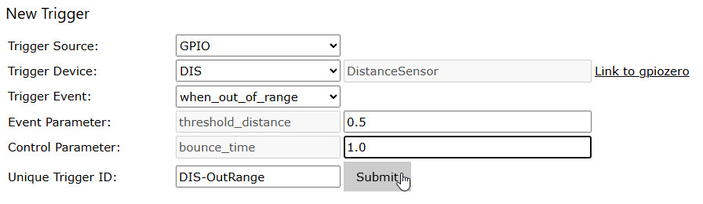

# Triggers

This page is used for spacification of triggers.     
Triggers are registered events occurring for the camera system or for GPIO input [devices](./SettingsDevices.md) which can be used to initiate one or multiple [actions](./TriggerActions.md).

**IMPORTANT**: To preserve any configurations over server restart, you need to [store the configuration and activate *Start Server with stored Configuration*](./SettingsConfiguration.md)

## Creating a Trigger

1. In field *Trigger Source*, select the source system for which the trigger is defined:    
(*Camera* and *Motion Detector* will be available as option only when a camera is available)    

1. This will open a list of devices defined for the chosen source system:    
    
for the GPIO system, these are the **Input** devices configured on [Settings/Devices](./SettingsDevices.md)
1. After a device has been selected, the system will show the device type with a link to related gpiozero documentation as well as the events which can be trapped for this device (this information is taken from the [fixed configuration for the device type](./SettingsDevices.md#device-type-configuration)):    
    
1. When the event has been chosen, the sytem will display any parameters which may be required for this event:    
    
Now you need to specify values for these parameters, unless you leave the defaults, and enter a unique name for the trigger.    
In this step, the *Submit* button will be activated.    
1. Pressing the *Submit* button will create the trigger and show it in the *Trigger Overview*.

### Parameters

The parameters, for which values can be specified, are properties or methods of the device class.    
Information about their function can be obtained from the gpiozero class documentation accessible through the link.

### Control

Control parameters are not part of the class functionality but they can affect how **raspiCamSrv** processes a captured event:

- *bounce_time* This is a time interval given in seconds. After an event has been processed, other events occurring within this interval will be ignored. This shall avoid jitter in triggered actions. For some devices (e.g. Button), bounce time can already be specified for the device and will be handled by gpiozero.
- *event_log* The value of this parameter decides whether or not a trigger and its [associated actions](./TriggerTriggerActions.md) will be treated as events and included in [event logging](./TriggerActive.md) and [event viewer](./TriggerEventViewer.md). If **False**, events triggered by the trigger will not be logged in [event logging](./TriggerActive.md) and they will also not be visible in the [event viewer](./TriggerEventViewer.md). Instead, if camera actions are associated with the trigger, the resulting photos and videos will be visible in the normal [Photo Viewer](./PhotoViewer.md).

### Restrictions

Only one active trigger can be configured for a specific device-event.

If another trigger is configured for the same event, only one trigger will remain active.

If you want multiple actions on a specific trigger, you will specify this in [Trigger-Actions](./TriggerTriggerActions.md).

## Activation of Triggers

If the event-handling thread is currently active:
- The *Active* check boxes are locked.
- If this is the only trigger for the chosen device-event, the trigger will be activated.
- If another trigger exists for the same device-event, the new trigger will not be activated.

If the event-handling thread is not active:
- The *Active* check boxes are active
- If this is the only trigger for the chosen device-event, the trigger will be activated
- If another trigger exists for the same device-event, this will be deactivated and the new trigger will be activated.

You can activate/deactivate triggers by changing the *Active* check box and submitting the change.

If you tried to activate several triggers for the same device-event, the system will leave only one of them active.

## Deletion of Triggers

You can select one or multiple triggers for deletion in the *Delete* column and submit the selection.

The *Delete* column will only be accessible for change if the event-handling thread is currently not active.

## Changing Triggers

Changing of triggers is currently not possible.

However, you can easily create a new similar one with different parameters and deactivate the old one.
