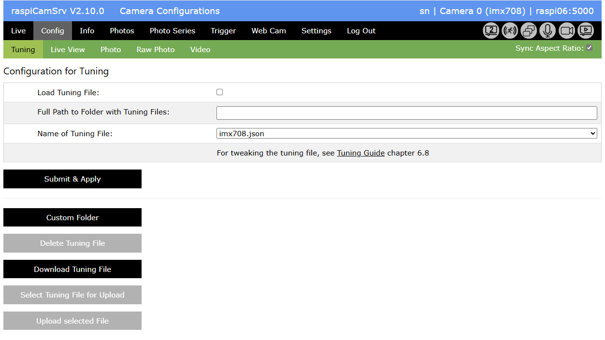
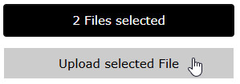

# raspiCamSrv Camera Tuning

[](./UserGuide.md)

The algorithms of Raspberry Pi cameras are affected by tuning files which are specific for each camera type and Raspberry Pi version. These files are automatically loaded when the camera system is instantiated.   
A set of default tuning files for all camera models are part of the Raspberry Pi OS distribution.     
(For details, see the [Raspberry Pi Camera Algorithm and Tuning Guide](https://datasheets.raspberrypi.com/camera/raspberry-pi-camera-guide.pdf))

With **raspiCamSrv**, you can control which files are used and you may tweak specific features within these files to optimize the camera behavior for your specific needs.

This functionality can be accessed through menu *Config*, submenu *Tuning*:



The configuration provides three parameters:

- *Name of Tuning File*<br>This is the name of the tuning file to be loaded for the active camera.<br>Raspberry Pi OS distributions include default tuning files with '.json' type and a name which is identical to the name of the camera model.<br>If you provide own tuning files, you may choose an arbitrary name. If you are using multiple camera models simultaneously, you should be able to correctly associate a file with a camera model.
- *Full path to folder with tuning files*<br>If this is empty (None), Picamera2 will search a system-specific list of likely installation folders for the required tuning file.<br>raspiCamSrv supports usage of a custom folder (```/home/<user>/prg/raspi-cam-srv/raspiCamSrv/static/tuning```) which allows keeping own tuning files separate from the default ones.
- *Load Tuning File*<br>If this checkbox is activated, raspiCamSrv will request Picamera2 to load the specified tuning file instead of the default one.<br>Otherwise, Picamera2 will load the default tuning file.

Any changes of one of these parameters needs to be submitted with the *Submit & Apply* button.    
If *Load Tuning File* is checked, a restart of the live stream will be requested so that the result of the chosen tuning file can be directly seen in the [Live](./LiveScreen.md) view.

## Switching between Custom and Default Folder

- Button *Custom Folder* will switch the folder for tuning files to the custom folder ```/home/<user>/prg/raspi-cam-srv/raspiCamSrv/static/tuning```<br>If there is already a tuning file with the specified name in this folder, it will be used.<br>If the tuning file does not yet exist in the custom folder, the standard tuning file will be copied to the custom folder.
- Button *Default Folder* (toggled) will switch to the default folder.<br>This folder is system-specific, e.g. ```/usr/share/libcamera/ipa/rpi/pisp```


## Modification of Tuning Files

Modification of tuning files with raspiCamSrv can only be done in the custom folder.

If you are not directly accessing the tuning files on the Raspberry Pi, you can download a file, rename it, if desired, and modify it on the client machine.     
Afterwards you can upload it to the custom folder.    
When done, the file will be available for selection.

### Deleting a Tuning File

The button *Delete Tuning File* will only be active, if

- the custom folder is activated
- *Load Tuning File* is unchecked
- No parameter changes have beenn made after the last *Submit & Apply*

This restriction avoids inadvertently deleting the wrong file if the file has been changed without submitting.

### Download Tuning File

A tuning file can be downloaded from the default folder or from the custom folder.

### Uploading Tuning Files

The buttons for upload will only be active if the custom folder is selected.

1. You start pushing the *Select Tuning File for Upload* button<br>
2. If a single file has been selected, its name will be shown on the button:<br>
3. If a multiple files have been selected, the number of selected files will be shown on the button:<br>
4. Finally, you need to the *Upload selected File* button to upload:<br>

## Using a different Custom Folder

If you have already prepared tuning files in a specific folder on the Raspberry Pi, which is different from the Custom Folder used by raspiCamSrv, you can also refer to this folder.

You first need to manually enter the *Full Path* to this folder and push *Submit & Apply*.

Afterwards, the .json files in this folder will be available for selection as *Name of Tuning File*

## Tuning with Multiple Cameras

Tuning files are specific for a camera and not for a camera model.

If two cameras are used with a Pi5, the tuning file needs to be individually specified for each camera, also if both are the same model.

To preserve the tuning configuration for a camera, it must be memorized using the *Memorize Configuration and Controls for Camera Change* in screen [Web Cam](./Webcam.md)

Because of a Threading issue in Picamera2 (see Picamera2 Issue #1103 [Tuning file support not thread-safe?](https://github.com/raspberrypi/picamera2/issues/1103)), the streams from the two cameras in dialog [Web Cam](./Webcam.md) may look as if the tuning file of the first camera would have also been applied to the second one.

Nevertheless, the handling in raspiCamSrv is correct.   
You may proof this in the following way:

1. Activate a dialog without live view, e.g. [Info](./Information.md).
2. Wait at least 10 sec. until both streaming threads have terminated (refresh the screen from time to time)
3. In another browser window, stream just one camera (endpoint video_feed or video_feed2).<br>You should then see the effect of the correct tuning file.<br>However, if you later start streaming the other camera, you may see that the tuning file for the previously started camera has been applied.
