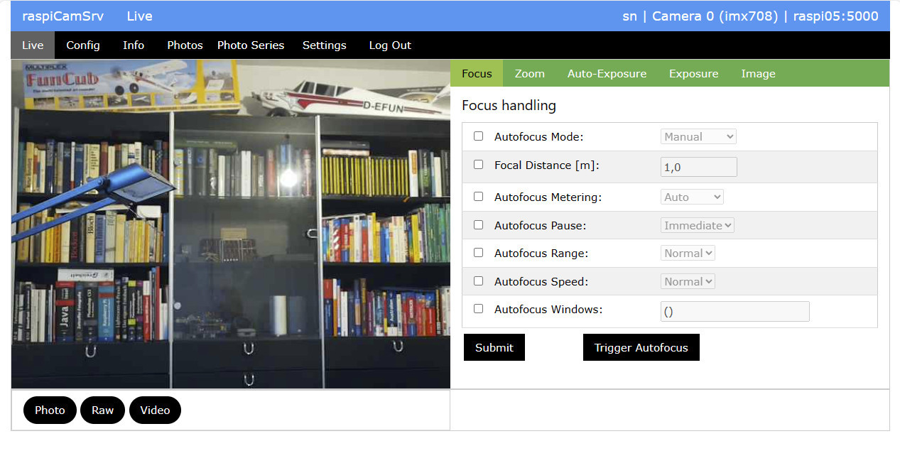

# RaspiCamSrv User Guide

[](../README.md)

**NOTE**     
For a full understanding of application details, users should familiarize with the official document [Raspberry Pi - The Picamera2 Library](https://datasheets.raspberrypi.com/camera/picamera2-manual.pdf).  
The document version, on which this raspiCamSrv release is based, is also included in this documentation: [picamera2-manual.pdf](./picamera2-manual.pdf)

When the server on a Pi is running and the Pi is reacheable through the network (usually WiFi), you can connect with a browser using the Pi address ('raspi05' in the example below) with the Flask port number, usually 5000, e.g.:  
```http://raspi05:5000```

The system will request an initial [registration and a login](./Authentication.md) and subsequently open the **Live** application screen.

For error handling, see [raspiCamSrv Troubleshooting](./Troubelshooting.md)

For interoperability, **raspiCamSrv** provides an [API](./API.md) which allows access to selected functions through web services.

## Application Screen


### Elements

#### Title bar
On the right side, the title bar shows
- the current server connection
- the active camera as advertised by Picamera2
- the active user

On the left side, the title bar shows the application name (raspiCamSrv) and the current screen.

#### Main Menu

The main menu (black background) allows navigation to different screens:
- **Live** shows the [Live Screen](./LiveScreen.md) which includes functionality for image control as well as photo- and video taking
- **Config** gives access to camera [Tuning](./Tuning.md) and camera [Configuration](./Configuration.md) where basic camera configurations can be specified for different scenarios.
- **Info** opens the [Camera Information](./Information.md) page with information on installed cameras as well as Properties and Sensor Modes of the active camera.
- **Photos** shows the [Photos](./PhotoViewer.md) where the currently available photos and videos can be browsed and inspected in detail.
- **Photoseries** opens the [Photo Series](./PhotoSeries.md) page for control of photo series.
- **Trigger** Allows configuring and controlling [triggered actions](./Trigger.md), based on [Motion Capturing](./TriggerMotion.md) as well as on configured [events from GPIO-connected sensors](./TriggerTriggers.md)
- **Web Cam** opens the [Web Cam](./Webcam.md) page showing web cam features of **raspiCamSrv**
- **Console** is dedicated to manually controlled interactions with the [Raspberry Pi OS](./ConsoleVButtons.md) or with [GPIO-connected Actors](./ConsoleActionButtons.md), such as motors, servos or LEDs.
- **Settings** opens the [Settings](./Settings.md) page for all kinds of static configurations for **raspiCamSrv**.
- **Log Out** will log the active user out and direct to the [Log-In Screen](./Authentication.md#log-in)

**NOTE:** Selecting an option on the main menue will issue a request to the server with a specific URL and, thus, refresh the screen.

#### Submenue

Many of the **raspiCamSrv** pages, selected by a [Main Menue](#main-menu) option have a submenue.    
Submenues are indicated by a green background.

**NOTE:** Selecting an option on a submenue will **not** issue a new request and, thus, will **not** refresh the screen with new information from the server.    
Instead, submenue options activate different sections of the currently loaded page.   
However, *Submit* buttons on a page section apply only to data shown on the active section and not to data on other sections of the same page.


#### Process Status indicators

On the right side of the menu bar there is a group of status indicators for the different [background processes](./Background%20Processes.md):


From right to left, these indicate the status of

- Live stream thread for active camera
- Video thread
- Recording [audio](./Settings.md#recording-audio-along-with-video) along with video
- [Photo Series](./PhotoSeries.md) thread
- [Motion Capture](./Trigger.md) thread
- [Trigger](./TriggerTriggers.md) thread
- Live stream thread for the other camera, if available (see [Webcam](./Webcam.md))

Red color indicates that a process is active whereas gray indicates that it is inactive.   

In the case of [motion capture](./TriggerMotion.md),    
- yellow color indicates that the process is active but currently not scheduled to register events
- turquoise color indicates that the motion capture process runs in [test mode](./TriggerMotion.md#testing-motion-capturing)

     


#### Message Line
At the bottom of the screen, there is a message line where application messages will be shown when necessary.

## Streaming

**raspiCamSrv** supports streaming MJPEG video.

The straming URL is   
```http://<server>:<port>/video_feed``` for MJPEG video   
```http://<server>:<port>/photo_feed``` for photo snapshots      
Both URLs can be accessed without authentication if the checkbox *Req. Auth for Streaming* on the [Settings](./Settings.md) screen is deactivated.   
If this checkbox is activated, a user must have logged in to raspiCamSrv once in the same browser session which shall be used for streaming. A streaming request in a browser session without login will redirect to the login screen.

In the web client, an active streaming server is indicated with the process status indicators as    
 if only the active camera is streaming or   
 if both cameras are streaming or     
 if if only the other (not active) camera is streaming     

A live stream is shown in in the [Live Screen](./LiveScreen.md) for the active camera or on the [Webcam](./Webcam.md) page for both cameras.

The streaming servers are automatically shut down if no client has been streaming within the last 10 seconds.   
This is independently controlled for both cameras.   
For example if one is working in other dialogs rather than *Live Screen*, straming is not used and the streaming servers are shut down, which is indicated by   
   
Streaming is automatically reactivated, if a streaming client connects, for example if the *Live Screen* is activated.

Other clients, either connecting directly through the streaming URL or by using the **raspiCamSrv** web client, will also activate the streaming servers.

Streaming of the active camera can be deactivated, if a **raspiCamSrv** task is executed which requires exclusive access to the camera because of a specific [Configuration](./Configuration.md) which is not compliant with the configuration required for streaming (for more details, see [raspiCamSrv Tasks and Background Processes](./Background%20Processes.md)).
