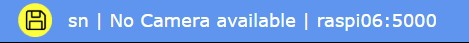

# RaspiCamSrv User Guide (No Camera)

This is a special variant of the general **raspiCamSrv** [User Interface](./UserGuide.md) for the case when no camera is available.

This applies to the following situations:

- There is currently no camera at all connected to the Raspberry Pi, neither CSI camera nor USB camera.
- Currently, only one or more USB cameras are connected and have been recognized by the system (see [Info](./Information_NoCam.md)) but usage of USB cameras has been deactivated in [Settings](./Settings_NoCam.md).

## Application Screen

Initailly, the system starts up with the [Info](./Information_NoCam.md) dialog activated:

### Elements

#### Title bar

On the right side, the title bar shows

- the current server connection
- An information that currently no camera is available
- the active user
- A special icon will indicate unsaved configuration changes:  It will vanish after changes have been saved with [Settings/Configuration/Store Configuration](./SettingsConfiguration.md) or after a stored configuration has been loaded.    
The icon can be pressed to save unsaved changes.

On the left side, the title bar shows the application name (raspiCamSrv) and the current screen.

#### Main Menu

The main menu (black background) allows navigation to different screens:

- **Info** opens the [Camera Information](./Information.md) page with information on installed cameras as well as Properties and Sensor Modes of the active camera.
- **Trigger** Allows configuring and controlling [triggered actions](./Trigger.md), based on configured [events from GPIO-connected sensors](./TriggerTriggers.md)
- **Console** is dedicated to manually controlled interactions with the [Raspberry Pi OS](./ConsoleVButtons.md) or with [GPIO-connected Actors](./ConsoleActionButtons.md), such as motors, servos or LEDs.
- **Settings** opens the [Settings](./Settings.md) page for all kinds of static configurations for **raspiCamSrv**.
- **Log Out** will log the active user out and direct to the [Log-In Screen](./Authentication.md)

**NOTE:** Selecting an option on the main menu will issue a request to the server with a specific URL and, thus, refresh the screen.

#### Submenu

Most of the **raspiCamSrv** pages, selected by a [Main Menu](#main-menu) option have a submenu.    
Submenues are indicated by a green background.

**NOTE:** Selecting an option on a submenu will **not** issue a new request and, thus, will **not** refresh the screen with new information from the server.    
Instead, submenu options activate different sections of the currently loaded page.   
However, *Submit* buttons on a page section apply only to data shown on the active section and not to data on other sections of the same page.

#### Process Status indicators

On the right side of the menu bar there is space status indicators for [background processes](./Background%20Processes.md):

When a camera is not available, there is only the status indicator for the [Trigger](./TriggerTriggers.md) thread:

Gray color indicates that a process is inactive whereas red indicates that it is active.   

Yellow color indicates that the process is active but currently not scheduled to register events

#### Message Line

At the bottom of the screen, there is a message line where application messages will be shown when necessary.
