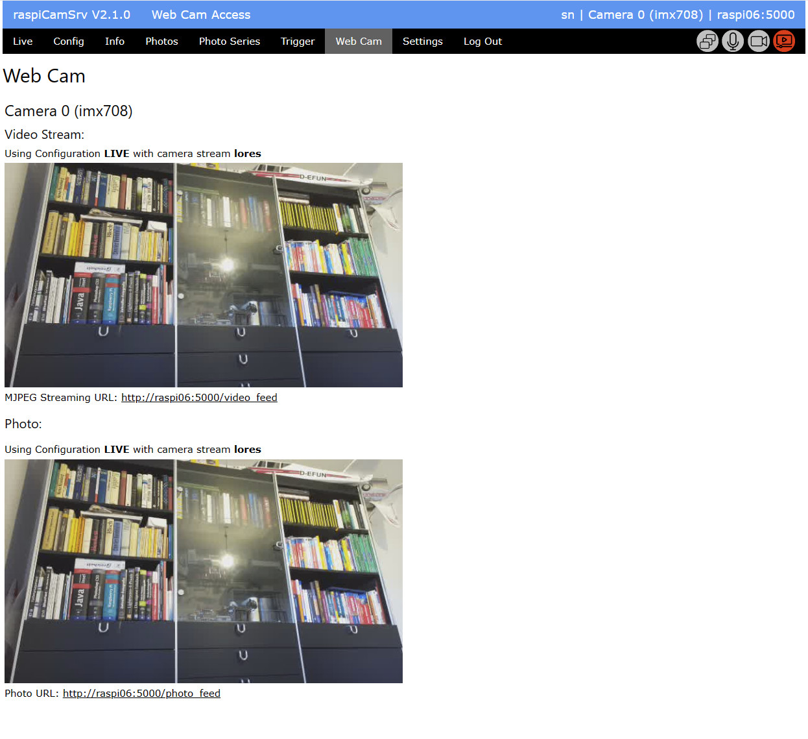

# Web Cam Settings

**raspiCamSrv** enables webcam functionalities with Raspberry Pi cameras.

This page shows the URLS for MJPEG streaming as well as for photo snapshots:

The left side of the page always shows the active camera.

The configuration and camera stream used for video and photo capture are indicated.

The links shown on the page open a new browser window.

## Video Stream

The video stream will always use the LIVE configuration.   
By default, this configuration uses the *lores* camera stream.   
The camera stream as well as its *stream size* can be configured in the [Configuration](./Configuration.md) screen.

## Photo Snapshot

The photo snapshot is currently also using the LIVE configuration.

