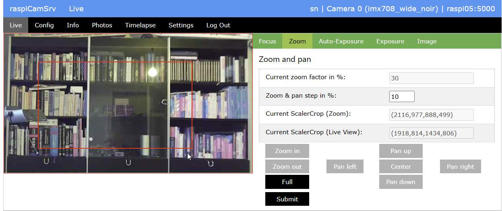

# raspiCamSrv Zoom & Pan

This tab allows zooming and panning the image area within the dimensions supported by the camera pixel array size and Sensor Modes.

For more details, see [Image Cropping and Sensor Modes](./ScalerCrop.md)

## Current zoom factor in %

This value shows the current zoom factor.   
It cannot be modified manually but only through the **Zoom in**, **Zoom out** or **Full** buttons.

The value is given in % of the [ScalerCrop Default](./ScalerCrop.md#cropping) size.

## Zoom & pan step in %

This value can be adjusted.   
It specifies the step size by which every click on **Zoom in** or **Zoom out** will change the *Current zoom factor*.

## Current ScalerCrop (Zoom)

This rectangle, given in pixels, specifies the ScalerCrop rectangle which will be requested as part of the [Camera Controls](./CameraControls.md).   

The rectangle is given as tuple (x_offset, y_offset, width, height).

When drawing the zoom window (see [below](#graphically-setting-the-zoom-window)), the rectangle parameters will be updated.

After Submitting, the entry should be identical to the *Current ScalerCrop (Live View)*.

## Current ScalerCrop (Live View)

This shows the scaler crop rectangle which is currently active for the live view.

The *Current ScalerCrop (Live View)* is the base for determining offset and size of the *Autofocus Windows* when drawing rectangles on the canvas (see [Focus](./FocusHandling.md)).

## Zoom

The following buttons allow zooming:
- Zoom in   
zooms into the image (reduces the viewport), keeping the center.
- Zoom out   
zooms out (enlarges the viewport), keeping the center.    
If the image had been panned before, the center will be shifted, if necessary, to keep the ScalerCrop rectangle within the [ScalerCrop Maximum](./ScalerCrop.md#cropping) area.
- Full    
Zooms to 100% keeping the center, unless a shift is required to keep the ScalerCrop rectangle within the [ScalerCrop Maximum](./ScalerCrop.md#cropping) area.

## Pan

Panning can be done with the following buttons:

- Pan up / Pan down    
Move the ScalerCrop rectangle up/down until the upper/lower border of the [ScalerCrop Maximum](./ScalerCrop.md#cropping) rectangle is reached.
- Pan left / Pan right    
Move the ScalerCrop rectangle left/right until the left/right border of the [ScalerCrop Maximum](./ScalerCrop.md#cropping) rectangle is reached.
- Center   
Move the ScalerCrop rectangle to the center of the [ScalerCrop Maximum](./ScalerCrop.md#cropping) rectangle, keeping the zoom factor.
- Default   
Set the ScalerCrop rectangle to the [ScalerCrop Default](./ScalerCrop.md#cropping) rectangle.

## Graphically setting the Zoom Window

Pushing the **Draw** button will switch into graphical mode where the zoom window can be drawn on a canvas over the Live Stream area.   
All other buttons, except **Full** will be disabled in this mode.

**Attention:** With Safari (e.g. on an iPad), due to the issue with onload events, the canvas will not be directly visible. It needs to trigger window resize by shortly 'pulling' down the window.

While drawing a rectangle for the intended image section, the original aspect ratio will be preserved.   
After drawing is finished, the *Current ScalerCrop (Zoom)* will be updated with offset and dimensions of the zoom window.

After pressing **Draw**, the button has changed to **Submit** which must be pressed in order to apply the ScalerCrop setting to the preview and store it for later photo or video taking.

Pressing **Submit** terminates the graphic mode.

When the **Full** button is pressed in the graphic mode, the dialog returns to normal mode without applying a previously drawn zoom window.
