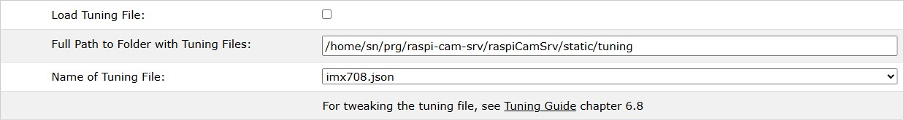
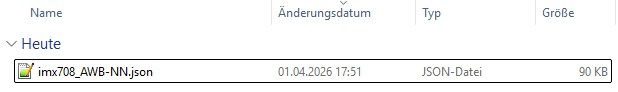
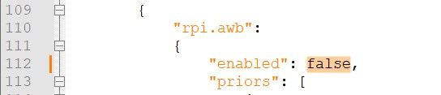
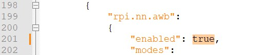
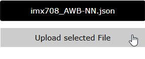
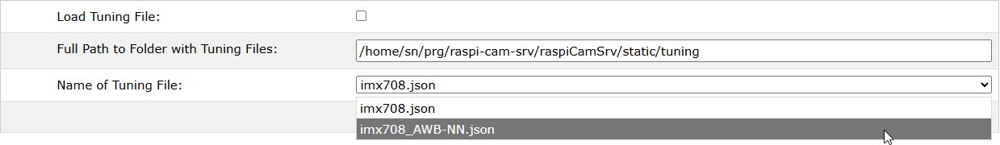
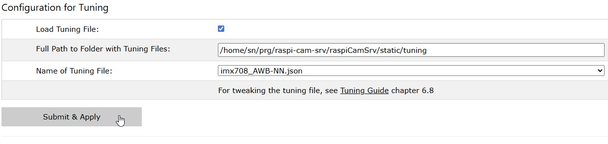

# Tutorial: Automatic White Balance with Neural Networks

[](./Tutorials_Overview.md)

This tutorial describes how to activate neural network-based AWB (AWB-NN).

This is a relatively new feature provided by the Raspberry Pi team which is currently only documented in the Forum article [AWB with Neural Networks](https://forums.raspberrypi.com/viewtopic.php?p=2365911).

AWB-NN can currently only be activated through a modification of the tuning file for the camera.     
If activated, it overrules *AWB* settings in the [Camera Controls](../CameraControls_Image.md).

## Precondition

AWB-NN is only available in Trixie with libcamera version 0.7.0+rpt20260205 or later.

To check, open the [Info / System](../Information_Sys.md) dialog and check 

- Hardware and OS / Debial Version
- Software Stack / libcamera

## Procedure

1. Open the [Config / Tuning](../Tuning.md) dialog
<br>The dialog will show the tuning file for the active camera located in the standard folder ```/usr/share/libcamera/ipa/rpi/pisp```.
2. Push button **Custom Folder**
<br>which will create a custom folder for tuning files if it does not yet exist (```/home/<user>/prg/raspi-cam-srv/raspiCamSrv/static/tuning```) and copy the tuning file to this folder:
<br>
<br>The reason for this is that standard tuning files in the standard folders must not be edited.
3. Push button **Download Tuning File**
<br>This will download the tuning file to your Downloads folder
4. It is recommended to rename the tuning file to indicate that it is used for AWB-NN:
<br>
5. Open the tuning file in your preferred text editor
6. Search for node ```rpi.awb``` and change the element ```"enabled"``` to ```false```:
<br>
7. Now, search for node ```rpi.nn.awb``` and change the element ```"enabled"``` to ```true```:
<br>
8. Save the file
9. In dialog **Tuning**, press button **Select Tuning File for Upload**,
<br>navigate to your Downloads folder and select the modified tuning file.
<br>The button will now show the name of the selected tuning file (if just one file has been selected).
10. Now, push button **Upload selected File**
<br>
<br>This will upload the file to the custom folder for tuning files
11. Change the seleted tuning file to the modified file. Make sure that it is the file for the active camera:
<br>
12. Check *Load Tuning File* and push button **Submit and Apply**
<br>

## Result

If the modified tuning file is selected, Picamera2 will load this file when the camera is started.

Cited from [AWB with Neural Networks](https://forums.raspberrypi.com/viewtopic.php?p=2365911#p2365911):        
"The AWB NN algorithm definitely produces different results to the default Bayesian algorithm, the nature of which depends on the training data.    
Generally, we find it produces significantly better results, though your mileage may vary. Obviously this is quite early days still, 
so we're interested in people's experiences."


## Deactivate AWB-NN

To return to the standard AWB, deactivate *Load Tuning File* and push button **Submit and Apply**


